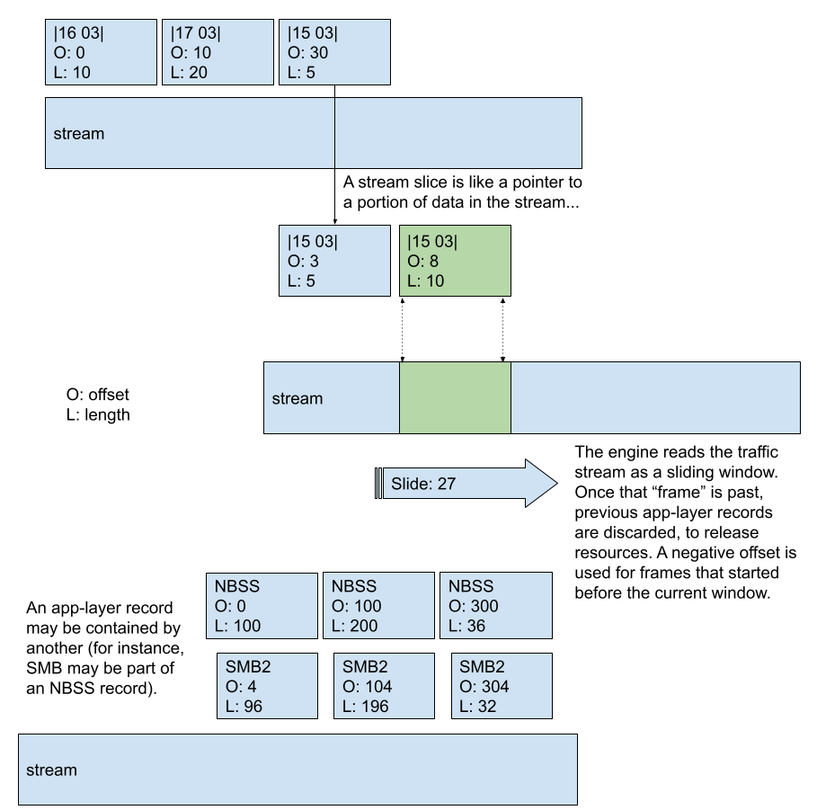

*******************************
Application Layer Frame Support
*******************************

.. contents:: Table of Contents

Baseline
========

- Basic functioning of the Suricata engine, like application layer `transactions <https://github.com/OISF/suricata/blob/master/doc/devguide/extending/app-layer/transactions.rst>`_ and Suricata flows
- `Suricata rules format <https://suricata.readthedocs.io/en/latest/rules/intro.html>`_
- `Multi-pattern rule matching <https://suricata.readthedocs.io/en/latest/configuration/suricata-yaml.html?highlight=multi%20pattern%20matcher#detection-engine>`_ algorithm, used for rule filtering and to address engine performance

General Concepts
================

.. note:: Stream Frames support is a work in progress. This means that names and some implementation details might still change, before we reach a more stable version of the code. The overall idea behind it is matured, though, so this documentation is still valid. Current progress: `Feat/appl records <https://github.com/OISF/suricata/pull/6713>`_

Suricata's architecture and current state of parsers mean that the network traffic stream isn't readily available to the
detection engine. Except for the application layer parsers, the Suricata engine itself only has access to higher level
abstractions - *State* and *Transactions* (much heavier objects, that store *Frame* information in the form of *Request-Response* pairs).

.. note:: For Suricata, *Frame* is a generic enough term that it can represent any unit of network data we are interested in, which could be comprised of one or several packages of other, lower level protocol(s).

The normal pipeline of detection in Suricata implies at least two things:

- Certain rules can be quite costly performance-wise. This happens because the same stream could be inspected several times for different rules, since for certain signatures the detection is done when Suricata is still inspecting a lower level stream, not the application layer protocol (e.g., *TCP* traffic, in place of *SMB* one);
- Rules can be difficult and tedious to write (and read), requiring that writers go in byte-detail to express matching on specific payload patterns.

To illustrate how difficult it can be to write some rules without frame support, consider a rule for SMB to match on the content "vigilant meerkat"::

    alert tcp any any -> any any (flow:to_server; content:"|ff|SMB"; offset:4; depth:4;
    \content:"vigilant meerkat"; sid:1; rev:1;)

For a rule like the above, even though one is interested in *SMB* traffic only, Suricata will inspect **all** *TCP* traffic to the back-end - regardless of application layer protocols.

What the Stream Frames offer is the ability to "point" to a specific portion of stream and identify what type of traffic Suricata is looking at.Then, as the engine reassembles the stream, one can have "read access" to that portion of the stream, aggregating concepts like: what type of application layer protocol that is, and differentiating between `header`, `data` or even protocol versions (`SMB1`, `SMB2`...).

The goal of the stream *Frames* is to expose application layer protocol `PDUs <https://en.wikipedia.org/wiki/Protocol_data_unit>`_ and other such arbitrary elements to the detection engine directly, instead of relying on Transactions. The main purpose is to bring *TCP.data* processing times down by specialising/ filtering down traffic detection.

Benefits for Rule Writers
=========================

With frame support, the previous example rule becomes something like::

    alert smb any any -> any any (flow:to_server; frame:smb.smb1.data; content:"vigilant meerkat";
    \sid:1; rev:1;)

As this hypothetical rule shows, this allows for easier to write, more human-readable rules, with the benefit that they are also less costly for the engine to inspect.

Another advantage of this feature is that there is a single rule keyword for application layer frames: ``frame``.
This keyword takes an argument to specify the per protocol frame type::

    frame:<app proto name>.<specific frame name>

Examples::

    tls.pdu
    smb.nbss.pdu
    smb.smb1.pdu

Rules will look something like this::

    alert tls any any -> any any (flow:to_client; frame:tls.pdu; \
         content:"|17 03 03|"; startswith; sid:1;)
    alert smb any any -> any any (flow:to_server; frame:smb.nbss.pdu; \
         content:"|fe|SMB"; offset:4; depth:4; sid:2;)
    alert smb any any -> any any (flow:to_server; frame:smb.smb1.pdu; content:"|ff|SMB"; sid:3;)

Implementation & API Callbacks
==============================

The application layer parser exposes frames it supports to the detect engine, by tagging them as they're parsed. The rest works automatically.

A code example from the `SMB` decoder - code excerpt from `PR #6713 <https://github.com/OISF/suricata/pull/6713/commits/88c1fea77f55284c74443eaaa230e0c21956433f>`_:

.. literalinclude:: ../../../../rust/src/smb/smb.rs
    :caption: rust/src/smb/smb.rs
    :language: rust
    :start-at: pub fn parse_tcp_data_ts<'b>
    :end-at: nbss_hdr.length as i64, SMBFrameType::NBSSData as u8);
    :lines: 1-3, 56-64
    :dedent: 4

.. code-block:: rust

     pub fn parse_tcp_data_ts<'b>(&mut self, flow: *const Flow, stream_slice: &StreamSlice)
     -> AppLayerResult
     {
        let mut cur_i = stream_slice.as_slice(); // pointer to current input
           // skipped code
           while cur_i.len() > 0 {
               // skipped code
                 match parse_nbss_record(cur_i) {
                    // skipped code
                     let _nbss_pdu = Frame::new_ts(flow, stream_slice, cur_i, nbss_hdr.length as i64 + 4, 
                                                SMBFrameType::NBSS as u8);
                     let _nbss_hdr_frame = Frame::new_ts(flow, stream_slice, cur_i, 4 as i64, 
                                                SMBFrameType::NBSSHdr as u8);
                     let _nbss_data_frame = Frame::new_ts(flow, stream_slice, &cur_i[4..], nbss_hdr.length as i64, 
                                                SMBFrameType::NBSSData as u8);
                     // skipped code
             }
        }
     }

The function calls for registering *frames* are available from *frames.rs*

A frame to the server can be registered like so:

.. literalinclude:: ../../../../rust/src/frames.rs
    :caption: rust/src/frames.rs
    :language: rust
    :start-at: pub fn new_ts
    :end-before: pub fn new_tc
    :dedent: 4

The parameters represent:

- ``flow``: dedicated data type to carry specific flow-related data
- ``stream_slice``: dedicated data type to carry stream data, shown bellow
- ``frame_start``: a pointer to the start of the frame buffer in the stream, ``cur_i`` in the example code snippet
- ``frame_len``: what we expect the frame length to be (the engine may need to wait until it has enough data...)
- ``frame_type``: type of frame we're registering (in the examples we have an NBSS PDU, Header and Data frames (``SMBFrameType::NBSS``, ``SMBFrameType::NBSSHdr`` and ``SMBFrameType::NBSSData``, respectively) for instance.

StreamSlice contains the input data to the parser, alongside other Stream-related data important in parsing context. Definition  is found in *applayer.rs*:

.. literalinclude:: ../../../../rust/src/applayer.rs
    :caption: rust/src/applayer.rs
    :language: rust
    :start-at: pub struct StreamSlice
    :end-before: impl StreamSlice

Visual context
--------------

``input`` and ``input_len`` are used to calculate the proper offset, for storing the frame. The stream buffer slides forward, so frame offsets/frames have to be updated. The `relative offset` (``rel_offset``) reflects that:

.. code-block:: c

    Start:
    [ stream ]
      [ frame   ...........]
       rel_offset: 2
       len: 19

    Slide:
         [ stream ]
    [ frame ....          .]
     rel_offset: -10
     len: 19

    Slide:
                [ stream ]
    [ frame ...........    ]
     rel_offset: -16
     len: 19

The way the engine handles stream frames can be illustrated as follows:

Adding Frame Support to a Parser
================================

To add this feature to a parser:

- identify the parsing function(s) where application layer frames are parsed;
- choose from the Frame API calls the one that makes more sense for each given case;
- identify the correct moment to use the calls;
- add frame logging (output) capability, if you want Suricata to be able to add a Frame event type to EVE logs.
