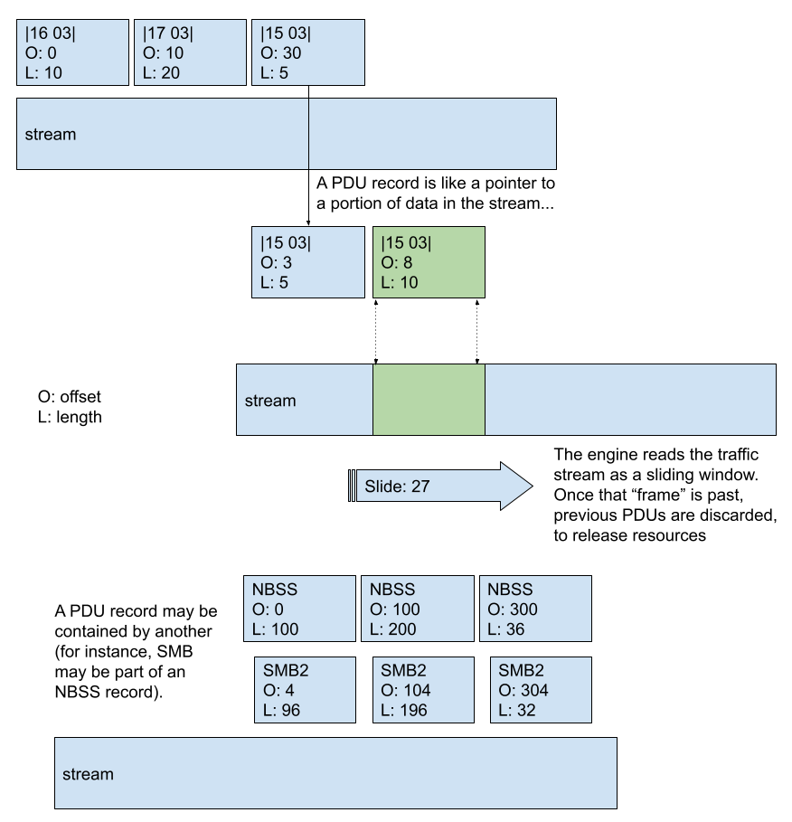

******************
Stream PDU Records
******************

.. contents:: Table of Contents

General Concepts
================

.. note:: The PDU support is a work in progress. This means that names and some implementation details are still bound to change, before we reach a more stable version of the code. The overall idea behind it is matured, though, so this documentation is still valid. Current progress: `WIP: initial stream PDU support <https://github.com/OISF/suricata/pull/6387>`_

Suricata's architecture and current state of parsers mean that the network traffic stream isn't readily available to the
detection engine. Except for the application layer parsers, the Suricata engine only has access to higher level
abstractions - *State* and *Transactions* (much heavier objects, that store `PDU` information in the form of *Request-Response* pairs). [add link
to transaction documentation]

The goal of the stream `PDU` parser is to expose application layer protocol PDUs to the detection engine directly, instead of relying on Transactions. The main purpose is to bring `TCP.data` processing times down, by specialising/ filtering down traffic detection.

The normal pipeline of detection in Suricata implies at least two things:

- Certain rules can be quite costly performance-wise. This happens because the same stream could be inspected several times for different rules, because for certain signatures the detection is done when Suricata is still inspecting a lower level stream, not the application layer protocol (e.g., `TCP` traffic, in place of `SMB` one);
- Rules can be difficult and tedious to write (and read), requiring that the writer go in byte-detail to express matching on specific payload patterns.

For example, if they were to write a rule for SMB to match on content "vigilant meerkat", they will have to do something like::

    alert tcp any any -> any any (content:"|ff|SMB"; offset:4; depth:4; 
    \content:"vigilant meerkat"; sid:1; rev:1;)

For a rule like the above, even though one is interested in `SMB` traffic only, Suricata will inspect *all* `TCP` traffic `toserver` - regardless of application layer protocols.
 
What the Stream `PDU` Records offer is the ability to "point" to a specific portion of stream and identify what type of traffic Suricata is looking at, allowing for the previous example rule to become something like::

    alert smb any any -> any any (record:smb.smb1.pdu; content:"vigilant meerkat"; sid:1; rev:1;)

As the engine reassembles the stream, the `PDU` stream support allows one to have a "read access" to that portion of the stream, aggregating `PDU` concepts like what type of application layer protocol that is, and differentiating betweene `header`, `data` or even protocol versions (`SMB1`, `SMB2`...).

As the example rule shows, this allows for easier to write, more human-readable rules, with the benefit that they are also less costly for the engine to inspect.

Rule Writing
============

An advantage of this feature is that there is a single rule keyword for the PDU record: ``record`` (note that this name is still to
be decided). A parser exposes records it supports to the detect engine, the rest works automatically. Rules will look
something like this::

    alert tls any any -> any any (flow:to_server; record:tls.pdu; \
         content:"|16 03|"; startswith; sid:1;)
    alert tls any any -> any any (flow:to_server; record:tls.hdr; \
         content:"|16 03|"; startswith; sid:2;)
    alert tls any any -> any any (flow:to_server; record:tls.data; \
         content:"|aa aa aa aa|"; startswith; sid:3;)
    alert smb any any -> any any (flow:to_server; record:smb.nbss.pdu; \ 
         content:"|fe|SMB"; offset:4; depth:4; sid:25;)
    alert smb any any -> any any (flow:to_client; record:smb.nbss.pdu; \
         content:"|fe|SMB"; offset:4; depth:4; sid:26;)
    alert smb any any -> any any (flow:to_server; record:smb.smb1.pdu; content:"|ff|SMB"; sid:21;)

API Callbacks
==============

Stream PDUs support allows applayer parsers to tag PDUs in the stream while parsing. A code example from the `SMB`
decoder (`rust/src/smb/smb.rs`) - code excerpt from PR: https://github.com/OISF/suricata/pull/6387/files#diff-9198df68b17e3b0f75f582243eac2835fad9472f28c31284efa0e8ced816bd02R1406:

    .. code-block:: rust

         pub fn parse_tcp_data_ts<'b>(&mut self, flow: *const Flow, i: &'b[u8]) -> AppLayerResult
         {
            let mut cur_i = i; // pointer to current input
               .
               while cur_i.len() > 0 {
                 match parse_nbss_record(cur_i) {
                 .
                 .
                   let _nbss_pdu = applayer_new_record_ts(flow, i, cur_i, 
                        nbss_hdr.length as i32 + 4, SMBPduType::NBSS as u8);
                   let _nbss_hdr_pdu = applayer_new_record_ts(flow, i, cur_i, 4,
                        SMBPduType::NBSSHdr as u8);
                   let _nbss_data_pdu = applayer_new_record_ts(flow, i, &cur_i[4..], 
                        nbss_hdr.length as i32, SMBPduType::NBSSData as u8);
                 .
                 .
                 }
            }
         }

There are a number of possible function calls for registering the `PDU` records. 

A frame to the server can be registered like so:

.. code-block:: rust

   pub fn applayer_new_record_ts(
           flow: *const Flow, base: &[u8], rec_start: &[u8], rec_len: i32, rec_type: u8) 
   -> *const StreamPDU

The parameters represent:

- ``flow``
- ``base``: stream buffer, ``i`` in the example code snippet
- ``rec_start``: a pointer to the start of the frame buffer in the stream, ``cur_i`` in the example code snippet
- ``length``: what we expect the record length to be (the engine may need to wait until it has enough data...)  
- ``record_type``: type of frame we're registering (in the examples we have `NBSS Header` and `NBSSData`, for instance).

More context
------------

``base`` and ``rec_start`` are used to calculate the proper offset, for storing the PDU. The stream buffer slides forward, so PDU offsets/records have to be updated. The `relative offset` (``rel_offset``) reflects that:

.. code-block:: c

    Start:
    [ stream ]
      [ pdu   ...........]
       rel_offset: 2
       len: 19
    Slide:
              [ stream ]
    [ pdu ....          .]
     rel_offset: -10
     len: 19
    Slide:
                     [ stream ]
    [ pdu ...........    ]
     rel_offset: -16
     len: 19

The PDU record workings can be illustrated as follows:

TODOs

Mention multi-pattern rule matching, for performance. -- currently
> to filter out rules??

