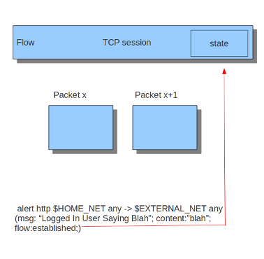

Flow-keywords
=============

Flowbits
~~~~~~~~

Flowbits consists of two parts. The first part describes the action it is going to perform, the second part is the name of the flowbit.

There are multiple packets that belong to one flow. Suricata keeps those flows in memory. For more information see [[suricata.yaml#Flow]].
Flowbits can make sure an alert will be generated when for example two different packets match.  An alert will only be generated when both packets match. So, when the second packet matches, Suricata has to know if the first packet was a match too. Flowbits marks the flow if a packet matches so Suricata 'knows' it should generate an alert when the second packet matches as well.

Flowbits have different actions. These are:

::

  flowbits: set, name                Will set the condition/'name', if present, in the flow.
  flowbits: isset, name              Can be used in the rule to make sure it generates an alert
                                     when the rule matches and the condition is set in the flow.
  flowbits: toggle, name             Reverses the present setting. So for example if a condition is set,
                                     it will be unset and vice-versa.
  flowbits: unset, name              Can be used to unset the condition in the flow.
  flowbits: isnotset, name           Can be used in the rule to make sure it generates an alert
                                     when it matches and the condition is not set in the flow.
  flowbits: noalert                  Does not generate an alert for this rule.

Example:

.. image:: flow-keywords/Flowbit_3.png

When you take a look at the first rule you will notice it would generate an alert if it would match, if it were not for  the 'flowbits: noalert' at the end of that rule. The purpose of this rule is to check for a match on 'userlogin' and mark that in the flow. So, there is no need for generating an alert.
The second rule has no effect without the first rule. If the first rule matches, the flowbits sets that specific condition to be present in the flow. Now with the second rule there can be checked whether or not the previous packet fulfills the first condition. If at that point the second rule matches, an alert will be generated.

It is possible to use flowbits several times in a rule and combine the different functions.

Flow
~~~~

The flow keyword can be used to match on direction of the flow, so to/from client or to/from server. The to_client is equal to from_server, same goes for from_client and to_server - there's no difference, both names are supported due to historical reasons. It can also match if the flow is established or not. The flow keyword can also be use to say the signature has to match on stream only (only_stream) or on packet only (no_stream).

So with the flow keyword you can match on:

::

  to_client                       established           only_stream
  from_client                     stateless             no_stream
  to_server
  from_server

**NOTE:** *from_server* and *to_client* are the same, and so are *to_server* and _from_client_. This comes from the original Snort language and we support it for compatibility reasons.

These options from the different columns can be combined. You can use up to three options. For example:

::

  flow:to_client, established;
  flow:from_client, established, only_stream;

There are different ways in which can be checked whether the connection is established or not. With tcp-traffic a connection starts with the three-way-handshake. In the flow is a part in which the state is set. There will be checked in which state the connection is.
In other cases there will be just checked if traffic comes from two sides.

Example:

.. image:: flow-keywords/Flow2.png

Flowint
~~~~~~~

For information, read the information on the [[flowint]] page.

stream_size
~~~~~~~~~~~

The stream size option matches on traffic according to the registered amount of bytes by the sequence numbers.
There are several modifiers to this keyword:

::

  >      greater than
  <      less than
  =      equal
  !=     not equal
  >=    greater than or equal
  <=    less than or equal

Format

::

  stream_size:<server|client|both|either>, <modifier>, <number>;

Example of the stream-size keyword in a rule: