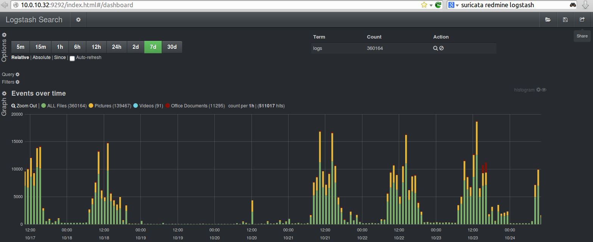
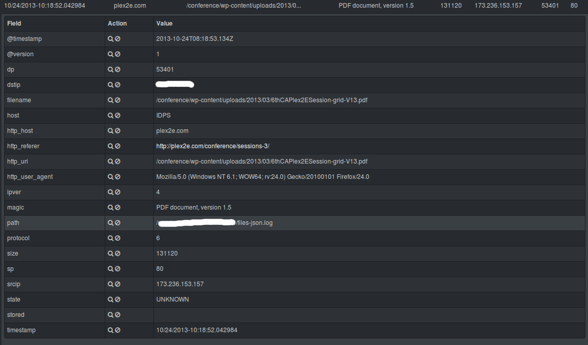

Logstash Kibana and Suricata JSON output
========================================

With the release of Suricata 2.0rc1 , Suricata introduces all JSON output capability. 
What is JSON - http://en.wikipedia.org/wiki/JSON

One way to handle easily Suricata's JSON log outputs is through Kibana - http://kibana.org/ :
> Kibana is a highly scalable interface for Logstash (http://logstash.net/) and ElasticSearch (http://www.elasticsearch.org/) that allows you to efficiently search, graph, analyze and otherwise make sense of a mountain of logs.
> 

The installation is very simple/basic start up with minor specifics for ubuntu. You can be up and running, looking through the logs in under 5 min.
The downloads can be found here - http://www.elasticsearch.org/overview/elkdownloads/

This is what yo need to do.

Suricata 
---------

Make sure your Suricata is compiled/installed with libjansson support enabled:
  
::

  
  $ suricata --build-info
  This is Suricata version 2.0 RELEASE
  Features: NFQ PCAP_SET_BUFF LIBPCAP_VERSION_MAJOR=1 AF_PACKET HAVE_PACKET_FANOUT LIBCAP_NG LIBNET1.1 HAVE_HTP_URI_NORMALIZE_HOOK HAVE_NSS HAVE_LIBJANSSON 
  ...
    libnss support:                          yes
    libnspr support:                         yes
    libjansson support:                     --> yes <--
    Prelude support:                         no
    PCRE jit:                                no
    libluajit:                               no
    libgeoip:                                yes
    Non-bundled htp:                         yes
    Old barnyard2 support:                   no
    CUDA enabled:                            no
  ...

If it isn't check out the [[Suricata_installation]] page to install or compile Suricata for your distribution. 
**NOTE:** you will need these packages installed -> **libjansson4** and *libjansson-dev* before compilation. 

Configure suricata
------------------

In your suricata.yaml
  
::

  
    # "United" event log in JSON format
    - eve-log:
        enabled: yes
        type: file #file|syslog|unix_dgram|unix_stream
        filename: eve.json
        # the following are valid when type: syslog above
        #identity: "suricata"
        #facility: local5
        #level: Info ## possible levels: Emergency, Alert, Critical,
                     ## Error, Warning, Notice, Info, Debug
        types:
          - alert
          - http:
              extended: yes     # enable this for extended logging information
          - dns
          - tls:
              extended: yes     # enable this for extended logging information
          - files:
              force-magic: yes   # force logging magic on all logged files
              force-md5: yes     # force logging of md5 checksums
          #- drop
          - ssh
          - smtp
          - flow

Install ELK (elasticsearch, logstash, kibana)
---------------------------------------------

First install the dependencies 
(
**NOTE:**
ELK recommends running with Oracle Java - how to -> 
http://www.elasticsearch.org/guide/en/elasticsearch/reference/current/setup-service.html#_installing_the_oracle_jdk
)

Otherwise you can install the openjdk:

  
::

  
  apt-get install apache2 openjdk-7-jdk openjdk-7-jre-headless

Then download and install the software.

Make sure you download the latest versions - 
http://www.elasticsearch.org/overview/elkdownloads/
The installation process is simple (for example):
  
::

  
  wget https://download.elasticsearch.org/kibana/kibana/kibana-3.0.0.tar.gz
  wget https://download.elasticsearch.org/elasticsearch/elasticsearch/elasticsearch-1.6.1.deb
  wget https://download.elastic.co/logstash/logstash/packages/debian/logstash_1.5.3-1_all.deb
  
  tar -C /var/www/ -xzf kibana-3.0.0.tar.gz
  dpkg -i elasticsearch-1.6.1.deb
  dpkg -i logstash_1.5.3-1_all.deb

Logstash configuration
----------------------

Create and save a *logstash.conf* file with the following content in the /etc/logstash/conf.d/ directory :
  
::

  
  touch /etc/logstash/conf.d/logstash.conf

Insert the following(make sure the directory path is correct):
  
::

  
  input {
    file { 
      path => ["/var/log/suricata/eve.json"]
      sincedb_path => ["/var/lib/logstash/"]
      codec =>   json 
      type => "SuricataIDPS" 
    }
  
  }
  
  filter {
    if [type] == "SuricataIDPS" {
      date {
        match => [ "timestamp", "ISO8601" ]
      }
      ruby {
        code => "if event['event_type'] == 'fileinfo'; event['fileinfo']['type']=event['fileinfo']['magic'].to_s.split(',')[0]; end;"
      }
    }
  
    if [src_ip]  {
      geoip {
        source => "src_ip" 
        target => "geoip" 
        #database => "/opt/logstash/vendor/geoip/GeoLiteCity.dat" 
        add_field => [ "[geoip][coordinates]", "%{[geoip][longitude]}" ]
        add_field => [ "[geoip][coordinates]", "%{[geoip][latitude]}"  ]
      }
      mutate {
        convert => [ "[geoip][coordinates]", "float" ]
      }
      if ![geoip.ip] {
        if [dest_ip]  {
          geoip {
            source => "dest_ip"
            target => "geoip"
            #database => "/opt/logstash/vendor/geoip/GeoLiteCity.dat"
            add_field => [ "[geoip][coordinates]", "%{[geoip][longitude]}" ]
            add_field => [ "[geoip][coordinates]", "%{[geoip][latitude]}"  ]
          }
          mutate {
            convert => [ "[geoip][coordinates]", "float" ]
          }
        }
      }
    }
  }
  
  output { 
    elasticsearch {
      host => localhost
      #protocol => http
    }
  }
  

Configure the start-up services
~~~~~~~~~~~~~~~~~~~~~~~~~~~~~~~

  
::

  
  update-rc.d elasticsearch defaults 95 10
  update-rc.d logstash defaults
  
  service apache2 restart
  service elasticsearch start
  service logstash start

Enjoy
-----

That's all. Now make sure Suricata is running and you have logs written in your JSON log files and you point your browser towards ->
  
::

  
  http://localhost/kibana-3.0.0

**NOTE:**
Some ready to use templates can be found here:

* https://github.com/pevma/Suricata-Logstash-Templates

From here on if you would like to customize and familiarize yourself more with the interface you should read the documentation about Kibana and Logstash.
Please have in mind that this is a very quick(under 5 min) tutorial. You should customize and review the proper way for you of using it as a service and/or consider using *httpS web interface and reversy proxy with some authentication*.

Some possible customization of the output of Logstash and Kibana - >

.. image:: logstash-kibana-and-suricata-json-output/Logstash2.png

.. image:: logstash-kibana-and-suricata-json-output/Logstash3.png

.. image:: logstash-kibana-and-suricata-json-output/Logstash4.png

.. image:: logstash-kibana-and-suricata-json-output/Logstash5.png

Peter Manev
