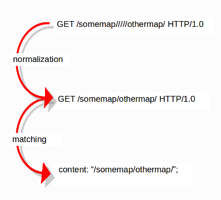

Normalized Buffers
==================

.. toctree::

   http-uri-normalization

A packet consists of raw data. HTTP and reassembly make a copy of
those kinds of packets data. They erase anomalous content, combine
packets etcetera. What remains is a called the 'normalized buffer'.

Example:

Because the data is being normalized, it is not what it used to be; it
is an interpretation.  Normalized buffers are: all HTTP-keywords,
reassembled streams, TLS-, SSL-, SSH-, FTP- and dcerpc-buffers.
