Suricata.yaml
=============

Suricata uses the Yaml format for configuration. The Suricata.yaml
file included in the source code, is the example configuration of
Suricata. This document will explain each option.

At the top of the YAML-file you will find % YAML 1.1.  Suricata reads
the file and identifies the file as YAML.

.. _suricata-yaml-max-pending-packets:

Max-pending-packets
-------------------

With the max-pending-packets setting you can set the number of packets
you allow Suricata to process simultaneously. This can range from one
packet to tens of thousands/hundreds of thousands of packets. It is a
trade of higher performance and the use of more memory (RAM), or lower
performance and less use of memory. A high number of packets being
processed results in a higher performance and the use of more
memory. A low number of packets, results in lower performance and less
use of memory. Choosing a low number of packets being processed while
having many CPU's/CPU cores, can result in not making use of the whole
computer-capacity. (For instance: using one core while having three
waiting for processing packets.)

::

  max-pending-packets: 1024

Runmodes
--------

By default the runmode option is disabled With the runmodes setting
you can set the runmode you would like to use. For all runmodes
available, enter **--list-runmodes** in your command line. For more
information, see :doc:`../performance/runmodes`.

::

  runmode: autofp

Default-packet-size
-------------------

For the max-pending-packets option, Suricata has to keep packets in
memory. With the default-packet-size option, you can set the size of
the packets on your network. It is possible that bigger packets have
to be processed sometimes. The engine can still process these bigger
packets, but processing it will lower the performance.

::

  default-packet-size: 1514

User and group
--------------

It is possible to set the user and group to run Suricata as:

::

  run-as:
    user: suri
    group: suri

PID File
--------

This option sets the name of the PID file when Suricata is run in
daemon mode. This file records the Suricata process ID.

::

   pid-file: /var/run/suricata.pid

.. note:: This configuration file option only sets the PID file when
          running in daemon mode. To force creation of a PID file when
          not running in daemon mode, use the :option:`--pidfile`
          command line option.

	  Also, if running more than one Suricata process, each
	  process will need to specify a different pid-file location.

.. _suricata-yaml-action-order:

Action-order
------------

All signatures have different properties. One of those is the Action
property. This one determines what will happen when a signature
matches. There are four types of Action. A summary of what will
happen when a signature matches and contains one of those Actions:

1) Pass

If a signature matches and contains pass, Suricata stops scanning the
packet and skips to the end of all rules (only for the current
packet).

2) Drop

This only concerns the IPS/inline mode. If the program finds a
signature that matches, containing drop, it stops immediately. The
packet will not be sent any further. Drawback: The receiver does not
receive a message of what is going on, resulting in a time-out
(certainly with TCP). Suricata generates an alert for this packet.

3) Reject

This is an active rejection of the packet. Both receiver and sender
receive a reject packet. There are two types of reject packets that
will be automatically selected. If the offending packet concerns TCP,
it will be a Reset-packet. For all other protocols it will be an
ICMP-error packet. Suricata also generates an alert. When in
Inline/IPS mode, the offending packet will also be dropped like with
the 'drop' action.

4) Alert

If a signature matches and contains alert, the packet will be treated
like any other non-threatening packet, except for this one an alert
will be generated by Suricata. Only the system administrator can
notice this alert.

Inline/IPS can block network traffic in two ways. One way is by drop
and the other by reject.

Rules will be loaded in the order of which they appear in files. But
they will be processed in a different order. Signatures have different
priorities. The most important signatures will be scanned first. There
is a possibility to change the order of priority. The default order
is: pass, drop, reject, alert.

::

  action-order:
   - pass
   - drop
   - reject
   - alert

This means a pass rule is considered before a drop rule, a drop rule
before a reject rule and so on.

Packet alert queue settings
---------------------------

It is possible to configure the size of the alerts queue that is used to append alerts triggered by each packet.

This will influence how many alerts would be perceived to have matched against a given packet.
The default value is 15. If an invalid setting or no value is provided, the engine will fall
back to the default.

::

    #Define maximum number of possible alerts that can be triggered for the same
    # packet. Default is 15
    packet-alert-max: 15

We recommend that you use the default value for this setting unless you are seeing a high number of discarded alerts
(``alert_queue_overflow``) - see the `Discarded and Suppressed Alerts Stats`_ section for more details.

Impact on engine behavior
~~~~~~~~~~~~~~~~~~~~~~~~~

Internally, the Suricata engine represents each packet with a data structure that has its own alert queue. The max size
of the queue is defined by ``packet-alert-max``. The same rule can be triggered by the same packet multiple times. As
long as there is still space in the alert queue, those are appended.

Rules that have the ``noalert`` keyword will be checked - in case their signatures have actions that must be applied to the Packet or Flow, then suppressed. They have no effect in the final alert queue.

Rules are queued by priority: higher priority rules may be kept instead of lower priority ones that may have been triggered earlier, if Suricata reaches ``packet-alert-max`` for a given packet (a.k.a. packet alert queue overflow).

Packet alert queue overflow
^^^^^^^^^^^^^^^^^^^^^^^^^^^

Once the alert queue reaches its max size, we are potentially at packet alert queue overflow, so new alerts will only be appended in case their rules have a higher priority id (this is the internal id attributed by the engine, not the signature id).

This may happen in two different situations:

- a higher priority rule is triggered after a lower priority one: the lower priority rule is replaced in the queue;
- a lower priority rule is triggered: the rule is just discarded.

.. note ::

    This behavior does not mean that triggered ``drop`` rules would have their action ignored, in IPS mode.

.. _alerts stats:

Discarded and Suppressed Alerts Stats
~~~~~~~~~~~~~~~~~~~~~~~~~~~~~~~~~~~~~

Both scenarios previously described will be logged as *detect.alert_queue_overflow* in the stats logs (in stats.log and eve-log's stats event).

When ``noalert`` rules match, they appear in the stats logs as *detect.alerts_suppressed*.

::

    Date: 4/6/2022 -- 17:18:08 (uptime: 0d, 00h 00m 00s)
    ------------------------------------------------------------------------------------
    Counter                                       | TM Name                   | Value
    ------------------------------------------------------------------------------------
    detect.alert                                  | Total                     | 3
    detect.alert_queue_overflow                   | Total                     | 4
    detect.alerts_suppressed                      | Total                     | 1

In this example from a stats.log, we read that 8 alerts were generated: 3 were kept in the packet queue while 4
were discarded due to packets having reached max size for the alert queue, and 1 was suppressed due to coming from a ``noalert``
rule.

Splitting configuration in multiple files
-----------------------------------------

Some users might have a need or a wish to split their suricata.yaml
file in to separate files, this is available via the 'include' and
'!include' keyword. The first example is of taking the contents of the
outputs section and storing them in outputs.yaml.

::

  # outputs.yaml
  - fast
      enabled: yes
      filename: fast.log
      append: yes

  ...

::

  # suricata.yaml
  ...

  outputs: !include outputs.yaml

  ...

The second scenario is where multiple sections are migrated to a
different YAML file.

::

  # host_1.yaml

  max-pending-packets: 2048

  outputs:
      - fast
          enabled: yes
          filename: fast.log
          append: yes

::

  # suricata.yaml

  include: host_1.yaml

  ...

If the same section, say outputs is later redefined after the include
statement it will overwrite the included file. Therefore any include
statement at the end of the document will overwrite the already
configured sections.

Event output
------------

Default logging directory
~~~~~~~~~~~~~~~~~~~~~~~~~

In the /var/log/suricata directory, all of Suricata's output (alerts
and events) will be stored.

::

  default-log-dir: /var/log/suricata

This directory can be overridden by entering the -l command line
parameter or by changing the directory directly in Yaml. To change it
with the -l command line parameter, enter the following:

::

  suricata -c suricata.yaml -i eth0 -l /var/log/suricata-logs/

.. _suricata_yaml_outputs:

Stats
~~~~~

Engine statistics such as packet counters, memory use counters and others
can be logged in several ways. A separate text log 'stats.log' and an EVE
record type 'stats' are enabled by default.

The stats have a global configuration and a per logger configuration. Here
the global config is documented.

::

    # global stats configuration
    stats:
      enabled: yes
      # The interval field (in seconds) controls at what interval
      # the loggers are invoked.
      interval: 8
      # Add decode events as stats.
      #decoder-events: true
      # Decoder event prefix in stats. Has been 'decoder' before, but that leads
      # to missing events in the eve.stats records. See issue #2225.
      #decoder-events-prefix: "decoder.event"
      # Add stream events as stats.
      #stream-events: false

Statistics can be `enabled` or disabled here.

Statistics are dumped on an `interval`. Setting this below 3 or 4 seconds is
not useful due to how threads are synchronized internally.

The decoder events that the decoding layer generates, can create a counter per
event type. This behaviour is enabled by default. The `decoder-events` option
can be set to `false` to disable.

In 4.1.x there was a naming clash between the regular decoder counters and
the decoder-event counters. This lead to a fair amount of decoder-event
counters not being shown in the EVE.stats records. To address this without
breaking existing setups, a config option `decoder-events-prefix` was added
to change the naming of the decoder-events from decoder.<proto>.<event> to
decoder.event.<proto>.<event>. In 5.0 this became the default.
See `issue 2225 <https://redmine.openinfosecfoundation.org/issues/2225>`_.

Similar to the `decoder-events` option, the `stream-events` option controls
whether the stream-events are added as counters as well. This is disabled by
default.

Outputs
~~~~~~~

There are several types of output. The general structure is:

::

  outputs:
    - fast:
      enabled: yes
      filename: fast.log
      append: yes/no

Enabling all of the logs, will result in a much lower performance and
the use of more disc space, so enable only the outputs you need.

Line based alerts log (fast.log)
~~~~~~~~~~~~~~~~~~~~~~~~~~~~~~~~

This log contains alerts consisting of a single line. Example of the
appearance of a single fast.log-file line:

::

  10/05/10-10:08:59.667372  [**] [1:2009187:4] ET WEB_CLIENT ACTIVEX iDefense
    COMRaider ActiveX Control Arbitrary File Deletion [**] [Classification: Web
    Application Attack] [Priority: 3] {TCP} xx.xx.232.144:80 -> 192.168.1.4:56068

::

  -fast:                    #The log-name.
     enabled:yes            #This log is enabled. Set to 'no' to disable.
     filename: fast.log     #The name of the file in the default logging directory.
     append: yes/no         #If this option is set to yes, the last filled fast.log-file will not be
                            #overwritten while restarting Suricata.

.. _suricata-yaml-outputs-eve:

Eve (Extensible Event Format)
~~~~~~~~~~~~~~~~~~~~~~~~~~~~~

This is an JSON output for alerts and events. It allows for easy
integration with 3rd party tools like logstash.

.. literalinclude:: ../partials/eve-log.yaml

For more advanced configuration options, see :ref:`Eve JSON Output <eve-json-output>`.

The format is documented in :ref:`Eve JSON Format <eve-json-format>`.

TLS parameters and certificates logging (tls.log)
~~~~~~~~~~~~~~~~~~~~~~~~~~~~~~~~~~~~~~~~~~~~~~~~~

The TLS handshake parameters can be logged in a line based log as well.
By default, the logfile is `tls.log` in the suricata log directory.
See :ref:`Custom TLS logging <output-custom-tls-logging>` for details
about the configuration and customization of the log format.

Furthermore there is an output module to store TLS certificate files to
disk. This is similar to :ref:`File-store (File Extraction)
<suricata-yaml-file-store>`, but for TLS certificates.

Example:

::

  # output module to store certificates chain to disk
  - tls-store:
      enabled: yes
      #certs-log-dir: certs # directory to store the certificates files

A line based log of HTTP requests (http.log)
~~~~~~~~~~~~~~~~~~~~~~~~~~~~~~~~~~~~~~~~~~~~

This log keeps track of all HTTP-traffic events. It contains the HTTP
request, hostname, URI and the User-Agent. This information will be
stored in the http.log (default name, in the suricata log
directory). This logging can also be performed through the use of the
:ref:`Eve-log capability <eve-json-format>`.

Example of a HTTP-log line with non-extended logging:

::

  07/01/2014-04:20:14.338309 vg.no [**] / [**] Mozilla/5.0 (Macintosh; Intel Mac OS X 10_9_2)
  AppleWebKit/537.36 (KHTML, like Gecko) Chrome/35.0.1916.114 Safari/537.36 [**]
  192.168.1.6:64685 -> 195.88.54.16:80

Example of a HTTP-log line with extended logging:

::

  07/01/2014-04:21:06.994705 vg.no [**] / [**] Mozilla/5.0 (Macintosh; Intel Mac OS X 10_9_2)
  AppleWebKit/537.36 (KHTML, like Gecko) Chrome/35.0.1916.114 Safari/537.36 [**] <no referer> [**]
  GET [**] HTTP/1.1 [**] 301 => http://www.vg.no/ [**] 239 bytes [**] 192.168.1.6:64726 -> 195.88.54.16:80

::

  - http-log:                     #The log-name.
      enabled: yes                #This log is enabled. Set 'no' to disable.
      filename: http.log          #The name of the file in the default logging directory.
      append: yes/no              #If this option is set to yes, the last filled http.log-file will not be
                                  # overwritten while restarting Suricata.
      extended: yes               # If set to yes more information is written about the event.

.. _suricata_yaml_pcap_log:

Packet log (pcap-log)
~~~~~~~~~~~~~~~~~~~~~

With the pcap-log option you can save all packets, that are registered
by Suricata, in a log file named _log.pcap_. This way, you can take a
look at all packets whenever you want.  In the normal mode a pcap file
is created in the default-log-dir. It can also be created elsewhere if
a absolute path is set in the yaml-file.

The file that is saved in example the default -log-dir
/var/log/suricata, can be be opened with every program which supports
the pcap file format. This can be Wireshark, TCPdump, Suricata, Snort
and many others.

The pcap-log option can be enabled and disabled.

There is a size limit for the pcap-log file that can be set. The
default limit is 32 MB. If the log-file reaches this limit, the file
will be rotated and a new one will be created. The pcap-log option
has an extra functionality for "Sguil":http://sguil.sourceforge.net/
that can be enabled in the 'mode' option. In the sguil mode the
"sguil_base_dir" indicates the base directory. In this base dir the
pcaps are created in a Sguil-specific directory structure that is
based on the day:

::

  $sguil_base_dir/YYYY-MM-DD/$filename.<timestamp>

If you would like to use Suricata with Sguil, do not forget to enable
(and if necessary modify) the base dir in the suricata.yaml file.
Remember that in the 'normal' mode, the file will be saved in
default-log-dir or in the absolute path (if set).

The pcap files can be compressed before being written to disk by setting
the compression option to lz4. This option is incompatible with sguil
mode. Note: On Windows, this option increases disk I/O instead of
reducing it. When using lz4 compression, you can enable checksums using
the lz4-checksum option, and you can set the compression level lz4-level
to a value between 0 and 16, where higher levels result in higher
compression.

By default all packets are logged except:

- TCP streams beyond stream.reassembly.depth
- encrypted streams after the key exchange

It is possible to do conditional pcap logging by using the `conditional`
option in the pcap-log section. By default the variable is set to `all`
so all packets are logged. If the variable is set to `alerts` then only
the flow with alerts will be logged. If the variable is set to `tag`
then only packets tagged by signatures using the `tag` keyword will
be logged to the pcap file. Please note that if `alerts` or `tag` is
used, then in the case of TCP session, Suricata will use available
information from the streaming engine to log data that have triggered
the alert.

::

  - pcap-log:
      enabled:  yes
      filename: log.pcap

      # Limit in MB.
      limit: 32

      mode: sguil # "normal" (default) or sguil.
      sguil_base_dir: /nsm_data/
      conditional: alerts

Verbose Alerts Log (alert-debug.log)
~~~~~~~~~~~~~~~~~~~~~~~~~~~~~~~~~~~~

This is a log type that gives supplementary information about an
alert. It is particularly convenient for people who investigate false
positives and who write signatures. However, it lowers the performance
because of the amount of information it has to store.

::

  - alert-debug:                  #The log-name.
      enabled: no                 #This log is not enabled. Set 'yes' to enable.
      filename: alert-debug.log   #The name of the file in the default logging directory.
      append: yes/no              #If this option is set to yes, the last filled fast.log-file will not be
                                  # overwritten while restarting Suricata.

Stats
~~~~~

In stats you can set the options for stats.log.  When enabling
stats.log you can set the amount of time in seconds after which you
want the output-data to be written to the log file.

::

  - stats:
       enabled: yes               #By default, the stats-option is enabled
       filename: stats.log        #The log-name. Combined with the default logging directory
                                  #(default-log-dir) it will result in /var/log/suricata/stats.log.
                                  #This directory can be overruled with a absolute path. (A
                                  #directory starting with / ).
       append: yes/no             #If this option is set to yes, the last filled fast.log-file will not be
                                  #overwritten while restarting Suricata.

The interval and several other options depend on the global stats
section as described above.

Syslog
~~~~~~

With this option it is possible to send all alert and event output to syslog.

::

  - syslog:                       #This is a output-module to direct log-output to several directions.
       enabled: no                #The use of this output-module is not enabled.
       facility: local5           #In this option you can set a syslog facility.
       level: Info                #In this option you can set the level of output. The possible levels are:
                                  #Emergency, Alert, Critical, Error, Warning, Notice, Info and Debug.

.. _suricata-yaml-file-store:

File-store (File Extraction)
~~~~~~~~~~~~~~~~~~~~~~~~~~~~

The `file-store` output enables storing of extracted files to disk and
configures where they are stored.

The following shows the configuration options for version 2 of the
`file-store` output.

.. code-block:: yaml

  - file-store:
      # This configures version 2 of the file-store.
      version: 2

      enabled: no

      # Set the directory for the filestore. If the path is not
      # absolute will be be relative to the default-log-dir.
      #dir: filestore

      # Write out a fileinfo record for each occurrence of a
      # file. Disabled by default as each occurrence is already logged
      # as a fileinfo record to the main eve-log.
      #write-fileinfo: yes

      # Force storing of all files. Default: no.
      #force-filestore: yes

      # Override the global stream-depth for sessions in which we want
      # to perform file extraction. Set to 0 for unlimited; otherwise,
      # must be greater than the global stream-depth value to be used.
      #stream-depth: 0

      # Uncomment the following variable to define how many files can
      # remain open for filestore by Suricata. Default value is 0 which
      # means files get closed after each write
      #max-open-files: 1000

      # Force logging of checksums, available hash functions are md5,
      # sha1 and sha256. Note that SHA256 is automatically forced by
      # the use of this output module as it uses the SHA256 as the
      # file naming scheme.
      #force-hash: [sha1, md5]

Detection engine
----------------

Inspection configuration
~~~~~~~~~~~~~~~~~~~~~~~~

The detection-engine builds internal groups of signatures. Suricata loads signatures, with which the network traffic will be compared. The fact is, that many rules certainly will not be necessary. (For instance: if there appears a packet with the UDP-protocol, all signatures for the TCP-protocol won't be needed.) For that reason, all signatures will be divided in groups. However, a distribution containing many groups will make use of a lot of memory. Not every type of signature gets its own group. There is a possibility that different signatures with several properties in common, will be placed together in a group. The quantity of groups will determine the balance between memory and performance. A small amount of groups will lower the performance yet uses little memory. The opposite counts for a higher amount of groups. The engine allows you to manage the balance between memory and performance. To manage this, (by determining the amount of groups) there are several general options: high for good performance and more use of memory, low for low performance and little use of memory. The option medium is the balance between performance and memory usage. This is the default setting. The option custom is for advanced users. This option has values which can be managed by the user.

::

  detect:
    profile: medium
    custom-values:
      toclient-groups: 2
      toserver-groups: 25
    sgh-mpm-context: auto
    inspection-recursion-limit: 3000

At all of these options, you can add (or change) a value. Most
signatures have the adjustment to focus on one direction, meaning
focusing exclusively on the server, or exclusively on the client.

If you take a look at example 4, *the Detection-engine grouping tree*,
you see it has many branches. At the end of each branch, there is
actually a 'sig group head'. Within that sig group head there is a
container which contains a list with signatures that are significant
for that specific group/that specific end of the branch. Also within
the sig group head the settings for Multi-Pattern-Matcher (MPM) can be
found: the MPM-context.

As will be described again at the part 'Pattern matching settings',
there are several MPM-algorithms of which can be chosen from. Because
every sig group head has its own MPM-context, some algorithms use a
lot of memory. For that reason there is the option sgh-mpm-context to
set whether the groups share one MPM-context, or to set that every
group has its own MPM-context.

For setting the option sgh-mpm-context, you can choose from auto, full
or single. The default setting is 'auto', meaning Suricata selects
full or single based on the algorithm you use. 'Full' means that every
group has its own MPM-context, and 'single' that all groups share one
MPM-context. The two algorithms ac and ac-gfbs are new in 1.03. These
algorithms use a single MPM-context if the Sgh-MPM-context setting is
'auto'. The rest of the algorithms use full in that case.

The inspection-recursion-limit option has to mitigate that possible
bugs in Suricata cause big problems. Often Suricata has to deal with
complicated issues. It could end up in an 'endless loop' due to a bug,
meaning it will repeat its actions over and over again. With the
option inspection-recursion-limit you can limit this action.

*Example 4	Detection-engine grouping tree*

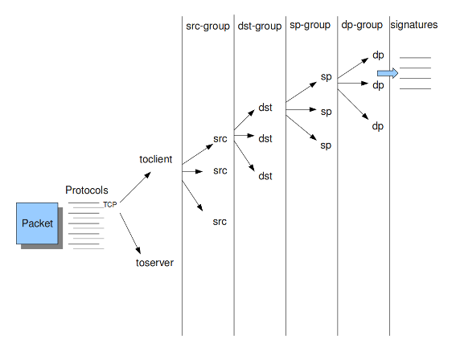

::

  src             Stands for source IP-address.
  dst             Stands for destination IP-address.
  sp              Stands for source port.
  dp              Stands for destination port.

*Example 5       Detail grouping tree*

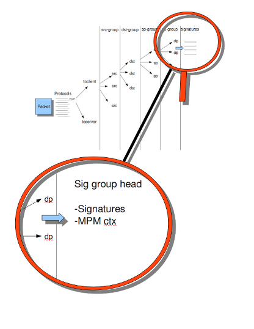

.. _suricata-yaml-prefilter:

Prefilter Engines
~~~~~~~~~~~~~~~~~

The concept of prefiltering is that there are far too many rules to inspect individually. The approach prefilter takes is that from each rule one condition is added to prefilter, which is then checked in one step. The most common example is MPM (also known as fast_pattern). This takes a single pattern per rule and adds it to the MPM. Only for those rules that have at least one pattern match in the MPM stage, individual inspection is performed.

Next to MPM, other types of keywords support prefiltering. ICMP itype, icode, icmp_seq and icmp_id for example. TCP window, IP TTL are other examples.

For a full list of keywords that support prefilter, see:

::

  suricata --list-keywords=all

Suricata can automatically select prefilter options, or it can be set manually.

::

  detect:
    prefilter:
      default: mpm

By default, only MPM/fast_pattern is used.

The prefilter engines for other non-MPM keywords can then be enabled in specific rules by using the 'prefilter' keyword.

E.g.

::

  alert ip any any -> any any (ttl:123; prefilter; sid:1;)

To let Suricata make these decisions set default to 'auto':

::

  detect:
    prefilter:
      default: auto

Pattern matcher settings
~~~~~~~~~~~~~~~~~~~~~~~~

The multi-pattern-matcher (MPM) is a part of the detection engine
within Suricata that searches for multiple patterns at
once. Often, signatures have one or more patterns. Of each
signature, one pattern is used by the multi-pattern-matcher. That way
Suricata can exclude many signatures from being examined, because a
signature can only match when all its patterns match.

These are the proceedings:

1) A packet comes in.
2) The packed will be analyzed by the Multi-pattern-matcher in search of patterns that match.
3) All patterns that match, will be further processed by Suricata (signatures).

*Example 8	Multi-pattern-matcher*

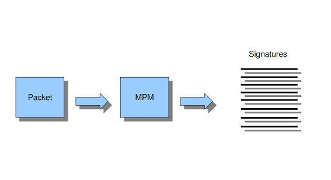

Suricata offers various implementations of different
multi-pattern-matcher algorithm's. These can be found below.

To set the multi-pattern-matcher algorithm:

::

    mpm-algo: ac

After 'mpm-algo', you can enter one of the following algorithms: ac, hs and ac-ks.

On `x86_64` hs (Hyperscan) should be used for best performance.

Threading
---------

Suricata is multi-threaded. Suricata uses multiple CPUs/CPU cores so
it can process a lot of network packets simultaneously. (In a
single-core engine, the packets will be processed one at a time.)

There are four thread-modules: Packet acquisition, decode and stream
application layer, detection, and outputs.

# The packet acquisition module reads packets from the network.

# The decode module decodes the packets and the stream application
application layer has three tasks:

::

      First: it performs stream-tracking, meaning it is making sure all steps will be taken to make a correct network-connection.
      Second: TCP-network traffic comes in as packets. The Stream-Assembly engine reconstructs the original stream.
      Finally: the application layer will be inspected. HTTP and DCERPC will be analyzed.

# The detection threads will compare signatures. There can be several detection threads so they can operate simultaneously.

# In Outputs all alerts and events will be processed.

*Example 6	Threading*

.. image:: suricata-yaml/threading.png

::

  Packet acquisition:             Reads packets from the network
  Decode:                         Decodes packets.
  Stream app. Layer:              Performs stream-tracking and reassembly.
  Detect:                         Compares signatures.
  Outputs:                        Processes all events and alerts.

Most computers have multiple CPU's/ CPU cores. By default the
operating system determines which core works on which thread. When a
core is already occupied, another one will be designated to work on
the thread. So, which core works on which thread, can differ from time
to time.

There is an option within threading:

::

  set-cpu-affinity: no

With this option you can cause Suricata setting fixed cores for every
thread. In that case 1, 2 and 4 are at core 0 (zero). Each core has
its own detect thread. The detect thread running on core 0 has a lower
priority than the other threads running on core 0. If these other
cores are to occupied, the detect thread on core 0 has not much
packets to process. The detect threads running on other cores will
process more packets. This is only the case after setting the option
to 'yes'.

*Example 7	Balancing workload*

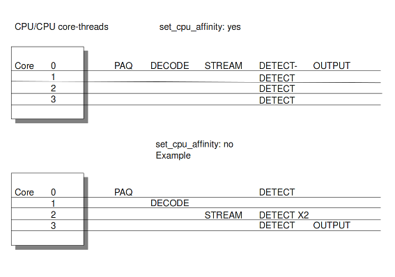

You can set the detect-thread-ratio:

::

  detect-thread-ratio: 1.5

The detect thread-ratio will determine the amount of detect
threads. By default it will be 1.5 x the amount of CPU's/CPU cores
present at your computer. This will result in having more detection
threads then CPU's/ CPU cores. Meaning you are oversubscribing the
amount of cores. This may be convenient at times when there have to be
waited for a detection thread. The remaining detection thread can
become active.

You can alter the per-thread stack-size if the default provided by
your build system is too small. The default value is provided by
your build system; we suggest setting the value to 8MB if the default
value is too small.

::

  stack-size: 8MB

In the option 'cpu affinity' you can set which CPU's/cores work on which
thread. In this option there are several sets of threads. The management-,
receive-, worker- and verdict-set. These are fixed names and can not be
changed. For each set there are several options: cpu, mode, and prio. In the
option 'cpu' you can set the numbers of the CPU's/cores which will run the
threads from that set. You can set this option to 'all', use a range (0-3) or a
comma separated list (0,1).  The option 'mode' can be set to 'balanced' or
'exclusive'. When set to 'balanced', the individual threads can be processed by
all cores set in the option 'cpu'. If the option 'mode' is set to 'exclusive',
there will be fixed cores for each thread. As mentioned before, threads can
have different priority's. In the option 'prio' you can set a priority for each
thread. This priority can be low, medium, high or you can set the priority to
'default'. If you do not set a priority for a CPU, than the settings in
'default' will count. By default Suricata creates one 'detect' (worker) thread
per available CPU/CPU core.

::

    cpu-affinity:
      - management-cpu-set:
          cpu: [ 0 ]  # include only these cpus in affinity settings
      - receive-cpu-set:
          cpu: [ 0 ]  # include only these cpus in affinity settings
      - worker-cpu-set:
          cpu: [ "all" ]
          mode: "exclusive"
          # Use explicitely 3 threads and don't compute number by using
          # detect-thread-ratio variable:
          # threads: 3
          prio:
            low: [ 0 ]
            medium: [ "1-2" ]
            high: [ 3 ]
            default: "medium"
      - verdict-cpu-set:
          cpu: [ 0 ]
          prio:
            default: "high"

Relevant cpu-affinity settings for IDS/IPS modes
~~~~~~~~~~~~~~~~~~~~~~~~~~~~~~~~~~~~~~~~~~~~~~~~

IDS mode
~~~~~~~~

Runmode AutoFp::

	management-cpu-set - used for management (example - flow.managers, flow.recyclers)
	receive-cpu-set - used for receive and decode
	worker-cpu-set - used for streamtcp,detect,output(logging),reject

Rumode Workers::

	management-cpu-set - used for management (example - flow.managers, flow.recyclers)
	worker-cpu-set - used for receive,streamtcp,decode,detect,output(logging),respond/reject

IPS mode
~~~~~~~~

Runmode AutoFp::

	management-cpu-set - used for management (example - flow.managers, flow.recyclers)
	receive-cpu-set - used for receive and decode
	worker-cpu-set - used for streamtcp,detect,output(logging)
	verdict-cpu-set - used for verdict and respond/reject

Runmode Workers::

	management-cpu-set - used for management (example - flow.managers, flow.recyclers)
	worker-cpu-set - used for receive,streamtcp,decode,detect,output(logging),respond/reject, verdict

IP Defrag
---------

Occasionally network packets appear fragmented. On some networks it
occurs more often than on others. Fragmented packets exist of many
parts. Before Suricata is able to inspect these kind of packets
accurately, the packets have to be reconstructed. This will be done by
a component of Suricata; the defragment-engine. After a fragmented
packet is reconstructed by the defragment-engine, the engine sends on
the reassembled packet to rest of Suricata.

There are three options within defrag: max-frags, prealloc and
timeout. At the moment Suricata receives a fragment of a packet, it
keeps in memory that other fragments of that packet will appear soon
to complete the packet. However, there is a possibility that one of
the fragments does not appear. To prevent Suricata for keeping waiting
for that packet (thereby using memory) there is a timespan after which
Suricata discards the fragments. This occurs by default after 60
seconds.

::

  defrag:
    max-frags: 65535
    prealloc: yes
    timeout: 60

Flow and Stream handling
------------------------

.. _suricata-yaml-flow-settings:

Flow Settings
~~~~~~~~~~~~~

Within Suricata, Flows are very important. They play a big part in the
way Suricata organizes data internally. A flow is a bit similar to a
connection, except a flow is more general. All packets having the same
Tuple (protocol, source IP, destination IP, source-port,
destination-port), belong to the same flow. Packets belonging to a
flow are connected to it internally.

*Example 9	Flow*

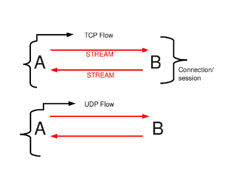

*Example 10	Tuple*

.. image:: suricata-yaml/Tuple1.png

Keeping track of all these flows, uses memory. The more flows, the
more memory it will cost.

To keep control over memory usage, there are several options:

The option memcap for setting the maximum amount of bytes the
flow-engine will use, hash-size for setting the size of the hash-table
and prealloc for the following:

	For packets not yet belonging to a flow, Suricata creates a
	new flow. This is a relative expensive action. The risk coming
	with it, is that attackers /hackers can a attack the engine
	system at this part. When they make sure a computer gets a lot
	of packets with different tuples, the engine has to make a lot
	of new flows. This way, an attacker could flood the system. To
	mitigate the engine from being overloaded, this option
	instructs Suricata to keep a number of flows ready in
	memory. This way Suricata is less vulnerable to these kind of
	attacks.

The flow-engine has a management thread that operates independent from
the packet processing. This thread is called the flow-manager. This
thread ensures that wherever possible and within the memcap. there
will be 10000 flows prepared.

::

  flow:
    memcap: 33554432              #The maximum amount of bytes the flow-engine will make use of.
    hash_size: 65536              #Flows will be organized in a hash-table. With this option you can set the
                                  #size of the hash-table.
    Prealloc: 10000               #The amount of flows Suricata has to keep ready in memory.

At the point the memcap will still be reached, despite prealloc, the
flow-engine goes into the emergency-mode. In this mode, the engine
will make use of shorter time-outs. It lets flows expire in a more
aggressive manner so there will be more space for new Flows.

There are two options: emergency_recovery and prune_flows. The
emergency recovery is set on 30. This is the percentage of prealloc'd
flows after which the flow-engine will be back to normal (when 30
percent of the 10000 flows is completed).

	If during the emergency-mode, the aggressive time-outs do not
	have the desired result, this option is the final resort. It
	ends some flows even if they have not reached their time-outs
	yet. The prune-flows option shows how many flows there will be
	terminated at each time a new flow is set up.

::

  emergency_recovery: 30                  #Percentage of 1000 prealloc'd flows.
  prune_flows: 5                          #Amount of flows being terminated during the emergency mode.

Flow Time-Outs
~~~~~~~~~~~~~~

The amount of time Suricata keeps a flow in memory is determined by
the Flow time-out.

There are different states in which a flow can be. Suricata
distinguishes three flow-states for TCP and two for UDP. For TCP,
these are: New, Established and Closed,for UDP only new and
established. For each of these states Suricata can employ different
timeouts.

The state new in a TCP-flow, means the period during the three way
handshake. The state established is the state when the three way
handshake is completed. The state closed in the TCP-flow: there a
several ways to end a flow. This is by means of Reset or the Four-way
FIN handshake.

New in a UDP-flow: the state in which packets are send from only one
direction.

Established in a UDP-flow: packets are send from both directions.

In the example configuration the are settings for each protocol. TCP,
UDP, ICMP and default (all other protocols).

::

  flow-timeouts:

    default:
      new: 30                     #Time-out in seconds after the last activity in this flow in a New state.
      established: 300            #Time-out in seconds after the last activity in this flow in a Established
                                  #state.
      emergency_new: 10           #Time-out in seconds after the last activity in this flow in a New state
                                  #during the emergency mode.
      emergency_established: 100  #Time-out in seconds after the last activity in this flow in a Established
                                  #state in the emergency mode.
    tcp:
      new: 60
      established: 3600
      closed: 120
      emergency_new: 10
      emergency_established: 300
      emergency_closed: 20
    udp:
      new: 30
      established: 300
      emergency_new: 10
      emergency_established: 100
    icmp:
      new: 30
      established: 300
      emergency_new: 10
      emergency_established: 100

Stream-engine
~~~~~~~~~~~~~

The Stream-engine keeps track of the TCP-connections. The engine
exists of two parts: The stream tracking- and the reassembly-engine.

The stream-tracking engine monitors the state of a connection. The
reassembly-engine reconstructs the flow as it used to be, so it will
be recognized by Suricata.

The stream-engine has two memcaps that can be set. One for the
stream-tracking-engine and one for the reassembly-engine.

The stream-tracking-engine keeps information of the flow in
memory. Information about the state, TCP-sequence-numbers and the TCP
window. For keeping this information, it can make use of the capacity
the memcap allows.

TCP packets have a so-called checksum. This is an internal code which
makes it possible to see if a packet has arrived in a good state. The
stream-engine will not process packets with a wrong checksum. This
option can be set off by entering 'no' instead of 'yes'.

::

  stream:
    memcap: 64mb                # Max memory usage (in bytes) for TCP session tracking
    checksum_validation: yes    # Validate packet checksum, reject packets with invalid checksums.

To mitigate Suricata from being overloaded by fast session creation,
the option prealloc_sessions instructs Suricata to keep a number of
sessions ready in memory.

A TCP-session starts with the three-way-handshake. After that, data
can be sent and received. A session can last a long time. It can happen
that Suricata will be started after a few TCP sessions have already been
started. This way, Suricata misses the original setup of those
sessions. This setup always includes a lot of information. If you want
Suricata to check the stream from that time on, you can do so by
setting the option 'midstream' to 'true'. The default setting is
'false'. Normally Suricata is able to see all packets of a
connection. Some networks make it more complicated though. Some of the
network-traffic follows a different route than the other part, in
other words: the traffic goes asynchronous. To make sure Suricata will
check the one part it does see, instead of getting confused, the
option 'async-oneside' is brought to life. By default the option is
set to 'false'.

Suricata inspects content in the normal/IDS mode in chunks. In the
inline/IPS mode it does that on the sliding window way (see example
..) In the case Suricata is set in inline mode, it has to inspect
packets immediately before sending it to the receiver. This way
Suricata is able to drop a packet directly if needed.(see example …)
It is important for Suricata to note which operating system it is
dealing with, because operating systems differ in the way they process
anomalies in streams. See :ref:`host-os-policy`.

::

    prealloc_sessions: 32768     # 32k sessions prealloc'd
    midstream: false             # do not allow midstream session pickups
    async_oneside: false         # do not enable async stream handling
    inline: no                   # stream inline mode
    drop-invalid: yes            # drop invalid packets
    bypass: no

The ``drop-invalid`` option can be set to no to avoid blocking packets that are
seen invalid by the streaming engine. This can be useful to cover some weird cases
seen in some layer 2 IPS setup.

The ``bypass`` option activates 'bypass' for a flow/session when either side
of the session reaches its ``depth``.

.. warning:: ``bypass`` can lead to missing important traffic. Use with care.

**Example 11   Normal/IDS mode**

Suricata inspects traffic in chunks.

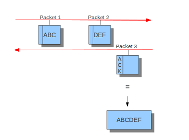

**Example 12     Inline/IPS Sliding Window**

Suricata inspects traffic in a sliding window manner.

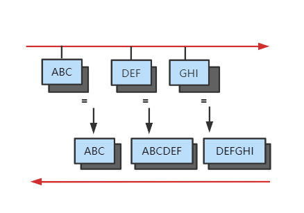

**Example 13     Normal/IDS (reasembly on ACK'D data)**

.. image:: suricata-yaml/Normal_ids_ack_d.png

**Example 14 Inline/IPS (reassembly on UNACK'D data)**

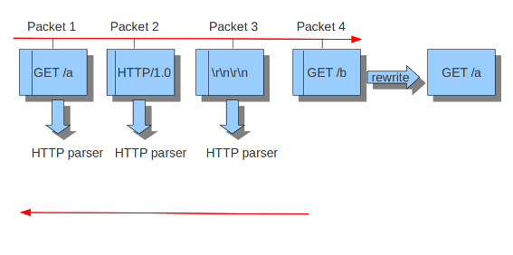

The reassembly-engine has to keep data segments in memory in order to
be able to reconstruct a stream. To avoid resource starvation a memcap
is used to limit the memory used.

Reassembling a stream is an expensive operation. With the option depth
you can control how far into a stream reassembly is done. By default
this is 1MB. This setting can be overridden per stream by the protocol
parsers that do file extraction.

Inspection of reassembled data is done in chunks. The size of these
chunks is set with ``toserver_chunk_size`` and ``toclient_chunk_size``.
To avoid making the borders predictable, the sizes can be varied by
adding in a random factor.

::

    reassembly:
      memcap: 256mb             # Memory reserved for stream data reconstruction (in bytes)
      depth: 1mb                # The depth of the reassembling.
      toserver_chunk_size: 2560 # inspect raw stream in chunks of at least this size
      toclient_chunk_size: 2560 # inspect raw stream in chunks of at least
      randomize-chunk-size: yes
      #randomize-chunk-range: 10

'Raw' reassembly is done for inspection by simple ``content``, ``pcre``
keywords use and other payload inspection not done on specific protocol
buffers like ``http_uri``. This type of reassembly can be turned off:

::

    reassembly:
      raw: no

Incoming segments are stored in a list in the stream. To avoid constant
memory allocations a per-thread pool is used.

::

    reassembly:
      segment-prealloc: 2048    # pre-alloc 2k segments per thread

Resending different data on the same sequence number is a way to confuse
network inspection.

::

    reassembly:
      check-overlap-different-data: true

*Example 15        Stream reassembly*

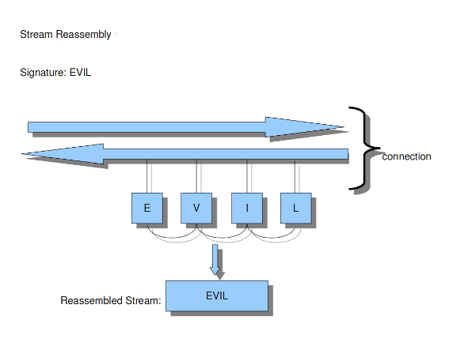

.. image:: suricata-yaml/IDS_chunk_size.png

Application Layer Parsers
-------------------------

Asn1_max_frames (new in 1.0.3 and 1.1)
~~~~~~~~~~~~~~~~~~~~~~~~~~~~~~~~~~~~~~

Asn1 (`Abstract Syntax One
<http://en.wikipedia.org/wiki/Abstract_Syntax_Notation_One>`_) is a
standard notation to structure and describe data.

Within Asn1_max_frames there are several frames. To protect itself,
Suricata will inspect a maximum of 256. You can set this amount
differently if wanted.

Application layer protocols such as X.400 electronic mail, X.500 and
LDAP directory services, H.323 (VoIP), BACnet and SNMP, use ASN.1 to
describe the protocol data units (PDUs) they exchange. It is also
extensively used in the Access and Non-Access Strata of UMTS.

Limit for the maximum number of asn1 frames to decode (default 256):

::

   asn1_max_frames: 256

.. _suricata-yaml-configure-ftp:

FTP
~~~

The FTP application layer parser is enabled by default and uses dynamic protocol
detection.

By default, FTP control channel commands and responses are limited to 4096
bytes, but this value can be changed. When a command request or response exceeds
the line length limit, the stored data will be truncated, however the parser
will continue to watch for the end of line and acquire the next command.
Commands that are truncated will be noted in the *eve* log file with the fields
``command_truncated`` or ``reply_truncated``. Please note that this affects the
control messages only, not FTP data (file transfers).

  ::

    ftp:
      enabled: yes
      #memcap: 64mb

      # Maximum line length for control messages before they will be truncated.
      #max-line-length: 4kb

.. _suricata-yaml-configure-libhtp:

Configure HTTP (libhtp)
~~~~~~~~~~~~~~~~~~~~~~~

The library Libhtp is being used by Suricata to parse HTTP-sessions.

While processing HTTP-traffic, Suricata has to deal with different
kind of servers which each process anomalies in HTTP-traffic
differently. The most common web-server is Apache. This is an open
source web-server program.

Besides Apache, IIS (Internet Information Services/Server) a web-server
program of Microsoft is also well-known.

Like with host-os-policy, it is important for Suricata to know which
IP-address/network-address is used by which server. In Libhtp this
assigning of web-servers to IP-and network addresses is called
personality.

Currently Available Personalities:

* Minimal
* Generic
* IDS (default)
* IIS_4_0
* IIS_5_0
* IIS_5_1
* IIS_6_0
* IIS_7_0
* IIS_7_5
* Apache
* Apache_2_2

You can assign names to each block of settings. Which in this case
is -apache and -iis7. Under these names you can set IP-addresses,
network-addresses the personality and a set of features.

The version-specific personalities know exactly how web servers
behave, and emulate that. The IDS personality would try to implement
a best-effort approach that would work reasonably well in the cases
where you do not know the specifics.

The default configuration also applies to every IP-address for which
no specific setting is available.

HTTP request bodies are often big, so they take a lot of time to
process which has a significant impact on the performance. With the
option 'request-body-limit' you can set the limit (in bytes) of the
client-body that will be inspected. Setting it to 0 will inspect all
of the body.

The same goes for HTTP response bodies.

::

  libhtp:

    default-config:
      personality: IDS
      request-body-limit: 3072
      response-body-limit: 3072

    server-config:
       - apache:
           address: [192.168.1.0/24, 127.0.0.0/8, "::1"]
           personality: Apache_2_2
           request-body-limit: 0
           response-body-limit: 0

       - iis7:
           address:
             - 192.168.0.0/24
             - 192.168.10.0/24
           personality: IIS_7_0
           request-body-limit: 4096
           response-body-limit: 8192

Suricata makes available the whole set of libhtp customisations for its users.

You can now use these parameters in the conf to customise suricata's
use of libhtp.

::

       # Configures whether backslash characters are treated as path segment
       # separators. They are not on Unix systems, but are on Windows systems.
       # If this setting is enabled, a path such as "/one\two/three" will be
       # converted to "/one/two/three".  Accepted values - yes, no.
       #path-convert-backslash-separators: yes

       # Configures whether input data will be converted to lowercase.
       #path-convert-lowercase: yes

       # Configures how the server reacts to encoded NUL bytes.
       #path-nul-encoded-terminates: no

       # Configures how the server reacts to raw NUL bytes.
       #path-nul-raw-terminates: no

       # Configures whether consecutive path segment separators will be
       # compressed. When enabled, a path such as "/one//two" will be normalized
       # to "/one/two". The backslash_separators and decode_separators
       # parameters are used before compression takes place. For example, if
       # backslash_separators and decode_separators are both enabled, the path
       # "/one\\/two\/%5cthree/%2f//four" will be converted to
       # "/one/two/three/four".  Accepted values - yes, no.
       #path-separators-compress: yes

       # Configures whether encoded path segment separators will be decoded.
       # Apache does not do this, but IIS does. If enabled, a path such as
       # "/one%2ftwo" will be normalized to "/one/two". If the
       # backslash_separators option is also enabled, encoded backslash
       # characters will be converted too (and subsequently normalized to
       # forward slashes).  Accepted values - yes, no.
       #path-separators-decode: yes

       # Configures whether %u-encoded sequences in path will be decoded. Such
       # sequences will be treated as invalid URL encoding if decoding is not
       # desireable.  Accepted values - yes, no.
       #path-u-encoding-decode: yes

       # Configures how server reacts to invalid encoding in path.  Accepted
       # values - preserve_percent, remove_percent, decode_invalid, status_400
       #path-url-encoding-invalid-handling: preserve_percent

       # Controls whether the data should be treated as UTF-8 and converted
       # to a single-byte stream using best-fit mapping
       #path-utf8-convert-bestfit:yes

       # Sets the replacement character that will be used to in the lossy
       # best-fit mapping from Unicode characters into single-byte streams.
       # The question mark is the default replacement character.
       #path-bestfit-replacement-char: ?

       # Configures whether plus characters are converted to spaces
       # when decoding URL-encoded strings.
       #query-plusspace-decode: yes

       #   response-body-decompress-layer-limit:
       #                           Limit to how many layers of compression will be
       #                           decompressed. Defaults to 2.

       #   uri-include-all:        Include all parts of the URI. By default the
       #                           'scheme', username/password, hostname and port
       #                           are excluded.

       #   meta-field-limit:       Hard size limit for request and response size
       #                           limits.

       # inspection limits
           request-body-minimal-inspect-size: 32kb
           request-body-inspect-window: 4kb
           response-body-minimal-inspect-size: 40kb
           response-body-inspect-window: 16kb

       # auto will use http-body-inline mode in IPS mode, yes or no set it statically
           http-body-inline: auto

       # Decompress SWF files.
       # 2 types: 'deflate', 'lzma', 'both' will decompress deflate and lzma
       # compress-depth:
       # Specifies the maximum amount of data to decompress,
       # set 0 for unlimited.
       # decompress-depth:
       # Specifies the maximum amount of decompressed data to obtain,
       # set 0 for unlimited.
           swf-decompression:
             enabled: yes
             type: both
             compress-depth: 0
             decompress-depth: 0

       # Take a random value for inspection sizes around the specified value.
       # This lower the risk of some evasion technics but could lead
       # detection change between runs. It is set to 'yes' by default.
       #randomize-inspection-sizes: yes
       # If randomize-inspection-sizes is active, the value of various
       # inspection size will be choosen in the [1 - range%, 1 + range%]
       # range
       # Default value of randomize-inspection-range is 10.
       #randomize-inspection-range: 10

       # Can enable LZMA decompression
       #lzma-enabled: false
       # Memory limit usage for LZMA decompression dictionary
       # Data is decompressed until dictionary reaches this size
       #lzma-memlimit: 1 Mb
       # Maximum decompressed size with a compression ratio
       # above 2048 (only reachable by LZMA)
       #compression-bomb-limit: 1 Mb
       # Maximum time spent decompressing a single transaction in usec
       #decompression-time-limit: 100000

Other parameters are customizable from Suricata.
::

#   double-decode-path:     Double decode path section of the URI
#   double-decode-query:    Double decode query section of the URI

decompression-time-limit
^^^^^^^^^^^^^^^^^^^^^^^^

decompression-time-limit was implemented to avoid DOS by resource exhaustion
on inputs such as decompression bombs (found by fuzzing).
The lower the limit, the better the protection against DOS is, but this
may also lead to false positives.
In case the time limit is reached,
the app-layer event ``http.compression_bomb`` is set
(this event can also set from other conditions).
This can happen on slow configurations (hardware, ASAN, etc...)

Configure SMB
~~~~~~~~~~~~~

The SMB parser will parse version 1, 2 and 3 of the SMB protocol over TCP.

To enable the parser add the following to the ``app-layer`` section of the YAML.

::

    smb:
      enabled: yes
      detection-ports:
        dp: 139, 445

The parser uses pattern based protocol detection and will fallback to ``probing parsers``
if the pattern based detection fails. As usual, the pattern based detection is port
independent. The ``probing parsers`` will only run on the ``detection-ports``.

SMB is commonly used to transfer the DCERPC protocol. This traffic is also handled by
this parser.

Resource limits
^^^^^^^^^^^^^^^

Several options are available for limiting record sizes and data chunk tracking.

::

    smb:
      enabled: yes
      max-read-size: 8mb
      max-write-size: 1mb

      max-read-queue-size: 16mb
      max-read-queue-cnt: 16

      max-write-queue-size: 16mb
      max-write-queue-cnt: 16

The `max-read-size` option can be set to control the max size of accepted
READ records. Events will be raised if a READ request asks for too much data
and/or if READ responses are too big. A value of 0 disables the checks.

The `max-write-size` option can be set to control the max size of accepted
WRITE request records. Events will be raised if a WRITE request sends too much
data. A value of 0 disables the checks.

Additionally if the `max-read-size` or `max-write-size` values in the
"negotiate protocol response" exceeds this limit an event will also be raised.

For file tracking, extraction and file data inspection the parser queues up
out of order data chunks for both READs and WRITEs. To avoid using too much
memory the parser allows for limiting both the size in bytes and the number
of queued chunks.

::

    smb:
      enabled: yes

      max-read-queue-size: 16mb
      max-read-queue-cnt: 16

      max-write-queue-size: 16mb
      max-write-queue-cnt: 16

`max-read-queue-size` controls how many bytes can be used per SMB flow for
out of order READs. `max-read-queue-cnt` controls how many READ chunks can be
queued per SMB flow. Processing of these chunks will be blocked when any of
the limits are exceeded, and an event will be raised.

`max-write-queue-size` and `max-write-queue-cnt` are as the READ variants,
but then for WRITEs.

Configure HTTP2
~~~~~~~~~~~~~~~

HTTP2 has 2 parameters that can be customized.
The point of these 2 parameters is to find a balance between the completeness
of analysis and the resource consumption.

`http2.max-table-size` refers to `SETTINGS_HEADER_TABLE_SIZE` from rfc 7540 section 6.5.2.
Its default value is 4096 bytes, but it can be set to any uint32 by a flow.

`http2.max-streams` refers to `SETTINGS_MAX_CONCURRENT_STREAMS` from rfc 7540 section 6.5.2.
Its default value is unlimited.

SSL/TLS
~~~~~~~

SSL/TLS parsers track encrypted SSLv2, SSLv3, TLSv1, TLSv1.1 and TLSv1.2
sessions.

Protocol detection is done using patterns and a probing parser running
on only TCP/443 by default. The pattern based protocol detection is
port independent.

::

    tls:
      enabled: yes
      detection-ports:
        dp: 443

      # What to do when the encrypted communications start:
      # - default: keep tracking TLS session, check for protocol anomalies,
      #            inspect tls_* keywords. Disables inspection of unmodified
      #            'content' signatures.
      # - bypass:  stop processing this flow as much as possible. No further
      #            TLS parsing and inspection. Offload flow bypass to kernel
      #            or hardware if possible.
      # - full:    keep tracking and inspection as normal. Unmodified content
      #            keyword signatures are inspected as well.
      #
      # For best performance, select 'bypass'.
      #
      #encrypt-handling: default

Encrypted traffic
^^^^^^^^^^^^^^^^^

There is no decryption of encrypted traffic, so once the handshake is complete
continued tracking of the session is of limited use. The ``encrypt-handling``
option controls the behavior after the handshake.

If ``encrypt-handling`` is set to ``default`` (or if the option is not set),
Suricata will continue to track the SSL/TLS session. Inspection will be limited,
as raw ``content`` inspection will still be disabled. There is no point in doing
pattern matching on traffic known to be encrypted. Inspection for (encrypted)
Heartbleed and other protocol anomalies still happens.

When ``encrypt-handling`` is set to ``bypass``, all processing of this session is
stopped. No further parsing and inspection happens. If ``stream.bypass`` is enabled
this will lead to the flow being bypassed, either inside Suricata or by the
capture method if it supports it and is configured for it.

Finally, if ``encrypt-handling`` is set to ``full``, Suricata will process the
flow as normal, without inspection limitations or bypass.

The option has replaced the ``no-reassemble`` option. If ``no-reassemble`` is
present, and ``encrypt-handling`` is not, ``false`` is interpreted as
``encrypt-handling: default`` and ``true`` is interpreted as
``encrypt-handling: bypass``.

Modbus
~~~~~~

According to MODBUS Messaging on TCP/IP Implementation Guide V1.0b, it
is recommended to keep the TCP connection opened with a remote device
and not to open and close it for each MODBUS/TCP transaction.
In that case, it is important to set the stream-depth of the modbus as
unlimited.

::

      modbus:
        # Stream reassembly size for modbus, default is 0
        stream-depth: 0

MQTT
~~~~

MQTT messages could theoretically be up to 256MB in size, potentially
containing a lot of payload data (such as properties, topics, or
published payloads) that would end up parsed and logged. To acknowledge
the fact that most MQTT messages, however, will be quite small and to
reduce the potential for denial of service issues, it is possible to limit
the maximum length of a message that we are willing to parse. Any message
larger than the limit will just be logged with reduced metadata, and rules
will only be evaluated against a subset of fields.
The default is 1 MB.

::

      mqtt:
        max-msg-length: 1mb

SMTP
~~~~~~

SMTP parsers can extract files from attachments.
It is also possible to extract raw conversations as files with the
key ``raw-extraction``. Note that in this case the whole conversation
will be stored as a file, including SMTP headers and body content. The filename
will be set to "rawmsg". Usual file-related signatures will match on the raw
content of the email.
This configuration parameter has a ``false`` default value. It is
incompatible with ``decode-mime``. If both are enabled,
``raw-extraction`` will be automatically disabled.

::

      smtp:
        # extract messages in raw format from SMTP
        raw-extraction: true

Maximum transactions
~~~~~~~~~~~~~~~~~~~~

MQTT, FTP, and NFS have each a `max-tx` parameter that can be customized.
`max-tx` refers to the maximum number of live transactions for each flow.
An app-layer event `protocol.too_many_transactions` is triggered when this value is reached.
The point of this parameter is to find a balance between the completeness of analysis
and the resource consumption.

Engine Logging
--------------

The engine logging system logs information about the application such
as errors and other diagnostic information during startup, runtime and
shutdown of the Suricata engine. This does not include Suricata
generated alerts and events.

The engine logging system has the following log levels:

- error
- warning
- notice
- info
- perf
- config
- debug

Note that debug level logging will only be emitted if Suricata was
compiled with the ``--enable-debug`` configure option.

The first option within the logging configuration is the
default-log-level. This option determines the severity/importance
level of information that will be displayed. Messages of lower levels
than the one set here, will not be shown. The default setting is
Info. This means that error, warning and info will be shown and the
other levels won't be.

Default Configuration Example
~~~~~~~~~~~~~~~~~~~~~~~~~~~~~

::

  # Logging configuration.  This is not about logging IDS alerts/events, but
  # output about what Suricata is doing, like startup messages, errors, etc.
  logging:
    # The default log level, can be overridden in an output section.
    # Note that debug level logging will only be emitted if Suricata was
    # compiled with the --enable-debug configure option.
    #
    # This value is overridden by the SC_LOG_LEVEL env var.
    default-log-level: notice

    # The default output format.  Optional parameter, should default to
    # something reasonable if not provided.  Can be overridden in an
    # output section.  You can leave this out to get the default.
    #
    # This value is overridden by the SC_LOG_FORMAT env var.
    #default-log-format: "[%i] %t - (%f:%l) <%d> (%n) -- "

    # A regex to filter output.  Can be overridden in an output section.
    # Defaults to empty (no filter).
    #
    # This value is overridden by the SC_LOG_OP_FILTER env var.
    default-output-filter:

    # Define your logging outputs.  If none are defined, or they are all
    # disabled you will get the default - console output.
    outputs:
    - console:
        enabled: yes
        # type: json
    - file:
        enabled: yes
        level: info
        filename: suricata.log
        # type: json
    - syslog:
        enabled: no
        facility: local5
        format: "[%i] <%d> -- "
        # type: json

Default Log Level
~~~~~~~~~~~~~~~~~

Example::

  logging:
    default-log-level: info

This option sets the default log level. The default log level is
`notice`. This value will be used in the individual logging
configuration (console, file, syslog) if not otherwise set.

.. note:: The ``-v`` command line option can be used to quickly
          increase the log level at runtime. See :ref:`the -v command
          line option <cmdline-option-v>`.

The ``default-log-level`` set in the configuration value can be
overridden by the ``SC_LOG_LEVEL`` environment variable.

Default Log Format
~~~~~~~~~~~~~~~~~~

A logging line exists of two parts. First it displays meta information
(thread id, date etc.), and finally the actual log message. Example:

::

  [27708] 15/10/2010 -- 11:40:07 - (suricata.c:425) <Info> (main) – This is Suricata version 1.0.2

(Here the part until the – is the meta info, "This is Suricata 1.0.2"
is the actual message.)

It is possible to determine which information will be displayed in
this line and (the manner how it will be displayed) in which format it
will be displayed. This option is the so called format string::

  default-log-format: "[%i] %t - (%f:%l) <%d> (%n) -- "

The % followed by a character, has a special meaning. There are eight
specified signs:

::

  t:      Time, timestamp, time and date
			example: 15/10/2010 - -11:40:07
  p:      Process ID. Suricata's whole processing consists of multiple threads.
  i:      Thread ID. ID of individual threads.
  m:      Thread module name. (Outputs, Detect etc.)
  d:      Log-level of specific log-event. (Error, info, debug etc.)
  f:      Filename. Name of C-file (source code) where log-event is generated.
  l:      Line-number within the filename, where the log-event is generated in the source-code.
  n:      Function-name in the C-code (source code).

The last three, f, l and n are mainly convenient for developers.

The log-format can be overridden in the command line by the
environment variable: SC_LOG_FORMAT

Output Filter
~~~~~~~~~~~~~

Within logging you can set an output-filter. With this output-filter
you can set which part of the event-logs should be displayed. You can
supply a regular expression (Regex). A line will be shown if the regex
matches.

::

  default-output-filter:               #In this option the regular expression can be entered.

This value is overridden by the environment var: SC_LOG_OP_FILTER

Logging Outputs
~~~~~~~~~~~~~~~

There are different ways of displaying output. The output can appear
directly on your screen, it can be placed in a file or via syslog. The
last mentioned is an advanced tool for log-management. The tool can be
used to direct log-output to different locations (files, other
computers etc.)

::

  outputs:
    - console:                                    #Output on your screen.
        enabled: yes                              #This option is enabled.
        #level: notice                            #Use a different level than the default.
    - file:                                       #Output stored in a file.
        enabled: no                               #This option is not enabled.
        filename: /var/log/suricata.log           #Filename and location on disc.
        level: info                               #Use a different level than the default.
    - syslog:                                     #This is a program to direct log-output to several directions.
        enabled: no                               #The use of this program is not enabled.
        facility: local5                          #In this option you can set a syslog facility.
        format: "[%i] <%d> -- "                   #The option to set your own format.
        #level: notice                            #Use a different level than the default.

Packet Acquisition
------------------

Data Plane Development Kit (DPDK)
~~~~~~~~~~~~~~~~~~~~~~~~~~~~~~~~~

`Data Plane Development Kit <https://www.dpdk.org/>`_ is a framework for fast packet processing in data plane
applications running on a wide variety of CPU architectures.
DPDK `Environment Abstraction Layer (EAL) <https://doc.dpdk.org/guides/prog_guide/env_abstraction_layer.html>`_
provides a generic interface to low-level resources. It is a unique way how DPDK libraries access
NICs. EAL creates an API for application to access NIC resources from the userspace level. In DPDK, packets
are not retrieved via interrupt handling. Instead, the application
`polls <https://doc.dpdk.org/guides/prog_guide/poll_mode_drv.html>`_ NIC for newly received packets.

DPDK allows the user space application to directly access memory where NIC stores the packets.
As a result, neither DPDK nor the application copies the packets for the inspection. The application directly
processes packets via passed packet descriptors.

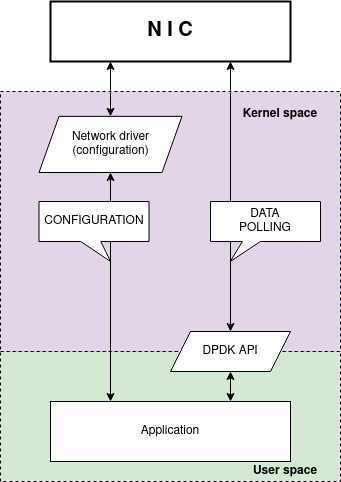

    `High-level overview of DPDK application`

Suricata makes use of DPDK for packet acquisition in workers runmode.
The whole DPDK configuration resides in the `dpdk:` node. This node encapsulates
2 main subnodes and those are eal-params and interfaces.

::

    dpdk:
      eal-params:
        proc-type: primary
      interfaces:
        - interface: 0000:3b:00.0
          threads: auto
          promisc: true
          multicast: true
          checksum-checks: true
          checksum-checks-offload: true
          mtu: 1500
          mempool-size: 65535
          mempool-cache-size: 257
          rx-descriptors: 1024
          tx-descriptors: 1024
          copy-mode: none
          copy-iface: none # or PCIe address of the second interface

The node `dpdk.eal-params` consists of `DPDK arguments <https://doc.dpdk.org/guides/linux_gsg/linux_eal_parameters.html>`_
that are usually passed through command line. These arguments are used to initialize and configure EAL.
Arguments can be specified in either long or short forms. When specifying the arguments, the dashes are omitted.
Among other settings, this configuration node is able to configure available NICs to Suricata, memory settings or other
parameters related to EAL.

The node `dpdk.interfaces` wraps a list of interface configurations. Items of the list follows the structure that can
be found in other capture interfaces. The individual items contain the usual configuration options
such as `threads`/`copy-mode`/`checksum-checks` settings. Other capture interfaces, such as AF_PACKET, rely on the user that NICs are appropriately configured.
Configuration through kernel does not apply to applications running under DPDK. The application is solely responsible for the
initialization of NICs it is using. So, before the start of Suricata, NICs that Suricata uses, must undergo the process of initialization.
As a result, there are extra extra configuration options (how NICs can be configured) in the items (interfaces) of the `dpdk.interfaces` list.
At the start of the configuration process, all NIC offloads are disabled to prevent any packet modification.
According to the configuration, checksum validation offload can be enabled to drop invalid packets.
Other offloads can not be currently enabled.
Additionally, the list items of `dpdk.interfaces` contains DPDK specific settings such as `mempool-size` or `rx-descriptors`.
These settings adjust individual parameters of EAL. One of the entries of the `dpdk.interfaces` is the `default` interface.
When loading interface configuration and some entry is missing, the corresponding value of the `default` interface is used.

The worker threads must be assigned to a specific cores. The configuration module `threading` can be used to set threads affinity.
Worker threads can be pinned to cores in the array configured in `threading.cpu-affinity["worker-cpu-set"]`.
Performance-oriented setups have everything (the NIC, memory and CPU cores interacting with the NIC) based on one NUMA node.
It is therefore required to know layout of the server architecture to get the best results.
The CPU core ids and NUMA locations can be determined for example from the output of `/proc/cpuinfo` where `physical id` described the NUMA number.
The NUMA node to which the NIC is connected to can be determined from the file `/sys/class/net/<KERNEL NAME OF THE NIC>/device/numa_node`.

::

    ## Check ids and NUMA location of individual CPU cores
    cat /proc/cpuinfo | grep 'physical id\|processor'

    ## Check NUMA node of the NIC
    ## cat /sys/class/net/<KERNEL NAME OF THE NIC>/device/numa_node e.g.
    cat /sys/class/net/eth1/device/numa_node

If Suricata has enabled at least 2 (or more) workers, the incoming traffic is load balanced across the worker threads
by Receive Side Scaling (RSS). Internally, DPDK runmode uses
a `symmetric hash (0x6d5a) <https://www.ran-lifshitz.com/2014/08/28/symmetric-rss-receive-side-scaling/>`_
that redirects bi-flows to specific workers.

Before Suricata can be run, it is required to allocate sufficient number of hugepages. Suricata allocates continuous block of memory.
For efficiency, CPU allocates memory in RAM in chunks. These chunks are usually in size of 4096 bytes. DPDK and other memory intensive applications makes use of hugepages.
Hugepages start at the size of 2MB but they can be as large as 1GB. Lower count of pages (memory chunks) allows faster lookup of page entries.
The hugepages need to be allocated on the NUMA node where the NIC and CPU resides.
Otherwise, if the hugepages are allocated only on NUMA node 0 and the NIC is connected to NUMA node 1, then the application will fail to start.
Therefore, it is recommended to first find out to which NUMA node the NIC is connected to and only then allocate hugepages and set CPU cores affinity to the given NUMA node.
If the Suricata deployment is using multiple NICs on different NUMA nodes then hugepages must be allocated on all of those NUMA nodes.

::

    ## To check number of allocated hugepages:
    grep Huge /proc/meminfo

    ## Allocate hugepages on NUMA node 0:
    echo 8192 | sudo tee /sys/devices/system/node/node0/hugepages/hugepages-2048kB/nr_hugepages

DPDK memory pools hold packets received from NICs. These memory pools are allocated in hugepages.
One memory pool is allocated per interface. The size of each memory pool can be individual and is set with
the `mempool-size`. Memory (in bytes) for one memory pool is calculated as: `mempool-size` * `mtu`.
Sum of memory pool requirements divided by the size of one hugepage results in the number of required hugepages.
It causes no problem to allocate more memory than required but it is vital for Suricata to not run out of hugepages.

Mempool cache is local to the individual CPU cores and holds packets that were recently processed. As the mempool is
shared among all cores, cache tries to minimize the required inter-process synchronization. Recommended size of the cache
is covered in the YAML file.

There has been an ongoing effort to add a DPDK support into Suricata. While the capture interface is continually evolving,
there has been certain areas with an increased focus. The current version of the DPDK capture interface provides
support for physical NICs and for running on physical machines in workers runmode.
The work has not been tested neither with the virtual interfaces nor
in the virtual environments like VMs, Docker or similar.

Although the capture interface uses DPDK library, there is no need to configure any lcores.
The capture interface uses the standard Suricata threading module.
Additionally, Suricata is intended to run as a primary process only.

The minimal supported DPDK is version 19.11 which should be available in most repositories of major distributions.
Alternatively, it is also possible to use `meson` and `ninja` to build and install DPDK from scratch.
It is required to have correctly configured tool `pkg-config` as it is used to load libraries and CFLAGS during
the Suricata configuration and compilation.

To be able to run DPDK on Intel cards, it is required to change the default Intel driver to either
`vfio-pci` or `igb_uio` driver. The process is described in
`DPDK manual page regarding Linux drivers <https://doc.dpdk.org/guides/linux_gsg/linux_drivers.html>`_.
DPDK is natively supported by Mellanox and thus their NICs should work "out of the box".

Pf-ring
~~~~~~~

The Pf_ring is a library that aims to improve packet capture
performance over libcap. It performs packet acquisition. There are
three options within Pf_ring: interface, cluster-id and cluster-type.

::

  pfring:
    interface: eth0    # In this option you can set the network-interface
                       # on which you want the packets of the network to be read.

Pf_ring will load balance packets based on flow. All packet
acquisition threads that will participate in the load balancing need
to have the same cluster-id. It is important to make sure this ID is
unique for this cluster of threads, so that no other engine / program
is making use of clusters with the same id.

::

  cluster-id: 99

Pf_ring can load balance traffic using pf_ring-clusters. All traffic
for pf_ring can be load balanced in one of two ways, in a round robin
manner or a per flow manner that are part of the same cluster. All
traffic for pf_ring will be load balanced across acquisition threads
of the same cluster id.

The cluster_round_robin manner is a way of distributing packets one at
a time to each thread (like distributing playing cards to fellow
players). The cluster_flow manner is a way of distributing all packets
of the same flow to the same thread. The flows itself will be
distributed to the threads in a round-robin manner.

::

   cluster-type: cluster_round_robin

.. _suricata-yaml-nfq:

NFQ
~~~

Using NFQUEUE in iptables rules, will send packets to Suricata. If the
mode is set to 'accept', the packet that has been send to Suricata by
a rule using NFQ, will by default not be inspected by the rest of the
iptables rules after being processed by Suricata. There are a few more
options to NFQ to change this if desired.

If the mode is set to 'repeat', the packets will be marked by Suricata
and be re-injected at the first rule of iptables. To mitigate the
packet from being going round in circles, the rule using NFQ will be
skipped because of the mark.

If the mode is set to 'route', you can make sure the packet will be
send to another tool after being processed by Suricata. It is possible
to assign this tool at the mandatory option 'route_queue'. Every
engine/tool is linked to a queue-number. This number you can add to
the NFQ rule and to the route_queue option.

Add the numbers of the options repeat_mark and route_queue to the NFQ-rule::

  iptables -I FORWARD -m mark ! --mark $MARK/$MASK -j NFQUEUE

::

  nfq:
     mode: accept                 #By default the packet will be accepted or dropped by Suricata
     repeat_mark: 1               #If the mode is set to 'repeat', the packets will be marked after being
                                  #processed by Suricata.
     repeat_mask: 1
     route_queue: 2               #Here you can assign the queue-number of the tool that Suricata has to
                                  #send the packets to after processing them.

*Example 1 NFQ1*

mode: accept

.. image:: suricata-yaml/NFQ.png

*Example 2 NFQ*

mode: repeat

.. image:: suricata-yaml/NFQ1.png

*Example 3 NFQ*

mode: route

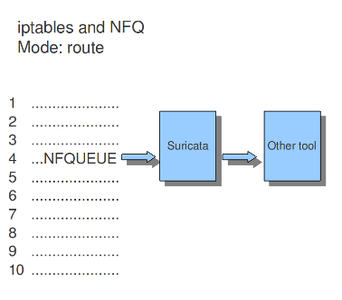

Ipfw
~~~~

Suricata does not only support Linux, it supports the FreeBSD
operating system (this is an open source Unix operating system) and
Mac OS X as well. The in-line mode on FreeBSD uses ipfw (IP-firewall).

Certain rules in ipfw send network-traffic to Suricata. Rules have
numbers. In this option you can set the rule to which the
network-traffic will be placed back. Make sure this rule comes after
the one that sends the traffic to Suricata, otherwise it will go
around in circles.

The following tells the engine to re-inject packets back into the ipfw
firewall at rule number 5500:

::

  ipfw:
    ipfw-reinjection-rule-number: 5500

*Example 16	Ipfw-reinjection.*

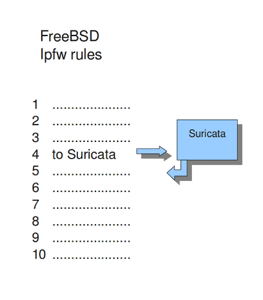

Rules
-----

Rule Files
~~~~~~~~~~

Suricata by default is setup for rules to be managed by Suricata-Update with
the following rule file configuration:

.. code-block:: yaml

    default-rule-path: /var/lib/suricata/rules
    rule-files:
      - suricata.rules

A default installation of Suricata-Update will write out the rules to
/var/lib/suricata/rules/suricata.rules.

You may want to edit this section if you are not using Suricata-Update or want
to add rule files that are not managed by Suricata-Update, for example:

.. code-block:: yaml

    default-rule-path: /var/lib/suricata/rules
    rule-files:
      - suricata.rules
      - /etc/suricata/rules/custom.rules

File names can be specific with an absolute path, or just the base name. If
just the base name is provided it will be looked for in the
``default-rule-path``.

If a rule file cannot be found, Suricata will log a warning message and
continue to load, unless ``--init-errors-fatal`` has been specified on the
command line, in which case Suricata will exit with an error code.

For more information on rule management see :doc:`../rule-management/index`.

Threshold-file
~~~~~~~~~~~~~~

Within this option, you can state the directory in which the
threshold-file will be stored. The default directory is:
/etc/suricata/threshold.config

Classifications
~~~~~~~~~~~~~~~

The Classification-file is a file which makes the purpose of rules
clear.

Some rules are just for providing information. Some of them are to
warn you for serious risks like when you are being hacked etc.

In this classification-file, there is a part submitted to the rule to
make it possible for the system-administrator to distinguish events.

A rule in this file exists of three parts: the short name, a
description and the priority of the rule (in which 1 has the highest
priority and 4 the lowest).

You can notice these descriptions returning in the rule and events / alerts.

::

  Example:

  configuration classification: misc-activity,Misc activity,3

  Rule:

  alert tcp $HOME_NET 21 -> $EXTERNAL_NET any (msg:"ET POLICY FTP Login Successful (non-anonymous)";
  flow:from_server,established;flowbits:isset,ET.ftp.user.login; flowbits:isnotset,ftp.user.logged_in;
  flowbits:set,ftp.user.logged_in; content:"230 ";pcre:!"/^230(\s+USER)?\s+(anonymous|ftp)/smi";
  classtype:misc-activity; reference:urldoc.emergingthreats.net/2003410,;
  reference:url,www.emergingthreats.net/cgi-bin/cvsweb.cgi/sigs/POLICY/POLICY_FTP_Login; sid:2003410; rev:7;)

  Event/Alert:

  10/26/10-10:13:42.904785  [**] [1:2003410:7] ET POLICY FTP Login Successful (non-anonymous) [**]
   [Classification: Misc activity[Priority: 3] {TCP} 192.168.0.109:21 -> x.x.x.x:34117

You can set the direction of the classification configuration.

::

      classification-file: /etc/suricata/classification.config

.. _suricata-yaml-rule-vars:

Rule-vars
~~~~~~~~~

There are variables which can be used in rules.

Within rules, there is a possibility to set for which IP-address the
rule should be checked and for which IP-address it should not.

This way, only relevant rules will be used. To prevent you from having
to set this rule by rule, there is an option in which you can set the
relevant IP-address for several rules. This option contains the
address group vars that will be passed in a rule. So, after HOME_NET
you can enter your home IP-address.

::

  vars:
    address-groups:
      HOME_NET: "[192.168.0.0/16,10.0.0.0/8,172.16.0.0/12]"        #By using [], it is possible to set
                                                                   #complicated variables.
      EXTERNAL_NET: any
      HTTP_SERVERS: "$HOME_NET"                                    #The $-sign tells that what follows is
                                                                   #a variable.
      SMTP_SERVERS: "$HOME_NET"
      SQL_SERVERS: "$HOME_NET"
      DNS_SERVERS: "$HOME_NET"
      TELNET_SERVERS: "$HOME_NET"
      AIM_SERVERS: any

It is a convention to use upper-case characters.

There are two kinds of variables: Address groups and Port-groups. They
both have the same function: change the rule so it will be relevant to
your needs.

In a rule there is a part assigned to the address and one to the
port. Both have their variable.

All options have to be set. If it is not necessary to set a specific
address, you should enter 'any'.

::

  port-groups:
    HTTP_PORTS: "80"
    SHELLCODE_PORTS: "!80"
    ORACLE_PORTS: 1521
    SSH_PORTS: 22

.. _host-os-policy:

Host-os-policy
~~~~~~~~~~~~~~

Operating systems differ in the way they process fragmented packets
and streams. Suricata performs differently with anomalies for
different operating systems. It is important to set of which operating
system your IP-address makes use of, so Suricata knows how to process
fragmented packets and streams. For example in stream-reassembly there
can be packets with overlapping payloads.

*Example 17	Overlapping payloads*

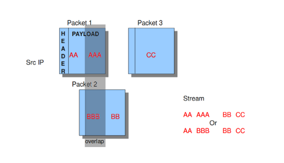

In the configuration-file, the operating-systems are listed. You can
add your IP-address behind the name of the operating system you make
use of.

::

  host-os-policy:
    windows: [0.0.0.0/0]
    bsd: []
    bsd_right: []
    old_linux: []
    linux: [10.0.0.0/8, 192.168.1.100, "8762:2352:6241:7245:E000:0000:0000:0000"]
    old_solaris: []
    solaris: ["::1"]
    hpux10: []
    hpux11: []
    irix: []
    macos: []
    vista: []
    windows2k3: []

Engine analysis and profiling
-----------------------------

Suricata offers several ways of analyzing performance of rules and the
engine itself.

Engine-analysis
~~~~~~~~~~~~~~~

The option engine-analysis provides information for signature writers
about how Suricata organizes signatures internally.

Like mentioned before, signatures have zero or more patterns on which
they can match. Only one of these patterns will be used by the multi
pattern matcher (MPM). Suricata determines which patterns will be used
unless the fast-pattern rule option is used.

The option engine-analysis creates a new log file in the default log
dir. In this file all information about signatures and patterns can be
found so signature writers are able to see which pattern is used and
change it if desired.

To create this log file, you have to run Suricata with
./src/suricata -c suricata.yaml --engine-analysis.

::

  engine-analysis:
     rules-fast-pattern: yes

Example:

::

  [10703] 26/11/2010 -- 11:41:15 - (detect.c:560) <Info> (SigLoadSignatures)
  -- Engine-Analysis for fast_pattern printed to file - /var/log/suricata/rules_fast_pattern.txt

  == Sid: 1292 ==
  Fast pattern matcher: content
  Fast pattern set: no
  Fast pattern only set: no
  Fast pattern chop set: no
  Content negated: no
  Original content: Volume Serial Number
  Final content: Volume Serial Number

  ---

  alert tcp any any -> any any (content:"abc"; content:"defghi"; sid:1;)

  == Sid: 1 ==
  Fast pattern matcher: content
  Fast pattern set: no
  Fast pattern only set: no
  Fast pattern chop set: no
  Content negated: no
  Original content: defghi
  Final content: defghi

  ---

  alert tcp any any -> any any (content:"abc"; fast_pattern:only; content:"defghi"; sid:1;)

  == Sid: 1 ==
  Fast pattern matcher: content
  Fast pattern set: yes
  Fast pattern only set: yes
  Fast pattern chop set: no
  Content negated: no
  Original content: abc
  Final content: abc

  ---

  alert tcp any any -> any any (content:"abc"; fast_pattern; content:"defghi"; sid:1;)

  == Sid: 1 ==
  Fast pattern matcher: content
  Fast pattern set: yes
  Fast pattern only set: no
  Fast pattern chop set: no
  Content negated: no
  Original content: abc
  Final content: abc

  ---

  alert tcp any any -> any any (content:"abc"; fast_pattern:1,2; content:"defghi"; sid:1;)

  == Sid: 1 ==
  Fast pattern matcher: content
  Fast pattern set: yes
  Fast pattern only set: no
  Fast pattern chop set: yes
  Fast pattern offset, length: 1, 2
  Content negated: no
  Original content: abc
  Final content: bc

Rule and Packet Profiling settings
~~~~~~~~~~~~~~~~~~~~~~~~~~~~~~~~~~

Rule profiling is a part of Suricata to determine how expensive rules
are. Some rules are very expensive while inspecting traffic. Rule
profiling is convenient for people trying to track performance
problems and resolving them. Also for people writing signatures.

Compiling Suricata with rule-profiling will have an impact on
performance, even if the option is disabled in the configuration file.

To observe the rule-performance, there are several options.

::

  profiling:
    rules:
      enabled: yes

This engine is not used by default. It can only be used if Suricata is
compiled with:

::

     -- enable-profiling

At the end of each session, Suricata will display the profiling
statistics. The list will be displayed sorted.

This order can be changed as pleased. The choice is between ticks,
avgticks, checks, maxticks and matches. The setting of your choice
will be displayed from high to low.

The amount of time it takes to check the signatures, will be
administrated by Suricata. This will be counted in ticks. One tick is
one CPU computation. 3 GHz will be 3 billion ticks.

Beside the amount of checks, ticks and matches it will also display
the average and the maximum of a rule per session at the end of the
line.

The option Limit determines the amount of signatures of which the
statistics will be shown, based on the sorting.

::

     sort: avgticks
     limit: 100

Example of how the rule statistics can look like;

::

  Rule            Ticks            %     Checks         Matches           Max Tick         Avg
  Ticks

  7560            107766621       0.02    138             37              105155334       780917.54
  11963           1605394413      0.29    2623             1              144418923       612045.14
  7040            1431034011      0.26    2500             0              106018209       572413.60
  5726            1437574662      0.26    2623             1              115632900       548065.06
  7037            1355312799      0.24    2562             0              116048286       529005.78
  11964           1276449255      0.23    2623             1              96412347        486637.15
  7042            1272562974      0.23    2623             1              96405993        485155.54
  5719            1233969192      0.22    2562             0              106439661       481642.93
  5720            1204053246      0.21    2562             0              125155431       469966.14

Packet Profiling
~~~~~~~~~~~~~~~~

::

    packets:

      # Profiling can be disabled here, but it will still have a
      # performance impact if compiled in.

      enabled: yes                                  #this option is enabled by default
      filename: packet_stats.log                    #name of the file in which packet profiling information will be
                                                    #stored.
      append: yes                                   #If set to yes, new packet profiling information will be added to the
                                                    #information that was saved last in the file.

      # per packet csv output
      csv:

        # Output can be disabled here, but it will still have a
        # performance impact if compiled in.

        enabled: no                                #the sending of packet output to a csv-file is by default disabled.
        filename: packet_stats.csv                 #name of the file in which csv packet profiling information will be
                                                   #stored

Packet profiling is enabled by default in suricata.yaml but it will
only do its job if you compiled Suricata with --enable profiling.

The filename in which packet profiling information will be stored, is
packet-stats.log. Information in this file can be added to the last
information that was saved there, or if the append option is set to
no, the existing file will be overwritten.

Per packet, you can send the output to a csv-file. This file contains
one line for each packet with all profiling information of that
packet. This option can be used only if Suricata is build
with --enable-profiling and if the packet profiling option is enabled
in yaml.

It is best to use runmode 'single' if you would like to profile the
speed of the code.  When using a single thread, there is no situation
in which two threads have to wait for each other. When using two
threads, the time threads might have to wait for each other will be
taken in account when/during profiling packets. For more information
see :doc:`../performance/packet-profiling`.

Decoder
-------

Teredo
~~~~~~

The Teredo decoder can be disabled. It is enabled by default.

::

    decoder:
      # Teredo decoder is known to not be completely accurate
      # it will sometimes detect non-teredo as teredo.
      teredo:
        enabled: true
        # ports to look for Teredo. Max 4 ports. If no ports are given, or
        # the value is set to 'any', Teredo detection runs on _all_ UDP packets.
        ports: $TEREDO_PORTS # syntax: '[3544, 1234]'

Using this default configuration, Teredo detection will run on UDP port
3544. If the `ports` parameter is missing, or set to `any`, all ports will be
inspected for possible presence of Teredo.

Advanced Options
----------------

stacktrace
~~~~~~~~~~
Display diagnostic stacktraces when a signal unexpectedly terminates Suricata, e.g., such as
SIGSEGV or SIGABRT. Requires the ``libunwind`` library to be available. The default value is
to display the diagnostic message if a signal unexpectedly terminates Suricata -- e.g.,
``SIGABRT`` or ``SIGSEGV`` occurs while Suricata is running.

::

    logging:
        # Requires libunwind to be available when Suricata is configured and built.
        # If a signal unexpectedly terminates Suricata, displays a brief diagnostic
        # message with the offending stacktrace if enabled.
        #stacktrace-on-signal: on

luajit
~~~~~~

states
^^^^^^

Luajit has a strange memory requirement, it's 'states' need to be in the
first 2G of the process' memory. For this reason when luajit is used the
states are allocated at the process startup. This option controls how many
states are preallocated.

If the pool is depleted a warning is generated. Suricata will still try to
continue, but may fail if other parts of the engine take too much memory.
If the pool was depleted a hint will be printed at the engines exit.

States are allocated as follows: for each detect script a state is used per
detect thread. For each output script, a single state is used. Keep in
mind that a rule reload temporary doubles the states requirement.

.. _deprecation policy: https://suricata.io/about/deprecation-policy/
