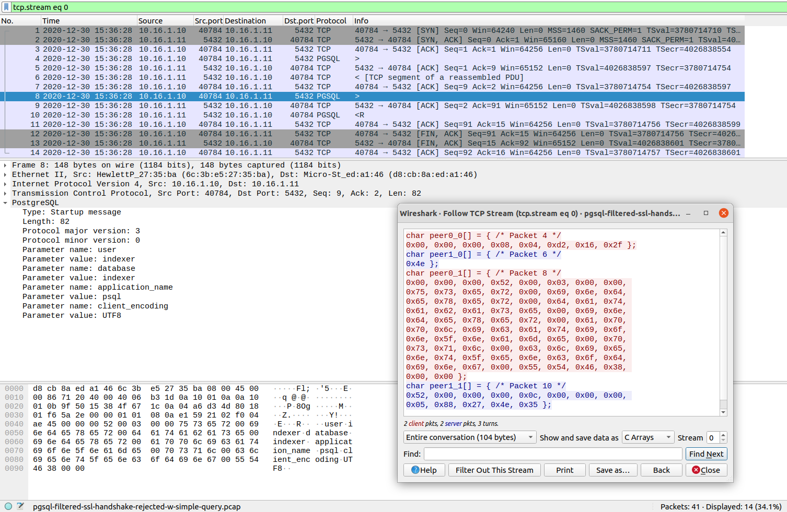

****************
Testing Suricata
****************

.. contents:: Table of Contents

General Concepts
================

There are a few ways of testing Suricata:

- **Unit tests**: for independently checking specific functions or portions of code. This guide has specific sections to
  further explain those, for C and Rust;
- `Suricata-Verify <https://github.com/OISF/suricata-verify>`_: those are used to check more complex behavior, like the log output or the alert counts for a given input, where that input is usually comprised of several packets;
- **Static and dynamic analysis tools**: to help in finding bugs, memory leaks and other issues (like     `scan-build <https://clang-analyzer.llvm.org/scan-build.html#scanbuild_basicusage>`_, from `clang`,     which is also used for our C formatting checks; or ASAN, which checks for memory issues);
- **Fuzz testing**: especially good for uncovering existing, often non-trivial bugs. For more on how to fuzz test Suricata, check :doc:`fuzz-testing`;
- **CI checks**: each PR submitted to the project's public repositories will be run against a suit of Continuous Integration
  workflows, as part of our QA process. Those cover: formatting and commit checks; fuzz tests (CI Fuzz), and several  builds. See our `github workflows <https://github.com/OISF/suricata/tree/master/.github/workflows>`_ for details and those in
  action at `<https://github.com/OISF/suricata/actions>`_.

  .. note:: If you can run unit tests or other checks and report failures in our `issue tracker <https://redmine.openinfosecfoundation.org/projects/suricata/issues>`_, that is rather useful and appreciated!

The focus of this document are Unit tests and Suricata-Verify tests, especially on offering some guidance regarding when to use each type of test, and how to prepare input
for them.

Unit tests
==========

Use these to check that specific functions behave as expected, in success and in failure scenarios. Specially useful
during development, for nom parsers in the Rust codebase, for instance, or for checking that messages
or message parts of a protocol/stream are processed as they should.

To execute all unit tests (both from C and Rust code), as well as ``libhtp`` ones, from the Suricata main directory, run::

    make check

Check the Suricata Devguide on :doc:`unittests-c` or :doc:`unittests-rust` for more on how to write and run unit tests,
given that the way to do so differs, depending on the language.

Code Examples
^^^^^^^^^^^^^

An example from the `DNS parser <https://github.com/OISF/suricata/blob/master/rust/src/dns/parser.rs#L417>`_. This
checks that the given raw input (note the comments indicating what it means), once processed by ``dns_parse_name`` yields
the expected result, including the unparsed portion.

.. code-block:: rust

    /// Parse a simple name with no pointers.
    #[test]
    fn test_dns_parse_name() {
        let buf: &[u8] = &[
                                                0x09, 0x63, /* .......c */
            0x6c, 0x69, 0x65, 0x6e, 0x74, 0x2d, 0x63, 0x66, /* lient-cf */
            0x07, 0x64, 0x72, 0x6f, 0x70, 0x62, 0x6f, 0x78, /* .dropbox */
            0x03, 0x63, 0x6f, 0x6d, 0x00, 0x00, 0x01, 0x00, /* .com.... */
        ];
        let expected_remainder: &[u8] = &[0x00, 0x01, 0x00];
        let (remainder,name) = dns_parse_name(buf, buf).unwrap();
        assert_eq!("client-cf.dropbox.com".as_bytes(), &name[..]);
        assert_eq!(remainder, expected_remainder);
    }

From the C side, ``decode-ethernet.c`` offers an good example:

.. code-block:: c

    /**
     * Test a DCE ethernet frame that is too small.
     */
    static int DecodeEthernetTestDceTooSmall(void)
    {
        uint8_t raw_eth[] = {
            0x00, 0x10, 0x94, 0x55, 0x00, 0x01, 0x00, 0x10,
            0x94, 0x56, 0x00, 0x01, 0x89, 0x03,
        };

        Packet *p = PacketGetFromAlloc();
        FAIL_IF_NULL(p);
        ThreadVars tv;
        DecodeThreadVars dtv;

        memset(&dtv, 0, sizeof(DecodeThreadVars));
        memset(&tv,  0, sizeof(ThreadVars));

        DecodeEthernet(&tv, &dtv, p, raw_eth, sizeof(raw_eth));

        FAIL_IF_NOT(ENGINE_ISSET_EVENT(p, DCE_PKT_TOO_SMALL));

        PacketFree(p);
        PASS;
    }

Suricata-Verify
===============

As mentioned above, these tests are used to check more complex behavior that involve a complete flow, with exchange of requests and responses. This can be done in an easier and more straightforward way,
since one doesn't have to simulate the network traffic and Suricata engine mechanics - one simply runs it, with the desired input packet capture,
configuration and checks.

A Suricata-verify test can help to ensure that code refactoring doesn't affect protocol logs, or signature detection,
for instance, as this could have a major impact to Suricata users and integrators.

For simpler tests, providing the pcap input is enough. But it is also possible to provide Suricata rules to be
inspected, and have Suricata Verify match for alerts and specific events.

Refer to the `Suricata Verify readme <https://github.com/OISF/suricata-verify#readme>`_ for details on how to create
this type of test. It suffices to have a packet capture representative of the behavior one wants to test, and then
follow the steps described there.

The Git repository for the Suricata Verify tests is a great source for examples, like the `app-layer-template <https://github.com/OISF/suricata-verify/tree/master/tests/app-layer-template>`_ one.

Generating Input
================

Using real traffic
^^^^^^^^^^^^^^^^^^

Having a packet capture for the desired protocol you want to test, open it in `Wireshark <https://www.wireshark.org/>`_, and select the specific
packet chosen for the test input, then use the Wireshark option ``Follow [TCP/UDP/HTTP/HTTP2/QUIC] Stream``. This allows for inspecting the whole network traffic stream in a different window.
There, it's possible to choose to ``Show and save data as`` ``C Arrays``, as well as to select if one wants to see the whole conversation or just **client** or **server** packets.
It is also possible to reach the same effect by accessing the **Analyze->Follow->TCP Stream** top menu in Wireshark.
(There are other stream options, the available one will depend on the type of network traffic captured).

This option will show the packet data as hexadecimal compatible with C-array style, and easily adapted for Rust,
as well. As shown in the image:

Wireshark can be also used to `capture sample network traffic <https://gitlab.com/wireshark/wireshark/-/wikis/CaptureSetup>`_ and generate pcap files.

Crafting input samples with Scapy
^^^^^^^^^^^^^^^^^^^^^^^^^^^^^^^^^

It is also possible to use Scapy to create specific traffic: `Scapy usage
<https://scapy.readthedocs.io/en/latest/usage.html>`_

Suricata-verify tests have several examples of pcaps generated in such a way. Look for Python scripts like the one used
for the `dce-udp-scapy
<https://github.com/OISF/suricata-verify/blob/master/tests/dcerpc/dcerpc-udp-scapy/dcerpc_udp_scapy.py>`_.

Other examples from our Suricata-Verify tests:
^^^^^^^^^^^^^^^^^^^^^^^^^^^^^^^^^^^^^^^^^^^^^^

Going through Suricata-Verify tests `readme` files it is also possible to find an assorted collection of pcap generation possibilities, some with explanation on the how-tos. To list a few:

- `http2-range <https://github.com/OISF/suricata-verify/blob/master/tests/http2-range/README.md>`_
- `http-range <https://github.com/OISF/suricata-verify/blob/master/tests/http-range/README.md>`_
- `smb2-delete <https://github.com/OISF/suricata-verify/blob/master/tests/smb2-delete/README.md>`_
- `smtp-rset <https://github.com/OISF/suricata-verify/blob/master/tests/smtp-rset/README.md>`_
- `http-auth-unrecognized <https://github.com/OISF/suricata-verify/blob/master/tests/http-auth-unrecognized/README.md>`_

Finding Capture Samples
^^^^^^^^^^^^^^^^^^^^^^^

If you can't capture traffic for the desired protocol from live traffic, or craft something up, you can try finding the type of traffic you
are interested in in public data sets. There's a thread for `Sharing good sources of sample captures
<https://forum.suricata.io/t/sharing-good-sources-of-sample-captures/1766/4>`_ in our forum.
