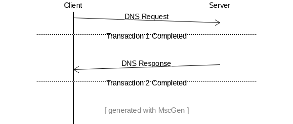
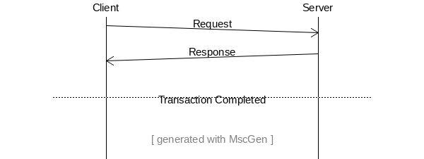
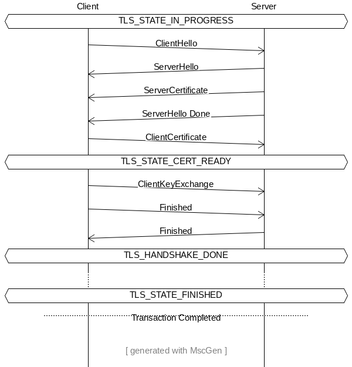
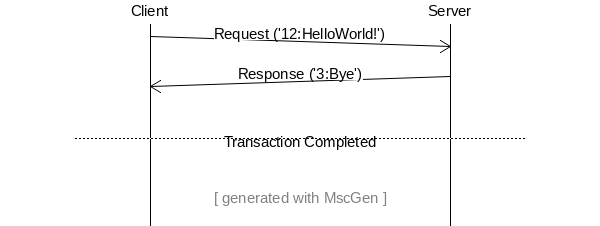

************
Transactions
************

.. contents:: Table of Contents

General Concepts
================

For Suricata, transactions are an abstraction that help with detecting and logging. An example of a complete transaction is
a pair of messages in the form of a request (from client to server) and a response (from server to client) in HTTP.

In order to know when to log an event for a given protocol, the engine tracks the progress of each transaction - that
is, when is it complete, or when it reaches a key intermediate state. They aid during the detection phase,
when dealing with protocols that can have large PDUs (protocol data units), like TCP, in controlling state for partial rule matching -- in case of rules that mention more than one field.

Transactions are implemented and stored in the per-flow state. The engine interacts with them using a set of callbacks the parser registers.

How the engine uses transactions
================================

Logging
~~~~~~~

Suricata controls when logging should happen based on transaction completeness. For simpler protocols, such as ``dns``
or ``ntp``, that will most
likely happen once per transaction, by the time of its completion. In other cases, like with HTTP, this may happen at intermediary states.

In ``OutputTxLog``, the engine will compare current state with the value defined for the logging to happen, per flow
direction (``logger->tc_log_progress``, ``logger->ts_log_progress``). If state is less than that value, the engine skips to
the next logger. Code snippet from: suricata/src/output-tx.c:

.. code-block:: c

    static TmEcode OutputTxLog(ThreadVars *tv, Packet *p, void *thread_data)
    {
        .
        .
        .
            if ((ts_eof && tc_eof) || last_pseudo) {
                SCLogDebug("EOF, so log now");
            } else {
                if (logger->LogCondition) {
                    int r = logger->LogCondition(tv, p, alstate, tx, tx_id);
                    if (r == FALSE) {
                        SCLogDebug("conditions not met, not logging");
                        goto next_logger;
                    }
                } else {
                    if (tx_progress_tc < logger->tc_log_progress) {
                        SCLogDebug("progress not far enough, not logging");
                        goto next_logger;
                    }

                    if (tx_progress_ts < logger->ts_log_progress) {
                        SCLogDebug("progress not far enough, not logging");
                        goto next_logger;
                    }
                }
             }
        .
        .
        .
    }

Rule Matching
~~~~~~~~~~~~~

Transaction progress is also used for certain keywords to know what is the minimum state before we can expect a match: until that, Suricata won't even try to look for the patterns.

As seen in ``DetectAppLayerMpmRegister2`` that has ``int progress`` as parameter, and ``DetectAppLayerInspectEngineRegister2``, which expects ``int tx_min_progress``, for instance. In the code snippet,
``HTTP2StateDataClient``, ``HTTP2StateDataServer`` and ``0`` are the values passed to the functions - in the last
example, for ``FTPDATA``,
the existence of a transaction implies that a file is being transferred. Hence the ``0`` value.

.. code-block:: c

    void DetectFiledataRegister(void)
    {
        .
        .
        DetectAppLayerMpmRegister2("file_data", SIG_FLAG_TOSERVER, 2,
                PrefilterMpmFiledataRegister, NULL,
                ALPROTO_HTTP2, HTTP2StateDataClient);
        DetectAppLayerMpmRegister2("file_data", SIG_FLAG_TOCLIENT, 2,
                PrefilterMpmFiledataRegister, NULL,
                ALPROTO_HTTP2, HTTP2StateDataServer);
        .
        .
        DetectAppLayerInspectEngineRegister2("file_data",
            ALPROTO_HTTP2, SIG_FLAG_TOCLIENT, HTTP2StateDataServer,
            DetectEngineInspectFiledata, NULL);
        DetectAppLayerInspectEngineRegister2(
                "file_data", ALPROTO_FTPDATA, SIG_FLAG_TOSERVER, 0, DetectEngineInspectFiledata, NULL);
        .
        .
    }

Progress Tracking
=================

As a rule of thumb, transactions will follow a request-response model: if a transaction has had a request and a response, it is complete.

But if a protocol has situations where a request or response won’t expect or generate a message from its counterpart,
it is also possible to have uni-directional transactions. In such cases, transaction is set to complete at the moment of
creation.

For example, DNS responses may be considered as completed transactions, because they also contain the request data, so
all information needed for logging and detection can be found in the response.

In addition, for file transfer protocols, or similar ones where there may be several messages before the file exchange
is completed (NFS, SMB), it is possible to create a level of abstraction to handle such complexity. This could be achieved by adding phases to the model implemented by the protocol (e.g., protocol negotiation phase (SMB), request parsed (HTTP), and so on).

This is controlled by implementing progress states. In Suricata, those will be enums that are incremented as the parsing
progresses. A state will start at 0. The higher its value, the closer the transaction would be to completion. Due to how
the engine tracks detection across states, there is an upper limit of 48 to the state progress (it must be < 48).

The engine interacts with transactions' state using a set of callbacks the parser registers. State is defined per flow direction (``STREAM_TOSERVER`` / ``STREAM_TOCLIENT``).

In Summary - Transactions and State
~~~~~~~~~~~~~~~~~~~~~~~~~~~~~~~~~~~

- Initial State value: ``0``.
- Simpler scenarios: State is simply a bool.  ``1`` represents transaction completion, per direction.
- Complex Transaction State in Suricata: ``enum`` (Rust: ``i32``). Completion is indicated by the highest enum value (some examples are: SSH, HTTP, HTTP2, DNS, SMB).

Examples
========

This section shares some examples from Suricata codebase, to help visualize how Transactions work and are handled by the engine.

Enums
~~~~~

Code snippet from: rust/src/ssh/ssh.rs:

.. code-block:: rust

    pub enum SSHConnectionState {
        SshStateInProgress = 0,
        SshStateBannerWaitEol = 1,
        SshStateBannerDone = 2,
        SshStateFinished = 3,
    }

From src/app-layer-ftp.h:

.. code-block:: c

    enum {
        FTP_STATE_IN_PROGRESS,
        FTP_STATE_PORT_DONE,
        FTP_STATE_FINISHED,
    };

From src/app-layer-ssl.h:

.. code-block:: c

    enum {
        TLS_STATE_IN_PROGRESS = 0,
        TLS_STATE_CERT_READY = 1,
        TLS_HANDSHAKE_DONE = 2,
        TLS_STATE_FINISHED = 3
    };

API Callbacks
~~~~~~~~~~~~~

In Rust, this is done via the RustParser struct. As seen in rust/src/applayer.rs:

.. code-block:: rust

    /// Rust parser declaration
    pub struct RustParser {
            .
            .
            .
        /// Progress values at which the tx is considered complete in a direction
        pub tx_comp_st_ts:      c_int,
        pub tx_comp_st_tc:      c_int,
        .
        .
        .
    }

In C, the callback API is:

.. code-block:: c

    void AppLayerParserRegisterStateProgressCompletionStatus(
        AppProto alproto, const int ts, const int tc)

Simple scenario described, in Rust:

rust/src/dhcp/dhcp.rs:

.. code-block:: rust

    tx_comp_st_ts: 1,
    tx_comp_st_tc: 1,

For SSH, this looks like this:

rust/src/ssh/ssh.rs:

.. code-block:: rust

    tx_comp_st_ts: SSHConnectionState::SshStateFinished as i32,
    tx_comp_st_tc: SSHConnectionState::SshStateFinished as i32,

In C, callback usage would be as follows:

src/app-layer-dcerpc.c:

.. code-block:: c

    AppLayerParserRegisterStateProgressCompletionStatus(ALPROTO_DCERPC, 1, 1);

src/app-layer-ftp.c:

.. code-block:: c

    AppLayerParserRegisterStateProgressCompletionStatus(
        ALPROTO_FTP, FTP_STATE_FINISHED, FTP_STATE_FINISHED);

Sequence Diagrams
~~~~~~~~~~~~~~~~~

A DNS transaction in Suricata can be considered unidirectional:

An HTTP2 transaction is an example of a bidirectional transaction, in Suricata (note that, while HTTP2 may have multiple streams, those are mapped to transactions in Suricata. They run in parallel, scenario not shown in this Sequence Diagram - which shows one transaction, only):

action is completed.

A TLS Handshake is a more complex example, where several messages are exchanged before the transaction is considered completed:

 to Client and vice-versa, before a dotted line indicates that the transaction is finally completed.

Template Protocol
~~~~~~~~~~~~~~~~~

Suricata has a template protocol for educational purposes, which has simple bidirectional transactions.

A completed transaction for the template looks like this:

Following are the functions that check whether a transaction is considered completed, for the Template Protocol. Those are called by the Suricata API. Similar functions exist for each protocol, and may present implementation differences, based on what is considered a transaction for that given protocol.

In C:

.. code-block:: c

    static int TemplateGetStateProgress(void *txv, uint8_t direction)
    {
        TemplateTransaction *tx = txv;

        SCLogNotice("Transaction progress requested for tx ID %"PRIu64
            ", direction=0x%02x", tx->tx_id, direction);

        if (direction & STREAM_TOCLIENT && tx->response_done) {
            return 1;
        }
        else if (direction & STREAM_TOSERVER) {
            /* For the template, just the existence of the transaction means the
             * request is done. */
            return 1;
        }

        return 0;
    }

And in Rust:

.. code-block:: rust

    pub extern "C" fn rs_template_tx_get_alstate_progress(
        tx: *mut std::os::raw::c_void,
        _direction: u8,
    ) -> std::os::raw::c_int {
        let tx = cast_pointer!(tx, TemplateTransaction);

        // Transaction is done if we have a response.
        if tx.response.is_some() {
            return 1;
        }
        return 0;
    }

Work In Progress changes
========================

Currently we are working to have files be part of the transaction instead of the per-flow state, as seen in https://redmine.openinfosecfoundation.org/issues/4444.

Another work in progress is to limit the number of transactions per flow, to prevent Denial of Service (DoS) by quadratic complexity - a type of attack that may happen to protocols which can have multiple transactions at the same time - such as HTTP2 so-called streams (see  https://redmine.openinfosecfoundation.org/issues/4530).

Common words and abbreviations
==============================

- al, applayer: application layer
- alproto: application layer protocol
- alstate: application layer state
- engine: refers to Suricata core detection logic
- flow: a bidirectional flow of packets with the same 5-tuple elements (protocol, source ip, destination ip, source port, destination port. Vlans can be added as well)
- PDU: Protocol Data Unit
- rs: rust
- tc: to client
- ts: to server
- tx: transaction
