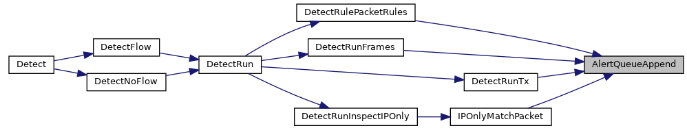

************
Alerts' Flow
************

.. contents:: Table of Contents

Important contents ::

- rules prioritizing
- Explain thresholding
- Describe the flow
- describe what each step does
- describe output/product of each step

Baseline
========

- `Suricata rules format <https://suricata.readthedocs.io/en/latest/rules/intro.html>`_

Introduction
============

This document explains how the Suricata engine processes Alerts, focusing on 
the main entities that interact and affect which alerts are actually kept for 
any traffic that Suricata sees.

We try to be accessible to newcomers, but some level of Suricata knowledge will
be required for the big picture to make sense.

Overall Concepts
================

In Suricata, an Alert represents that a rule was triggered by a certain traffic/
packet. Internally, we represent said matches with a ``PacketAlert`` structure 
that is pre-processed and then appended to the Packet that triggered the
corresponding rule.

Rules are analyzed by the engine when it loads them, and given an internal id 
that symbolizes their priority. A lower id means a higher priority. Unlike 
signature ids (``sids``), internal ids start at 0.

Rule priorities are based on aspects like `action priority order
<https://suricata.readthedocs.io/en/latest/configuration/suricata-yaml.html#suricata
-yaml-action-order>`_ (`PASS`, `DROP` etc), what does the rule inspect (payload,
whole flow...), and also the `priority rule keyword <https://suricata.
readthedocs.io/en/latest/rules/meta.html?highlight=keyword#priority>`_ itself.

Those prioritized rules will be matched against the packets based on their 
Signature Groupd Heads and the pattern matcher algorithm being used.

.. note::

    The action of an alert can be changed under specific circumstances (see
    :doc:`/configuration/global-thresholds`). If that happens, a normal alert
    could be converted to ``DROP``, which could affect which alerts are kept 
    and logged.

Interactions
============

Matched signatures become ``PacketAlerts`` that go to a temporary queue in
``DetectEngineThreadCtx``, where we also save the first matched `DROP` action.

This queue can be dynamically expanded beyond the maximum size of the Packet's
alert queue (``packet-alert-max``), based on the amount of matched alerts per 
Packet. If the expansion fails, Suricata will keep working, but new alerts will
be discarded  - ``alerts_queue_overflow`` in the stats log (see :ref:`alerts stats`).

Once there are no more alerts, the queue is passed on to ``PacketAlertFinalize``,
which will sort the queue by internal id and transaction id and then ensure 
that the rules' action and global thresholds are respected before appending the
alerts to the Packet.

Before the queue actually being attached to the Packet, the engine will do the 
following:

* Apply Signature actions to Packet
* Apply Signature actions to Flow
* Apply thresholds (this is where ``noalert`` rules are *suppressed* from the
  alerts queue, for instance)
* Enforce ``packet-alert-max`` queue size. While processing the queue, if the
  alerts count reaches the max size, any remaining alerts are discarded, 
  incrementing the ``alerts_queue_overflow`` stats

Big Picture
===========

A zoomed-in depiction of the caller graph for ``AlertQueueAppend`` is seen 
bellow. This is omitting all callers to ``Detect``, for simplicity. A more
complete graph is available at `AlertQueueAppend <https://doxygen.
openinfosecfoundation.org/detect-engine-alert_8c.html#a2a1950e6f21f643682dfeae011036de7>`_.

