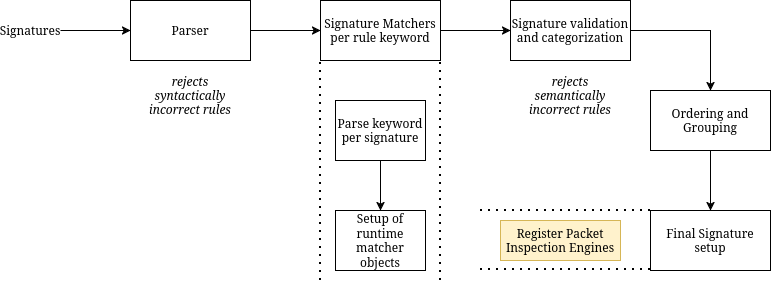
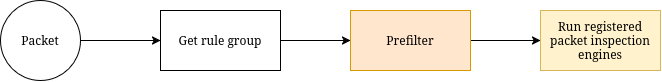
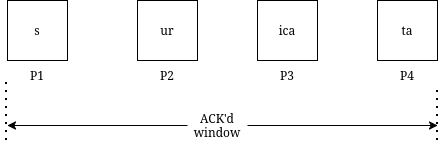

Packet Inspection in Suricata
=============================

Please note that there are several inspection engines inside Suricata, each of which
is invoked based on the signature's requirement and type. This document is concerned with
the packet inspection engine and isolates only the parts relevant to them.

There are several things in place in the engine to make inspection of a packet at run-time
fast and accurate. Some optimizations occur even before the engine starts. But, of
course Suricata does not know the nature of the traffic it is going to encounter; what it
does know are the rules that are going to be matched against the unexpected traffic.

The second round of optimizations comes when Suricata has actually seen the network traffic. With
the internal prefiltering engines, the possible matching list of signatures is further reduced.
So, ideally, when a packet comes in, Suricata quickly gets to matching it against as precise
a rule set as it can.

There are two types of packet inspection engines registered by Suricata:

1. Packet inspection engine

2. Packet payload inspection engine

Packet inspection engine
------------------------

As the name suggests, this engine runs all the available runtime matchers for the signature against
the given packet.

e.g. for a rule like:

.. container:: example-rule

   alert tcp any any -> any any (ttl:8; sid:123;)

During parsing of the signature, a ``ttl`` keyword matcher is registered. So, this inspection engine
will try to match ``ttl`` in the packet.

Packet payload inspection engine
--------------------------------

This is a bit more complex as the rule at hand may be a ``pkt``, ``pkt-stream``, or ``stream`` :ref:`type rule <rule-types>`.
Each of the types differ in its processing with respect to the inspection window.

There are two types of payloads that Suricata typically deals with.

1. Packet payload

   This means only the current packet buffer is evaluated. The inspection window is the beginning to
   the end of the packet payload.

2. Stream payload

   This means the current stream chunk that is ready for inspection is evaluated. The inspection window
   is the beginning of the stream chunk to the ACK'd data.

For a packet to be reassembled into the stream and be inspected, it must be a part of an accepted TCP
segment or the engine must be in one of the exceptional scenarios.

.. container:: example-rule

   alert tcp any any -> any any (content:"suricata"; sid:123;)

During parsing of the signature, Suricata categorizes this as a ``stream`` type rule which means there
is a requirement for a payload match which may exist in one or more packets. This is the default
categorization for anything that requires a content match unless there's another keyword that makes
the evaluation needed to be done per packet too.

For TCP, as a part of inspection, if there's a stream type rule at hand, the inspection will first be
attempted on the ACK'd stream window available. If that fails, the engine falls back on packet
in order to match as soon as possible.

For example, if the content to be matched in the rule arrived over a span of multiple packets,
it'll be matched when the packets are reassembled and ACK'd.

