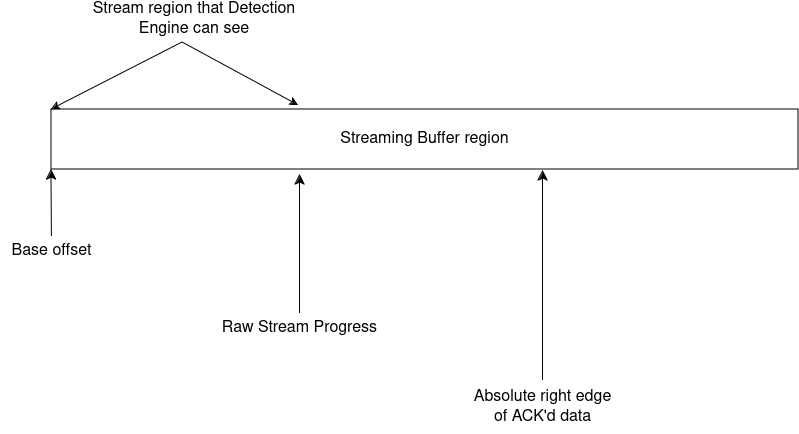
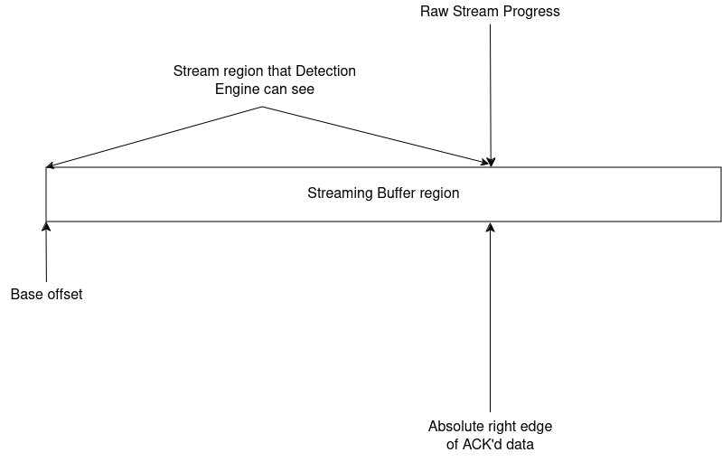

Triggering Raw Stream Reassembly from Application Layer
-------------------------------------------------------

It is possible to trigger the reassembly of the raw stream from the application
layer protocol parsers, by calling the function
``AppLayerParserTriggerRawStreamReassembly``.
This call is made for the immediate reassembly of raw stream to make more data
available for detection, e.g. upon completion of an HTTP request because of the
following reasons:

1. The reassembly ideally only happens after a certain chunk of data has been
   seen by the Stream Engine. This chunk size is configurable in
   ``suricata.yaml`` (see: ``stream.reassembly.toserver-chunk-size``).
2. The Stream Engine would have seen more data than the Detection Engine at any
   point in time.

The Stream Engine provides the following parameters for the stream to be
tracked by the different subsystems of Suricata:

* app layer progress
* raw reassembly progress
* streaming logger progress

These parameters are used to track the progress of the stream in the respective
subsystems. This serves as a communication between the different subsystems
about how far they have already looked into the stream. They are all relative
to the base offset of the streaming buffer region as seen in the file
``stream-tcp-private.h``.

.. code-block:: c

    #define STREAM_APP_PROGRESS(stream) (STREAM_BASE_OFFSET((stream)) + (stream)->app_progress_rel)
    #define STREAM_RAW_PROGRESS(stream) (STREAM_BASE_OFFSET((stream)) + (stream)->raw_progress_rel)
    #define STREAM_LOG_PROGRESS(stream) (STREAM_BASE_OFFSET((stream)) + (stream)->log_progress_rel)

For a given streaming buffer region as illustrated below:

If a call to ``AppLayerParserTriggerRawStreamReassembly`` was made, things
would change as represented in the next image, allowing the Detection Engine to
see a bigger part of the stream until the last ACK as seen by the Stream
Engine.

Note that there could be any amount of data in the stream but we're only
concerned about the last ACK'd data.

Terms displayed in the diagrams:

* ``Base offset``: Offset of the streaming buffer region w.r.t. the actual
  stream.
* ``ACK'd data``: The indicator of position in the streaming buffer region
  till which the last ACK was seen.
* ``Raw Stream Progress``: This indicates where in the stream the detection
  engine has already inspected, so it's a "bookmark" of sorts to keep track
  of where the last inspection left off and from what offset a next call
  should consider inspection.

Please note that the above scenario does not hold as-is for:

* Inline mode
* Gaps in the TCP stream
* Minimum inspection depth setting

The data is evaluated differently for these cases.
