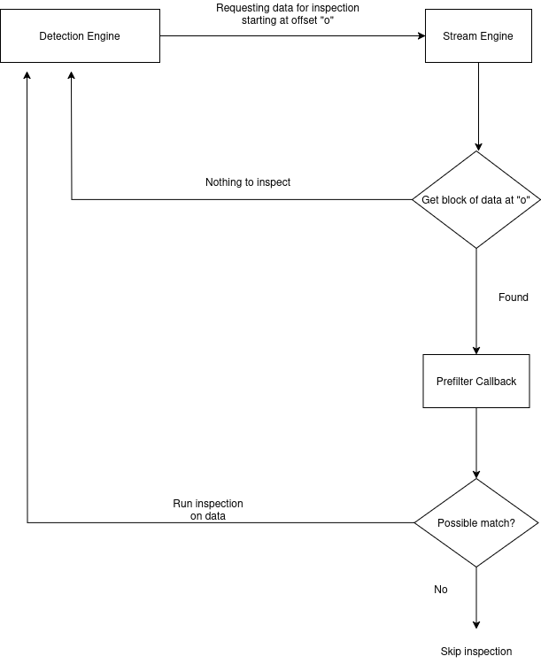

Inspection of raw stream data
#############################

Stream Engine
^^^^^^^^^^^^^

Suricata's Stream Engine tracks and processes all the TCP stream data. Its responsibilities include

* TCP segment reassembly
* TCP data normalization
* gap management and handling
* maintaining internal caches
* handling of special cases like TCP URG ptr
* applying user-defined constraints like stream depth etc

for IDS as well as inline mode.

Internal storage of stream data
===============================

For a stream with small gaps, a Red Black Tree is used to store the streaming buffer blocks.

For a stream with large gaps (>=262144 bytes), regions (list of blocks of data) are used.

For a stream without gaps, one continuous streaming buffer is used (i.e. just one region).

These different data structures are used in a quest to make efficient use of memory in exceptional
and regular conditions.

Role of stream reassembly
=========================

TCP stream data can arrive in any manner. For example, 100 bytes of data can arrive as 100 bytes at
once or 1 byte at a time in 100 segments. The possibilities are insanely high! So, if it's
100 bytes of data, there are :math:`2^{99}` ways this data can be received in a world where this
data arrives in order!

Hence, it is important for the engine to reassemble the TCP stream data to avoid unnecessary
inspection on incomplete data and to avoid leaving room for evasion techniques based on small
segments. Stream reassembly makes sure that the data to be matched upon is reliable.

Role of Detection Engine and Applayer Parser
^^^^^^^^^^^^^^^^^^^^^^^^^^^^^^^^^^^^^^^^^^^^

In order to conduct inspection on certain stream data, the Detection Engine has to request the
Stream Engine for data. Doing this for every parseable data can be expensive and unreliable, so,
the engine requests data in chunks. The size of these chunks can be defined in :ref:`suricata.yaml <stream-engine-yaml>`.
It is recommended to randomize the chunk size to avoid possible evasions on predictable boundaries.
By default, the chunk size is randomized by Suricata.

Note that in some cases these chunk sizes may be too far into the future resulting in delayed
inspection of data. This could lead to several issues like the one listed in `Bug 7004 <https://redmine.openinfosecfoundation.org/issues/7004>`_.
To deal with this, most applayer parsers request inspection of data as soon as they have fully and
reliably parsed a certain entity like a request or a response in a respective direction.

It is important to note that the inspection window can be limited by certain special conditions
like stream depth being reached or end of stream being reached, etc.

Tracking of inspection
^^^^^^^^^^^^^^^^^^^^^^

The Stream Engine must keep track of the point until which the inspection is already
done. This helps the engine know what data has been consumed and can be slid out of the window.
For a given stream without gaps, in IDS mode, from a very high level, assuming there are no overlaps
in the tracking/data, no special conditions at play, the oversimplified tracking would look
like the following.

On a very high level, the communication that takes place between the Detection Engine and the
Stream Engine about data inspection is as follows.

Of course this means that the Detection Engine also maintains a copy of the raw progress of the
data it has consumed so far. After the inspection is completed, the streaming buffer window slides if
the data was consumed successfully. Additionally, the relative raw tracker is updated.

Relevant configuration
^^^^^^^^^^^^^^^^^^^^^^

The following `suricata.yaml` settings can impact the internal inspection of data.

Stream Engine related settings:

::

  stream:
    memcap: 64 MiB
    #memcap-policy: ignore
    checksum-validation: yes      # reject incorrect csums
    #midstream: false
    #midstream-policy: ignore
    inline: auto                  # auto will use inline mode in IPS mode, yes#
    reassembly:
      urgent:
        policy: oob              # drop, inline, oob (1 byte, see RFC 6093, 3.#
        oob-limit-policy: drop
      memcap: 256 MiB
      #memcap-policy: ignore
      depth: 1 MiB                # reassemble 1 MiB into a stream
      toserver-chunk-size: 2560
      toclient-chunk-size: 2560
      randomize-chunk-size: yes
      #randomize-chunk-range: 10
      #raw: yes
      #segment-prealloc: 2048
      #check-overlap-different-data: true
      #max-regions: 8

Prefilter/MPM related settings:

::

  mpm-algo: hs
