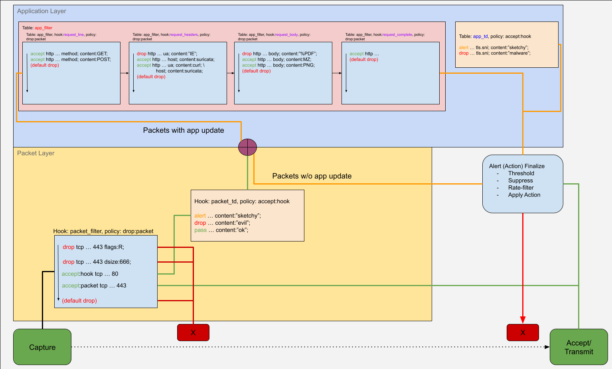

.. _firewall mode design:

Firewall Mode Design
********************

.. note:: In Suricata 8 the firewall mode is experimental and subject to change.

The firewall mode in Suricata allows the use of a ruleset that has different
properties than the default "threat detection" rulesets:

1. default policy is ``drop``, meaning a firewall ruleset needs to specify what
   is allowed
2. firewall rules are loaded from separate files
3. firewall rules use a new action ``accept``
4. firewall rules are required to use explicit action scopes and rule hooks (see below)
5. evaluation order is as rules are in the file(s), per protocol state

Concepts
========

Tables
------

A ``table`` is a collection of rules with different properties. These tables are built-in.
No custom tables can be created. Tables are available within the scope of packet layer
and application layer (if available). Each rule can define its own :ref:`action scope<ips_action_scopes>`.

Packet layer tables
~~~~~~~~~~~~~~~~~~~

Rules categorized in the following tables apply to all packets.

.. table::

    +-----------------------+--------------------------------------------------------------------+----------------+--------------------------------+
    |          Table        |                             Description                            | Default Policy |           Rule Order           |
    +=======================+====================================================================+================+================================+
    | ``packet:pre_flow``   | Firewall rules to be evaluated before flow is created/updated      | ``drop:packet``|   As appears in the rule file  |
    +-----------------------+--------------------------------------------------------------------+----------------+--------------------------------+
    | ``packet:pre_stream`` | Firewall rules to be evaluated before stream is updated            | ``drop:packet``|   As appears in the rule file  |
    +-----------------------+--------------------------------------------------------------------+----------------+--------------------------------+
    | ``packet:filter``     | Firewall rules to be evaluated against every packet after decoding | ``drop:packet``|   As appears in the rule file  |
    +-----------------------+--------------------------------------------------------------------+----------------+--------------------------------+
    | ``packet:td``         | Generic IDS/IPS threat detection rules                             | ``accept:hook``| Internal IDS/IPS rule ordering |
    +-----------------------+--------------------------------------------------------------------+----------------+--------------------------------+

Application layer tables
~~~~~~~~~~~~~~~~~~~~~~~~

If applayer is available, rules from the following tables apply. The tables for the
application layer are per app layer protocol and per protocol state. e.g. ``http:request_line``.

.. table::

    +----------------+--------------------------------------------------------------------------+----------------+--------------------------------+
    |      Table     |                                Description                               | Default Policy |           Rule Order           |
    +================+==========================================================================+================+================================+
    | ``app:filter`` | Firewall rules to be evaluated per applayer protocol and state           | ``drop:flow``  |   As appears in the rule file  |
    +----------------+--------------------------------------------------------------------------+----------------+--------------------------------+
    | ``app:td``     | Generic IDS/IPS threat detection rules                                   | ``accept:hook``| Internal IDS/IPS rule ordering |
    +----------------+--------------------------------------------------------------------------+----------------+--------------------------------+

.. _ips_action_scopes:

Actions and Action Scopes
-------------------------

Firewall rules require action scopes to be explicitly specified.

accept
~~~~~~

``accept`` is used to issue an accept verdict to the packet, flow or hook.

* ``packet`` accept this packet
* ``flow`` accept the rest of the packets in this flow
* ``hook`` accept rules for the current hook/state, evaluate the next tables
* ``tx`` accept rules for the current transaction, evaluate the next tables

The ``accept`` action is only available in firewall rules.

.. note:: some protocol implementations like ``dns`` use a transaction per direction.
   For those ``accept:tx`` will only accept packets that are part of that direction.

drop
~~~~

``drop`` is used to drop either the packet or the flow

* ``packet`` drop this packet directly, don't eval any further rules
* ``flow`` drop this packet as with ``packet`` and drop all future packets in this flow

.. note:: the action ``pass`` is not available in firewall rules due to ambiguity around
   the existing meaning for threat detection rules.

.. _rule-hooks:

Explicit rule hook (states)
---------------------------

In the regular IDS/IPS rules the engine infers from the rule's matching logic where the
rule should be "hooked" into the engine. While this works well for these types of rules,
it does lead to many edge cases that are not acceptable in a firewall ruleset. For this
reason in the firewall rules the hook needs to be explicitly set.

There are two types of hooks available based on the layer.

Packet layer hooks
~~~~~~~~~~~~~~~~~~

* ``flow_start``: evaluate the rule only on the first packet in both the directions
* ``pre_flow``: evaluate the rule before the flow is created/updated
* ``pre_stream``: evaluate the rule before the stream is updated
* ``all``: evaluate the rule on every packet

Application layer hooks
~~~~~~~~~~~~~~~~~~~~~~~

The application layer states / hooks are defined per protocol. Each of the hooks has its own
default-``drop`` policy, so a ruleset needs an ``accept`` rule for each of the states to allow
the traffic to flow through.

This is done in the protocol field of the rule. Where in threat detection a rule might look like::

    alert http ... http.uri; ...

In the firewall case it will be::

    accept:hook http1:request_line ... http.uri; ...

All available applayer hooks are available via commandline option ``--list-app-layer-hooks``.

general
^^^^^^^

Each protocol has at least the default states.

Request (``to_server``) side:

* ``request_started``
* ``request_complete``

Response (``to_client``) side:

* ``response_started``
* ``response_complete``

http
^^^^

For the HTTP protocol there are a number of states to hook into. These apply to HTTP 0.9, 1.0
and 1.1. HTTP/2 uses its own state machine.

Available states:

Request (``to_server``) side:

* ``request_started``
* ``request_line``
* ``request_headers``
* ``request_body``
* ``request_trailer``
* ``request_complete``

Response (``to_client``) side:

* ``response_started``
* ``response_line``
* ``response_headers``
* ``response_body``
* ``response_trailer``
* ``response_complete``

tls
^^^

Available states:

Request (``to_server``) side:

* ``client_in_progress``
* ``client_hello_done``
* ``client_cert_done``
* ``client_handshake_done``
* ``client_finished``

Response (``to_client``) side:

* ``server_in_progress``
* ``server_hello``
* ``server_cert_done``
* ``server_hello_done``
* ``server_handshake_done``
* ``server_finished``

ssh
^^^

Available states are listed in :ref:`ssh-hooks`.

Firewall pipeline
-----------------

The firewall pipeline works in the detection engine, and is invoked after packet decoding, flow
update, stream tracking and reassembly and app-layer parsing are all done in the context of a
single packet.

For each packet rules in the first firewall hook ``packet:filter`` are then evaluated. Assuming
the verdict of this hook is ``accept:hook``, the next hook is evaluated: ``packet:td`` (packet
threat detection). In this hook the IDS/IPS rules are evaluated. Rule actions here are not
immediate, as they can still be modified by alert postprocessing like rate_filter, thresholding, etc.

The default ``drop`` for the ``packet:filter`` table is ``drop:packet``. Thus the ``drop`` is
only applied to the current packet.

If the packet has been marked internally as a packet with an application layer update, then the
next table is ``app:*:*``.

In ``app:*:*`` the per application layer states are all evaluated at least once. At each of
these states an ``accept:hook`` is required to progress to the next state. When all available states
have been accepted, the pipeline moves to the final table ``app:td`` (application layer threat
detection). A ``drop`` in the ``app:filter`` table is immediate, however and ``accept`` is
conditional on the verdict of the ``app:td`` table.

The default ``drop`` in one of the ``app:*:*`` tables is a ``drop:flow``. This means that the
current packet as well as all future packets from that flow are dropped.

In ``app:td`` the IDS/IPS rules for the application layer are evaluated. ``drop`` actions in this
table are queued in the alert queue.

When all tables have been evaluated, the alert finalize process orders threat detection alerts
by ``action-order`` logic. It can then apply a ``drop`` or default to ``accept``-ing.

Pass rules with Firewall mode
-----------------------------

In IDS/IPS mode, a ``pass`` rule with app-layer matches will bypass the detection engine for the
rest of the flow. In firewall mode, this bypass no longer happens in the same way, as ``pass`` rules
do not affect firewall rules. So the detection engine is still invoked on packets of such a flow,
but the ``packet:td`` and ``app:td`` tables are skipped.

Firewall rules
==============

Firewall rules are loaded first and separately from the following section of ``suricata.yaml``:

::

  firewall-rule-path: /etc/suricata/firewall/
  firewall-rule-files:
    - fw.rules

One can optionally, also load firewall rules exclusively from commandline using the
``--firewall-rules-exclusive`` option.

Firewall rules are available in the file ``firewall.json`` as a part of the output
of :ref:`engine analysis<config:engine-analysis>`.
