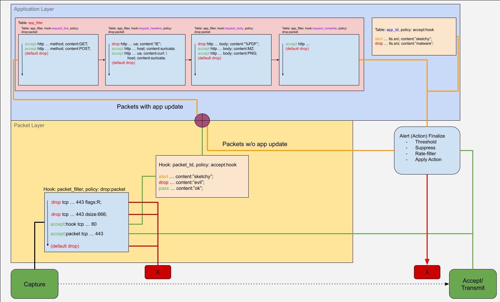

.. _firewall mode design:

Firewall Mode Design
********************

.. note:: In Suricata 8 the firewall mode is experimental and subject to change.

The firewall mode in Suricata allows the use of a ruleset that has different
properties than the default "threat detection" rulesets:

1. default policy is ``drop``, meaning a firewall ruleset needs to specify what
   is allowed
2. firewall rules are loaded from separate files
3. firewall rules use a new action ``accept``
4. firewall rules are required to use explicit action scopes and rule hooks (see below)
5. evaluation order is as rules are in the file(s), per protocol state

Concepts
========

Firewall vs Threat Detection (TD)
---------------------------------

The interaction between firewall and TD is concepualized as if they are 2 seperate
instances, where the firewall instance runs first, and it passes along to the TD
instance what is accepted by the firewall.

This is reflected in the stats, where a packet accepted by the firewall is counted
as ``firewall.accepted``. If it was also allowed by TD, it will additionally be
counted as ``ips.accepted``. If it was dropped by firewall, only ``firewall.blocked``
will be incremented. No ``ips.*`` counter will be updated as conceptually the TD
instance won't have seen the packet.

Tables
------

A ``table`` is a collection of rules with different properties. These tables are built-in.
No custom tables can be created. Tables are available within the scope of packet layer
and application layer (if available). Each rule can define its own :ref:`action scope<ips_action_scopes>`.

Packet layer tables
~~~~~~~~~~~~~~~~~~~

Rules categorized in the following tables apply to all packets.

.. table::

    +-----------------------+--------------------------------------------------------------------+----------------+--------------------------------+
    |          Table        |                             Description                            | Default Policy |           Rule Order           |
    +=======================+====================================================================+================+================================+
    | ``packet:pre_flow``   | Firewall rules to be evaluated before flow is created/updated      | ``accept:hook``| As appears in the rule file    |
    +-----------------------+--------------------------------------------------------------------+----------------+--------------------------------+
    | ``packet:pre_stream`` | Firewall rules to be evaluated before stream is updated            | ``accept:hook``| As appears in the rule file    |
    +-----------------------+--------------------------------------------------------------------+----------------+--------------------------------+
    | ``packet:filter``     | Firewall rules to be evaluated against every packet after decoding | ``drop:packet``| As appears in the rule file    |
    +-----------------------+--------------------------------------------------------------------+----------------+--------------------------------+
    | ``packet:td``         | Generic IDS/IPS threat detection rules                             | ``accept:hook``| Internal IDS/IPS rule ordering |
    +-----------------------+--------------------------------------------------------------------+----------------+--------------------------------+

Application layer tables
~~~~~~~~~~~~~~~~~~~~~~~~

If applayer is available, rules from the following tables apply. The tables for the
application layer are per app layer protocol and per protocol state. e.g. ``http1:request_line``.

.. table::

    +----------------+--------------------------------------------------------------------------+----------------+--------------------------------+
    |      Table     |                                Description                               | Default Policy |           Rule Order           |
    +================+==========================================================================+================+================================+
    | ``app:filter`` | Firewall rules to be evaluated per applayer protocol and state           | ``drop:flow``  | As appears in the rule file    |
    +----------------+--------------------------------------------------------------------------+----------------+--------------------------------+
    | ``app:td``     | App-layer IDS/IPS threat detection rules                                 | ``accept:hook``| Internal IDS/IPS rule ordering |
    +----------------+--------------------------------------------------------------------------+----------------+--------------------------------+

.. _ips_action_scopes:

Actions and Action Scopes
-------------------------

Firewall rules require action scopes to be explicitly specified.

accept
~~~~~~

``accept`` is used to issue an accept verdict to the packet, flow or hook.

* ``packet`` accept this packet
* ``flow`` accept the rest of the packets in this flow
* ``hook`` accept rules for the current hook/state, evaluate the next tables
* ``tx`` accept rules for the current transaction, evaluate the next tables

The ``accept`` action is only available in firewall rules.

.. note:: some protocol implementations like ``dns`` use a transaction per direction.
   For those ``accept:tx`` will only accept packets that are part of that direction.

drop
~~~~

``drop`` is used to drop either the packet or the flow

* ``packet`` drop this packet directly, don't eval any further rules
* ``flow`` drop this packet as with ``packet`` and drop all future packets in this flow

.. note:: unlike in threat detection mode rules, a ``drop`` in a firewall rule does not
   imply alert

pass
~~~~

``pass`` is not available as a primary firewall action, but can be used as a secondary
action in firewall rules. The effect of the action will only apply to threat detection rules.

alert
~~~~~

``alert`` is not available as a primary firewall action, but can be used as a secondary
action in firewall rules. The effect will be the creation of an alert event when the
firewall rule matches.

For application layer transactions the alert event carries a ``firewall`` object with
the resolved ``policy`` and, when the protocol registers a state name callback, the
``hook`` the rule was registered at. Protocols without such a callback (``quic``,
``modbus``, ``rdp``) omit the ``hook`` key; the policy is still reported.

config
~~~~~~

``config`` is a primary firewall action used to apply the setting of the ``config``
rule keyword when the rule matches, see :doc:`../rules/config`.
The ``config`` action does not issue a verdict for the packet or the flow, so the
other tables are still evaluated. It is not available as a secondary action.

Multi action rules
~~~~~~~~~~~~~~~~~~

In firewall rules, multiple actions can be specified: a primary firewall action, followed
by one or more secondary actions.

Example::

    accept:flow,pass:flow,alert tls:client_hello ... tls.sni; ...

In this example the first action ``accept:flow`` is the primary firewall action. When the
rule matches, the flow will be accepted. The secondary actions ``pass:flow`` and ``alert`` are
evaluated in the context of the threat detection engine.

.. note:: the secondary actions are only evaluated if the primary firewall action is accepted.
   This is different from the behavior of the ``pass`` action in threat detection mode.

.. _rule-hooks:

Explicit rule hook (states)
---------------------------

In the regular IDS/IPS rules the engine infers from the rule's matching logic where the
rule should be "hooked" into the engine. While this works well for these types of rules,
it does lead to many edge cases that are not acceptable in a firewall ruleset. For this
reason in the firewall rules the hook needs to be explicitly set.

There are two types of hooks available based on the layer.

Packet layer hooks
~~~~~~~~~~~~~~~~~~

* ``flow_start``: evaluate the rule only on the first packet in both the directions
* ``pre_flow``: evaluate the rule before the flow is created/updated
* ``pre_stream``: evaluate the rule before the stream is updated
* ``all``: evaluate the rule on every packet

Application layer hooks
~~~~~~~~~~~~~~~~~~~~~~~

The application layer states / hooks are defined per protocol. Each of the hooks has its own
default-``drop`` policy, so a ruleset needs an ``accept`` rule for each of the states to allow
the traffic to flow through.

This is done in the protocol field of the rule. Where in threat detection a rule might look like::

    alert http ... http.uri; ...

In the firewall case it will be::

    accept:hook http1:request_line ... http.uri; ...

All available applayer hooks are available via commandline option ``--list-app-layer-hooks``.

general
^^^^^^^

Each protocol has at least the default states.

Request (``to_server``) side:

* ``request_started``
* ``request_complete``

Response (``to_client``) side:

* ``response_started``
* ``response_complete``

http
^^^^

For the HTTP protocol there are a number of states to hook into. These apply to HTTP 0.9, 1.0
and 1.1. HTTP/2 uses its own state machine.

Available states:

Request (``to_server``) side:

* ``request_started``
* ``request_line``
* ``request_headers``
* ``request_body``
* ``request_trailer``
* ``request_complete``

Response (``to_client``) side:

* ``response_started``
* ``response_line``
* ``response_headers``
* ``response_body``
* ``response_trailer``
* ``response_complete``

tls
^^^

Available states:

Request (``to_server``) side:

* ``client_started``
* ``client_hello``
* ``client_cert``
* ``client_data``
* ``client_finished``

The ``client_hello`` state names the ClientHello message being parsed:
it is entered when the message starts, so the fragments of a hello split
over several TLS records are all decided at ``client_hello``. The hello
data (SNI, version, ...) is available once the final fragment completes
the message, which moves the state to ``client_cert``; rules evaluated
on the earlier fragments see the buffers still empty, the same way a
split HTTP request line is in ``request_line`` before the line is
complete.

Response (``to_client``) side:

* ``server_started``
* ``server_hello``
* ``server_cert``
* ``server_data``
* ``server_finished``

ssh
^^^

Available states are listed in :ref:`ssh-hooks`.

Auto-accept prior states
^^^^^^^^^^^^^^^^^^^^^^^^

To avoid creating lots of boilerplate ``accept`` rules there is a special notation to have
a rule accept not just the hook it matches in, but also the hooks before it.

Example::

    accept:flow tls:<client_hello ... tls.sni; content:"suricata.io"; ...

The main matching logic here is in the ``tls:client_hello`` hook. The
state before it, ``tls:client_started``, is also accepted, as if the
ruleset was actually::

    accept:hook tls:client_started ...
    accept:flow tls:client_hello ... tls.sni; content:"suricata.io"; ...

This logic only applies to the ``app:filter`` table.

While such a rule is still pending - it ran the states before its hook without
matching, but a buffer of its hook can still grow - a rule hooked at a higher
state is still evaluated once the transaction has moved past the pending rule's
hook; while the transaction is at or before that hook the walk stops, so no
higher state's policy can decide the flow early. A rule of a higher id at the
pending rule's own hook is inspected in the same walk: a rule which cannot be
decided by this update must not stall the hook for the rules which can. The price
is that such a rule's action - a ``drop:flow``, say - decides the flow before the
pending accept resolves. ``ruletype-firewall-616`` pins it.
A higher-hook rule inspects
the buffers of every state below its own hook, so its match covers the pending
rule and its action decides the flow: when it matches, the pending rule's later
no-match does not apply the default policy of its own state.

A sub-state's buffers can also grow after the transaction moved past the rule's
hook: a http2 trailer HEADERS frame updates the header lists above the
``request_headers`` hook. That growth stops with the direction's own END_STREAM,
not with the transaction: a http2 stream only completes once both sides closed,
and holding a rule pending that long defers the default policy past the request. The fast pattern at the hook decides there: above it a
group is retired once its rules are, so a rule whose buffer is final at that
point is not run again. A group whose buffer can still be rewritten is not: all
of its rules go into the list at that update, and with them the default policies
of the states they cover. A rule that would stay open because a *stream* match
can still arrive cannot use the notation at all, see the limitations below.

The bound is the transaction's end state. For a parser with per-direction sub-
states that can be later than the direction's own close - a http2 stream
completes when both sides closed, while its request buffers are final once the
client sent END_STREAM - so a window can open where that direction's own buffers
are final already. That is deliberate: the tighter bound needs a per-direction
completion the parsers do not expose yet.

Firewall pipeline
-----------------

The firewall pipeline works in the detection engine, and is invoked after packet decoding, flow
update, stream tracking and reassembly and app-layer parsing are all done in the context of a
single packet.

For each packet rules in the first firewall hook ``packet:filter`` are then evaluated. Assuming
the verdict of this hook is ``accept:hook``, the next hook is evaluated: ``packet:td`` (packet
threat detection). In this hook the IDS/IPS rules are evaluated. Rule actions here are not
immediate, as they can still be modified by alert postprocessing like rate_filter, thresholding, etc.

The default ``drop`` for the ``packet:filter`` table is ``drop:packet``. Thus the ``drop`` is
only applied to the current packet.

If the packet has been marked internally as a packet with an application layer update, then the
next table is ``app:*:*``.

In ``app:*:*`` the per application layer states are all evaluated at least once. At each of
these states an ``accept:hook`` is required to progress to the next state. When all available states
have been accepted, the pipeline moves to the final table ``app:td`` (application layer threat
detection). A ``drop`` in the ``app:filter`` table is immediate, however and ``accept`` is
conditional on the verdict of the ``app:td`` table.

The default ``drop`` in one of the ``app:*:*`` tables is a ``drop:flow``. This means that the
current packet as well as all future packets from that flow are dropped.

In ``app:td`` the IDS/IPS rules for the application layer are evaluated. ``drop`` actions in this
table are queued in the alert queue.

When all tables have been evaluated, the alert finalize process orders threat detection alerts
by ``action-order`` logic. It can then apply a ``drop`` or default to ``accept``-ing.

Pass rules with Firewall mode
-----------------------------

In IDS/IPS mode, a ``pass`` rule with app-layer matches will bypass the detection engine for the
rest of the flow. In firewall mode, this bypass no longer happens in the same way, as ``pass`` rules
do not affect firewall rules. So the detection engine is still invoked on packets of such a flow,
but the ``packet:td`` and ``app:td`` tables are skipped.

Firewall rules
==============

Firewall rules are loaded first and separately from the following section of ``suricata.yaml``:

::

  firewall-rule-path: /etc/suricata/firewall/
  firewall-rule-files:
    - fw.rules

One can optionally, also load firewall rules exclusively from commandline using the
``--firewall-rules-exclusive`` option. Note that this option blocks hot rule reloads, just like
the ``-S`` option in thread detection rules.

Firewall rules are available in the file ``firewall.json`` as a part of the output
of :ref:`engine analysis<config:engine-analysis>`.

Bridge vs router
================

The firewall mode can be used with capture methods in bridge and router mode. When using
the bridge mode, the default drop policy will also apply to non-IP protocols, like ARP.

For ARP to work, a rule to accept it is required:

::

    accept:packet arp:all any any -> any any (sid:200;)

Other ethernet types can be accepted by using generic ethernet rules, with the ``ether.hdr`` keyword.

The example below accepts ARP again, using this mechanism.

::

    accept:packet ether:all any any -> any any (ether.hdr; content:"|08 06|"; offset:12; depth:2; sid:1;)

Default policies
================

Each hook has a default policy applied to traffic that no firewall rule handled.
By default ``packet.filter`` enforces ``drop:packet``, ``packet.pre-flow`` and
``packet.pre-stream`` enforce ``accept:hook``, and every ``app`` hook enforces
``drop:flow``.

Defaults are configured in the ``firewall.policies`` block. A ``default-policy``
for any hook may be given at several levels and the most specific present
setting wins::

    firewall:
      policies:
        default-policy: ["accept:hook"]     # global fallback (all hooks)
        packet:
          default-policy: ["drop:packet"]   # fallback for packet hooks
          filter:     ["reject:packet"]
          pre-flow:   ["accept:hook"]
          pre-stream: ["accept:hook"]
        app:
          default-policy: ["drop:flow"]     # fallback for all app hooks
          dns:
            default-policy: ["drop:flow"]   # fallback for dns hooks
            request-started: ["accept:hook"]
            # Drop and alert on all DNS requests that are not allowed in
            # firewall.rules.
            request-complete: ["drop:flow", "alert"]
            # Accept all responses.
            response-started: ["accept:tx"]
          # Define default policies for protocols with sub states
          http2:
            default-policy: ["drop:flow"]   # fallback for all http2 hooks
            stream:
              default-policy: ["drop:flow"] # fallback for http2 stream hooks
              request-started: ["accept:hook"]
            global:
              request-started: ["accept:hook"]

Precedence:

* packet hook: ``packet.<hook>`` > ``packet.default-policy`` >
  ``policies.default-policy`` > built-in (``drop:packet`` or ``accept:hook``)
* app hook: ``app.<proto>.<hook>`` > ``app.<proto>.default-policy`` >
  ``app.default-policy`` > ``policies.default-policy`` > built-in (``drop:flow``)
* app hook in a sub state: ``app.<proto>..<hook>`` >
  ``app.<proto>..default-policy`` > ``app.<proto>.default-policy`` >
  ``app.default-policy`` > ``policies.default-policy`` > built-in (``drop:flow``)

An action scope must be valid for the hook it is applied to. For example,
defining ``accept:tx`` as a global default policy will fail to start Suricata,
because ``packet`` policies do not accept ``tx``.
Similarly, ``packet.pre-flow`` only accepts the ``packet`` and ``hook`` scopes,
so a ``drop:flow`` set in ``policies.default-policy`` or
``packet.default-policy`` will fail to start Suricata.
Cover such hooks with a more specific setting so the incompatible default never
reaches them::

    firewall:
      policies:
        default-policy: ["drop:flow"]
        packet:
          pre-flow: ["accept:hook"]

A ``<`` hook rule at the protocol's first state (progress 0) is accepted and is
equivalent to the plain hook form, as there are no prior states to auto-accept.

The pending window
------------------

Two words for two sets of rules, both rebuilt on every update of a transaction:

* the *group* of a hook: the LTE rules registered for one progress state of the
  transaction, held as a list of rule ids in one prefilter engine.
* the *pending window*: the rules of that group the fast pattern did not add as
  candidates at the hook state. It is a set of rules, not a range of progress states;
  the states only say when the set is filled and when it is dropped.

An LTE rule has no say below its hook, and at its hook the fast pattern decides which
of them are worth inspecting. The rules the pattern did not add hold the hook open:
they are not candidates, so the walk cannot decide them, but the default policy cannot
resolve the hook either.

::

    progress   0 ............ H (hook) C (a miss becomes final)
               |              |        |
    window     | empty        | filled | emptied here
    (a set of  |              |        |
     rules)    |              |        |
               v              v        v
    policy     while the window is not empty the hook is left unresolved, so a match
               anywhere else takes it and only an empty outcome falls through to the
               default policy

Two moments, for the rules of a group hooked at ``H``:

* at ``H``: the pattern runs; matches go to the candidate list, the rules it did not
  add are the window and the hook stays pending.
* at ``C``: a miss is final for the group's rules whose buffers are complete at
  ``H``. The window contributes its last rule only, so that any other match still
  wins the state and the policy decides when nothing does. A group that also holds
  a rule whose pattern can still grow above ``C`` is not retired there, so the
  retirement cannot apply a default policy through it. Tracking such a rule keeps
  its hook, so a rule which can never resolve does not hold it open for the whole
  transaction. When no candidate takes an id above them, the walk takes the pending
  rules at its end, so they are accounted for either way.

``C`` is ``H + 1`` for the app buffers of a protocol which declares no sub-states: an
app hooked rule can only hold patterns of buffers whose engine sits at its hook, so such
a buffer cannot grow once the transaction has moved past it. One case does grow: an
app buffer of a protocol declaring sub-states, because a frame can rewrite it above the
hook -- an http2 trailer HEADERS frame updates the header list buffers. The buffers of a
request that ended with END_STREAM do not: the parser says where each direction stops
growing, and that is what the revisit keys on. It has no pattern
which covers that update, so all the rules of the group are inspected there. A rule
with no fast pattern at all has no update which brings it, so a group which holds one is
inspected whole there as well. A
transaction that ends at or below ``H`` never opens a window: its end state decides,
and a window opens only for a tx that keeps going past ``H``.

LIMITATIONS
-----------

* A rule using the auto-accept notation (``<hook``) cannot match the raw stream: a
  ``content`` or ``pcre`` on the stream (including a bare ``content`` before any sticky
  buffer) makes the rule fail to load. The stream is the one buffer that keeps delivering
  data above any hook, so a miss at the hook would not be final, and the retirement above
  depends on it being so. Use the buffer keyword of the state you mean.
* A http2 request that ends with a body keeps the packets of a denied host until its
  END_STREAM frame. The revisit exists because a trailer can rewrite the header lists,
  so a rule hooked below them stays in the running until the request side closes, and a
  pending rule appends a packet accept for the packets it holds. main decides on the
  first body packet; a buffer-aware revisit - final at the hook unless one of the rule's
  buffers can still change - would close the difference and needs a per-buffer flag at
  registration. Pinned as it stands by
  ``ruletype-firewall-620-lte-http2-body-delivered-until-request-closes``.
* HTTP/1 rewrites ``http.header`` above its hook when a message has a trailer, so a rule
  at ``http1:<request_headers`` whose pattern only appears in a trailer is retired at the
  first update above the hook and the default policy of that state decides before the
  trailer is inspected. This is a known gap, open with the design discussion of the
  retirement bound.
