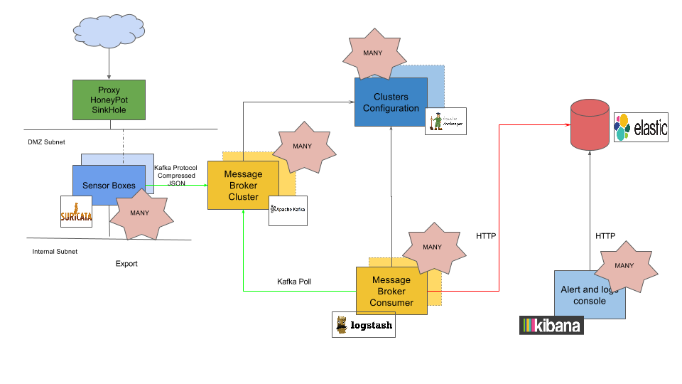

Kafka Output
============

This page shows a basic architecture diagram for Suricata eve ouput to
Apache Kafka.

Eve output to Kafka architecture diagram
----------------------------------------

Kafka Logstash Input plugin
---------------------------

The Kafka input plugin for Logstash usage example:

::

 input {
  kafka {
    zk_connect => "zookeeper:2181"
    topic_id   => "suricata"
    codec      => "json"
  }
 }

 output {
  elasticsearch {
   hosts    => [ "elasticsearch" ]
   index    => [ "suricata-%{+YYYY.MM.dd}" ]
  }
 }
