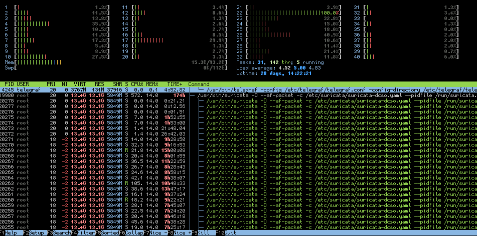
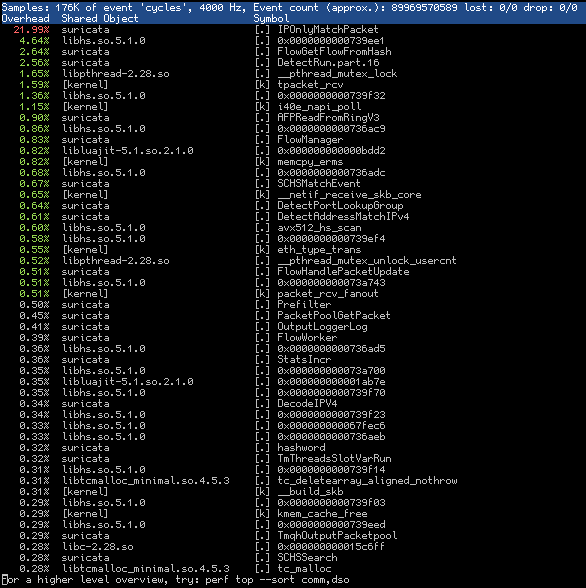

Performance Analysis
====================

There are many potential causes for for performance issues. In this section we
will guide you through some options. The first part will cover basic steps and
introduce some helpful tools. The second part will cover more in-depth
explanations and corner cases.

System Load
-----------

The first step should be to check the system load. Run a top tool like **htop**
to get an overview of the system load and if there is a bottleneck with the
traffic distribution. For example if you can see that only a small number of
cpu cores hit 100% all the time and others don't, it could be related to a bad
traffic distribution or elephant flows like in the screenshot where one core
peaks due to one big elephant flow.

If all cores are at peak load the system might be too slow for the traffic load
or it might be misconfigured. Also keep an eye on memory usage, if the actual
memory usage is too high and the system needs to swap it will result in very
poor performance.

The load will give you a first indication where to start with the debugging at
specific parts we describe in more detail in the second part.

Logfiles
--------

The next step would be to check all the log files with a focus on **stats.log**
and **suricata.log** if any obvious issues are seen. The most obvious indicator
is the **capture.kernel_drops** value that ideally would not even show up but
should be below 1% of the **capture.kernel_packets** value as high drop rates
could lead to a reduced amount of events and alerts.

If **memcap** is seen in the stats the memcap values in the configuration could
be increased. This can result to higher memory usage and should be taken into
account when the settings are changed.

Don't forget to check any system logs as well, even a **dmesg** run can show
potential issues.

Suricata Load
-------------

Besides the system load, another indicator for potential performance issues is
the load of Suricata itself.  A helpful tool for that is **perf** which helps
to spot performance issues. Make sure you have it installed and also the debug
symbols installed for Suricata or the output won't be very helpful. This output
is also helpful when you report performance issues as the Suricata Development
team can narrow down possible issues with that.

::

    sudo perf top -p $(pidof suricata)

If you see specific function calls at the top in red it's a hint that those are
the bottlenecks. For example if you see **IPOnlyMatchPacket** it can be either
a result of high drop rates or incomplete flows which result in decreased
performance. To look into the performance issues on a specific thread you can
pass **-t TID** to perf top. In other cases you can see functions that give you
a hint that a specific protocol parser is used a lot and can either try to
debug a performance bug or try to filter related traffic.

In general try to play around with the different configuration options that
Suricata does provide with a focus on the options described in
:doc:`high-performance-config`.

Traffic
-------

In most cases where the hardware is fast enough to handle the traffic but the
drop rate is still high it's related to specific traffic issues.

Basics
^^^^^^

Some of the basic checks are:

- Check if the traffic is bidirectional, if it's mostly unidirectional you're
  missing relevant parts of the flow (see **tshark** example at the bottom).
  Another indicator could be a big discrepancy between SYN and SYN-ACK as well
  as RST counter in the Suricata stats.

- Check for encapsulated traffic, while GRE, MPLS etc. are supported they could
  also lead to performance issues. Especially if there are several layers of
  encapsulation.

- Use tools like **iftop** to spot elephant flows. Flows that have a rate of
  over 1Gbit/s for a long time can result in one cpu core peak at 100% all the
  time and increasing the droprate while it might not make sense to dig deep
  into this traffic.

- Another approach to narrow down issues is the usage of **bpf filter**. For
  example filter all HTTPS traffic with **not port 443** to exclude traffic
  that might be problematic or just look into one specific port **port 25** if
  you expect some issues with a specific protocol. See :doc:`ignoring-traffic`
  for more details.

- If VLAN is used it might help to disable **vlan.use-for-tracking** in
  scenarios where only one direction of the flow has the VLAN tag.

Advanced
^^^^^^^^

There are several advanced steps and corner cases when it comes to a deep dive
into the traffic.

If VLAN QinQ (IEEE 802.1ad) is used be very cautious if you use **cluster_qm**
in combination with Intel drivers and AF_PACKET runmode. While the RFC expects
ethertype 0x8100 and 0x88A8 in this case (see
https://en.wikipedia.org/wiki/IEEE_802.1ad) most implementations only add
0x8100 on each layer. If the first seen layer has the same VLAN tag but the
inner one has different VLAN tags it will still end up in the same queue in
**cluster_qm** mode. This was observed with the i40e driver up to 2.8.20 and
the firmware version up to 7.00, feel free to report if newer versions have
fixed this (see https://suricata.io/support/).

If you want to use **tshark** to get an overview of the traffic direction use
this command:

::

    sudo tshark -i $INTERFACE -q -z conv,ip -a duration:10

The output will show you all flows within 10s and if you see 0 for one
direction you have unidirectional traffic, thus you don't see the ACK packets
for example. Since Suricata is trying to work on flows this will have a rather
big impact on the visibility. Focus on fixing the unidirectional traffic. If
it's not possible at all you can enable **async-oneside** in the **stream**
configuration setting.

Check for other unusual or complex protocols that aren't supported very well.
You can try to filter those to see if it has any impact on the performance.  In
this example we filter Cisco Fabric Path (ethertype 0x8903) with the bpf filter
**not ether proto 0x8903** as it's assumed to be a performance issue (see
https://redmine.openinfosecfoundation.org/issues/3637)

Elephant Flows
^^^^^^^^^^^^^^

The so called Elephant Flows or traffic spikes are quite difficult to deal
with. In most cases those are big file transfers or backup traffic and it's not
feasible to decode the whole traffic. From a network security monitoring
perspective it's often enough to log the metadata of that flow and do a packet
inspection at the beginning but not the whole flow.

If you can spot specific flows as described above then try to filter those. The
easiest solution would be a bpf filter but that would still result in a
performance impact. Ideally you can filter such traffic even sooner on driver
or NIC level (see eBPF/XDP) or even before it reaches the system where Suricata
is running. Some commercial packet broker support such filtering where it's
called **Flow Shunting** or **Flow Slicing**.

Rules
-----

The Ruleset plays an important role in the detection but also in the
performance capability of Suricata. Thus it's recommended to look into the
impact of enabled rules as well.

If you run into performance issues and struggle to narrow it down start with
running Suricata without any rules enabled and use the tools again that have
been explained at the first part. Keep in mind that even without signatures
enabled Suricata still does most of the decoding and traffic analysis, so a
fair amount of load should still be seen. If the load is still very high and
drops are seen and the hardware should be capable to deal with such traffic
loads you should deep dive if there is any specific traffic issue (see above)
or report the performance issue so it can be investigated (see
https://suricata.io/join-our-community/).

Suricata also provides several specific traffic related signatures in the rules
folder that could be enabled for testing to spot specific traffic issues. Those
are found the **rules** and you should start with **decoder-events.rules**,
**stream-events.rules** and **app-layer-events.rules**.

It can also be helpful to use :doc:`rule-profiling` and/or
:doc:`packet-profiling` to find problematic rules or traffic pattern. This is
achieved by compiling Suricata with **--enable-profiling** but keep in mind
that this has an impact on performance and should only be used for
troubleshooting.
