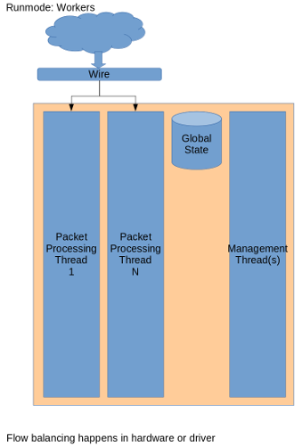
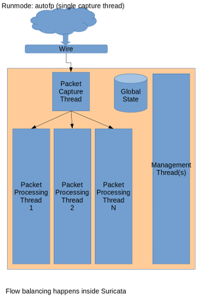
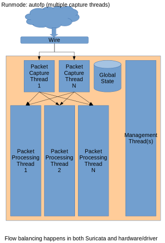
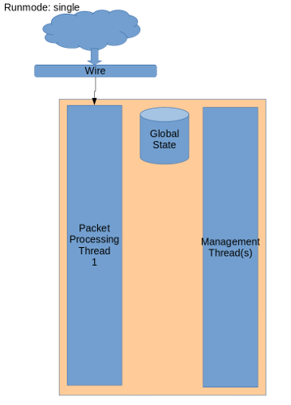

Runmodes
========

Suricata consists of several 'building blocks' called threads,
thread-modules and queues.  A thread is like a process that runs on a
computer. Suricata is multi-threaded, so multiple threads are active
at once.  A thread-module is a part of a functionality. One module is
for example for decoding a packet, another is the detect-module and
another one the output-module.  A packet can be processed by more than
one thread. The packet will then be passed on to the next thread through
a queue. Packets will be processed by one thread at a time, but there
can be multiple packets being processed at a time by the engine (see
:ref:`suricata-yaml-max-pending-packets`). A thread can have one or
more thread-modules. If they have more modules, they can only be
active one a a time.  The way threads, modules and queues are arranged
together is called the "Runmode".

Different runmodes
~~~~~~~~~~~~~~~~~~

You can choose a runmode out of several predefined runmodes. The
command line option ``--list-runmodes`` shows all available runmodes. All
runmodes have a name: single, workers, autofp.

Generally, the ``workers`` runmode performs the best. In this mode the
NIC/driver makes sure packets are properly balanced over Suricata's
processing threads. Each packet processing thread then contains the
full packet pipeline.

For processing PCAP files, or in case of certain IPS setups (like NFQ),
``autofp`` is used. Here there are one or more capture threads, that
capture the packet and do the packet decoding, after which it is passed
on to the ``flow worker`` threads.

Finally, the ``single`` runmode is the same as the ``workers`` mode,
however there is only a single packet processing thread. This is mostly
useful during development.

For more information about the command line options concerning the
runmode, see :doc:`../command-line-options`.
