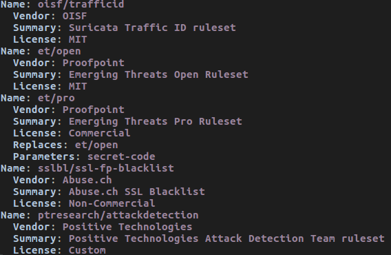

Rule Management with Suricata-Update
====================================

.. note:: ``suricata-update`` is in active development and is not yet
          considered 'production quality'. Proceed with care.

While it is possible to download and install rules manually, it is
recommended to use a management tool for this. Suricata-Update is the
official way to update and manage rules for Suricata.

To install suricata-update

::

  sudo apt install python-pip python-yaml
  sudo pip install --pre --upgrade suricata-update

To download the Emerging Threats Open ruleset, it is enough to simply run:

::

  sudo suricata-update

This will download the ruleset into /var/lib/suricata/rules/

Suricata's configuration will have to be updated to have a rules config like
this:

::

  default-rule-path: /var/lib/suricata/rules
  rule-files:
    - suricata.rules

Now (re)start Suricata.

Updating your rules
~~~~~~~~~~~~~~~~~~~

To update the rules, simply run

::

  sudo suricata-update

It is recommended to update your rules frequently.

Using other rulesets
~~~~~~~~~~~~~~~~~~~~

Suricata-Update is capable of making other rulesets accessible as well.

To see what is available, fetch the master index from the OISF hosts:

::

    sudo suricata-update update-sources

Then have a look at what is available:

::

    sudo suricata-update list-sources

This will give a result similar to

To enable 'oisf/trafficid', enter:

::

    sudo suricata-update enable-source oisf/trafficid
    sudo suricata-update

Now restart Suricata again and the rules from the OISF TrafficID ruleset are loaded.

To see which rulesets are currently active, use "list-enabled-sources".

Controlling which rules are used
~~~~~~~~~~~~~~~~~~~~~~~~~~~~~~~~

By default suricata-update will merge all rules into a single file
"/var/lib/suricata/rules/suricata.rules".

To enable rules that are disabled by default, use '/etc/suricata/enable.conf'

::

    2019401                   # enable this sid
    group:emerging-icmp.rules # enable this rulefile
    re:trojan                 # enable all rules with this string

Similarly, to disable rules use /etc/suricata/disable.conf:

::

    2019401                   # enable this sid
    group:emerging-info.rules # disable this rulefile
    re:heartbleed             # disable all rules with this string

After updating these files, rerun ``suricata-update`` again:

::

    sudo suricata-update

Finally restart Suricata.

Further reading
~~~~~~~~~~~~~~~

See https://suricata-update.readthedocs.io/en/latest/
