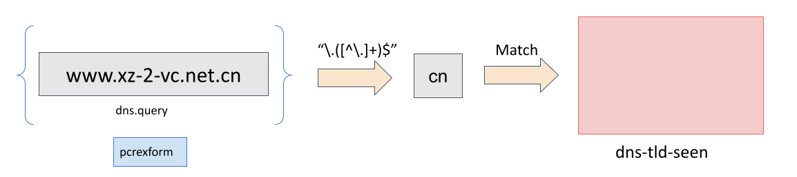

.. _datasets:

Datasets
========

Using the ``dataset`` and ``datarep`` keyword it is possible to match on
large amounts of data against any sticky buffer.

For example, to match against a DNS black list called ``dns-bl``::

    dns.query; dataset:isset,dns-bl;

These keywords are aware of transforms. So to look up a DNS query against
a MD5 black list::

    dns.query; to_md5; dataset:isset,dns-bl;

Global config (optional)
------------------------

Datasets can optionally be defined in the main config. Sets can also be
declared from the rule syntax.

Example of sets for tracking unique values::

    datasets:
      ua-seen:
        type: string
        state: ua-seen.lst
      dns-sha256-seen:
        type: sha256
        state: dns-sha256-seen.lst

Rules to go with the above:

.. container:: example-rule

    alert dns any any -> any any (msg:"dns list test"; dns.query; to_sha256; dataset:isset,dns-sha256-seen; sid:123; rev:1;)

.. container:: example-rule

    alert http any any -> any any (msg: "http user-agent test"; http.user_agent; dataset:set,ua-seen; sid:234; rev:1;)

It is also possible to optionally define global default memcap and hashsize.

Example::

    datasets:
      defaults:
        memcap: 100mb
        hashsize: 2048
      ua-seen:
        type: string
        load: ua-seen.lst

or define memcap and hashsize per dataset.

Example::

    datasets:
      ua-seen:
        type: string
        load: ua-seen.lst
        memcap: 10mb
        hashsize: 1024

.. note:: The `hashsize` should be close to the amount of entries in the dataset to avoid collisions. If it's set too low, this could result in rather long startup time.

Rule keywords
-------------

dataset
~~~~~~~

Datasets are binary: something is in the set or it's not.

Syntax::

    dataset:<cmd>,<name>,<options>;

    dataset:<set|isset|isnotset>,<name> \
        [, type <string|md5|sha256|ipv4|ip>, save <file name>, load <file name>, state <file name>, memcap <size>, hashsize <size>];

type <type>
  the data type: string, md5, sha256, ipv4, ip
load <file name>
  file name for load the data when Suricata starts up
state
  sets file name for loading and saving a dataset
save <file name>
  advanced option to set the file name for saving the in-memory data
  when Suricata exits.
memcap <size>
  maximum memory limit for the respective dataset
hashsize <size>
  allowed size of the hash for the respective dataset

.. note:: 'type' is mandatory and needs to be set.

.. note:: 'load' and 'state' or 'save' and 'state' cannot be mixed.

Example rules could look like:

1. Detect unique User-Agents:

.. container:: example-rule

    alert http any any -> any any (msg:"LOCAL HTTP new UA"; http.user_agent; dataset:set,http-ua-seen, type string, state http-ua-seen.csv; sid:8000001; rev:1;)

2. Detect unique TLDs:

.. container:: example-rule

    alert dns $HOME_NET any -> any any (msg:"LOCAL DNS unique TLD"; dns.query; pcrexform:"\\.([^\\.]+)$"; dataset:set,dns-tld-seen, type string, state dns-tld-seen.csv; sid:8000002; rev:1;)

Following image is a pictorial representation of how the ``pcrexform`` works
on domain names to find TLDs in the dataset ``dns-tld-seen``:

Notice how it is not possible to do certain operations alone with datasets
(example 2 above), but, it is possible to use a combination of other rule
keywords. Keep in mind the cost of additional keywords though e.g. in the
second example rule above, negative performance impact can be expected due
to ``pcrexform``.

datarep
~~~~~~~

Data Reputation allows matching data against a reputation list.

Syntax::

    datarep:<name>,<operator>,<value>, \
        [, load <file name>, type <string|md5|sha256|ipv4|ip>, memcap <size>, hashsize <size>];

Example rules could look like::

    alert dns any any -> any any (dns.query; to_md5; datarep:dns_md5, >, 200, load dns_md5.rep, type md5, memcap 100mb, hashsize 2048; sid:1;)
    alert dns any any -> any any (dns.query; to_sha256; datarep:dns_sha256, >, 200, load dns_sha256.rep, type sha256; sid:2;)
    alert dns any any -> any any (dns.query; datarep:dns_string, >, 200, load dns_string.rep, type string; sid:3;)

In these examples the DNS query string is checked against three different
reputation lists. A MD5 list, a SHA256 list, and a raw string (buffer) list.
The rules will only match if the data is in the list and the reputation
value is higher than 200.

Rule Reloads
------------

Sets that are defined in the yaml, or sets that only use `state` or `save`, are
considered `dynamic` sets. These are not reloaded during rule reloads.

Sets that are defined in rules using only `load` are considered `static` tests.
These are not expected to change during runtime. During rule reloads these are
reloaded from disk. This reload is effective when the complete rule reload
process is complete.

Unix Socket
-----------

dataset-add
~~~~~~~~~~~

Unix Socket command to add data to a set. On success, the addition becomes
active instantly.

Syntax::

    dataset-add <set name> <set type> <data>

set name
  Name of an already defined dataset
type
  Data type: string, md5, sha256, ipv4, ip
data
  Data to add in serialized form (base64 for string, hex notation for md5/sha256, string representation for ipv4/ip)

Example adding 'google.com' to set 'myset'::

    dataset-add myset string Z29vZ2xlLmNvbQ==

dataset-remove
~~~~~~~~~~~~~~

Unix Socket command to remove data from a set. On success, the removal becomes
active instantly.

Syntax::

    dataset-remove <set name> <set type> <data>

set name
  Name of an already defined dataset
type
  Data type: string, md5, sha256, ipv4, ip
data
  Data to remove in serialized form (base64 for string, hex notation for md5/sha256, string representation for ipv4/ip)

dataset-clear
~~~~~~~~~~~~~

Unix Socket command to remove all data from a set. On success, the removal becomes
active instantly.

Syntax::

    dataset-clear <set name> <set type>

set name
  Name of an already defined dataset
type
  Data type: string, md5, sha256, ipv4, ip

dataset-lookup
~~~~~~~~~~~~~~

Unix Socket command to test if data is in a set. 

Syntax::

    dataset-lookup <set name> <set type> <data>

set name
  Name of an already defined dataset
type
  Data type: string, md5, sha256, ipv4, ip
data
  Data to test in serialized form (base64 for string, hex notation for md5/sha256, string notation for ipv4/ip)

Example testing if 'google.com' is in the set 'myset'::

    dataset-lookup myset string Z29vZ2xlLmNvbQ==

dataset-dump
~~~~~~~~~~~~

Unix socket command to trigger a dump of datasets to disk.

Syntax::

    dataset-dump

File formats
------------

Datasets use a simple CSV format where data is per line in the file.

data types
~~~~~~~~~~

string
  in the file as base64 encoded string
md5
  in the file as hex encoded string
sha256
  in the file as hex encoded string
ipv4
  in the file as string
ip
  in the file as string, it can be IPv6 or IPv4 address (standard notation or IPv4 in IPv6 one)

dataset
~~~~~~~

Datasets have a simple structure, where there is one piece of data
per line in the file.

Syntax::

    <data>

e.g. for ua-seen with type string::

    TW96aWxsYS80LjAgKGNvbXBhdGlibGU7ICk=

which when piped to ``base64 -d`` reveals its value::

    Mozilla/4.0 (compatible; )

datarep
~~~~~~~

The datarep format follows the dataset, expect that there are 1 more CSV
field:

Syntax::

    <data>,<value>

.. _datasets_file_locations:

File Locations
--------------

Dataset filenames configured in the ``suricata.yaml`` can exist
anywhere on your filesytem.

When a dataset filename is specified in rule, the following *rules*
are applied:

- For ``load``, the filename is opened relative to the rule file
  containing the rule. Absolute filenames and parent directory
  traversals are allowed.
- For ``save`` and ``state`` the filename is relative to
  ``$LOCALSTATEDIR/suricata/data``. On many installs this will be
  ``/var/lib/suricata/data``, but run ``suricata --build-info`` and
  check the value of ``--localstatedir`` to verify this location onn
  your installation.

  - Absolute filenames, or filenames containing parent directory
    traversal (``..``) are not allowed unless the configuration
    paramater ``datasets.allow-absolute-filenames`` is set to
    ``true``.

.. _datasets_security:

Security
--------

As datasets potentially allow a rule distributor write access to your
system with ``save`` and ``state`` dataset rules, the locations
allowed are strict by default, however there are two dataset options
to tune the security of rules utilizing dataset filenames::

  datasets:
    rules:
      # Set to true to allow absolute filenames and filenames that use
      # ".." components to reference parent directories in rules that specify
      # their filenames.
      allow-absolute-filenames: false

      # Allow datasets in rules write access for "save" and
      # "state". This is enabled by default, however write access is
      # limited to the data directory.
      allow-write: true

By setting ``datasets.rules.allow-write`` to false, all ``save`` and
``state`` rules will fail to load. This option is enabled by default
to preserve compatiblity with previous 6.0 Suricata releases, however
may change in a future major release.

Pre-Suricata 6.0.13 behavior can be restored by setting
``datasets.rules.allow-absolute-filenames`` to ``true``, however
allowing so will allow any rule to overwrite any file on your system
that Suricata has write access to.
