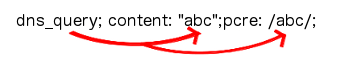

DNS Keywords
============

(from v2.0)

There are some more content modifiers (If you are unfamiliar with
content modifiers, please visit the page :doc:`payload-keywords` These
ones make sure the signature checks a specific part of the
network-traffic.

dns_query
---------

With **dns_query** the DNS request queries are inspected. The dns_query
keyword works a bit different from the normal content modifiers. When
used in a rule all contents following it are affected by it.  Example:

  alert dns any any -> any any (msg:"Test dns_query option";
  dns_query; content:"google"; nocase; sid:1;)

The dns_query keyword affects all following contents, until pkt_data
is used or it reaches the end of the rule.
