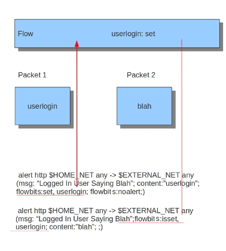

Flow Keywords
=============

flowbits
--------

Flowbits consists of two parts. The first part describes the action it
is going to perform, the second part is the name of the flowbit.

There are multiple packets that belong to one flow. Suricata keeps
those flows in memory. For more information see
:ref:`suricata-yaml-flow-settings`.  Flowbits can make sure an alert
will be generated when for example two different packets match.  An
alert will only be generated when both packets match. So, when the
second packet matches, Suricata has to know if the first packet was a
match too. Flowbits marks the flow if a packet matches so Suricata
'knows' it should generate an alert when the second packet matches as
well.

Flowbits have different actions. These are:

flowbits: set, name
  Will set the condition/'name', if present, in the flow.
flowbits: isset, name
  Can be used in the rule to make sure it generates an alert when the
  rule matches and the condition is set in the flow.
flowbits: toggle, name
  Reverses the present setting. So for example if a condition is set,
  it will be unset and vice-versa.
flowbits: unset, name
  Can be used to unset the condition in the flow.
flowbits: isnotset, name
  Can be used in the rule to make sure it generates an alert when it
  matches and the condition is not set in the flow.
flowbits: noalert
  No alert will be generated by this rule.

Example:

When you take a look at the first rule you will notice it would
generate an alert if it would match, if it were not for the 'flowbits:
noalert' at the end of that rule. The purpose of this rule is to check
for a match on 'userlogin' and mark that in the flow. So, there is no
need for generating an alert.  The second rule has no effect without
the first rule. If the first rule matches, the flowbits sets that
specific condition to be present in the flow. Now with the second rule
there can be checked whether or not the previous packet fulfills the
first condition. If at that point the second rule matches, an alert
will be generated.

It is possible to use flowbits several times in a rule and combine the
different functions.

flow
----

The flow keyword can be used to match on direction of the flow, so to/from
client or to/from server. It can also match if the flow is established or not.
The flow keyword can also be use to say the signature has to match on stream
only (only_stream) or on packet only (no_stream).

So with the flow keyword you can match on:

to_client
  Match on packets from server to client.
to_server
  Match on packets from client to server.
from_client
  Match on packets from client to server (same as to_server).
from_server
  Match on packets from server to client (same as to_client).
established
  Match on established connections.
not_established
  Match on packets that are not part of an established connection.
stateless
  Match on packets that are and are not part of an established connection.
only_stream
  Match on packets that have been reassembled by the stream engine.
no_stream
  Match on packets that have not been reassembled by the stream
  engine. Will not match packets that have been reassembled.
only_frag
  Match packets that have been reassembled from fragments.
no_frag
  Match packets that have not been reassembled from fragments.

Multiple flow options can be combined, for example::

  flow:to_client, established
  flow:to_server, established, only_stream
  flow:to_server, not_established, no_frag

The determination of *established* depends on the protocol:

* For TCP a connection will be established after a three way
  handshake.

  .. image:: flow-keywords/Flow1.png

* For other protocols (for example UDP), the connection will be
  considered established after seeing traffic from both sides of the
  connection.

  .. image:: flow-keywords/Flow2.png

flowint
-------

Flowint allows storage and mathematical operations using variables. It
operates much like flowbits but with the addition of mathematical
capabilities and the fact that an integer can be stored and
manipulated, not just a flag set. We can use this for a number of very
useful things, such as counting occurrences, adding or subtracting
occurrences, or doing thresholding within a stream in relation to
multiple factors. This will be expanded to a global context very soon,
so users can perform these operations between streams.

The syntax is as follows::

    flowint: name, modifier[, value];

Define a var (not required), or check that one is set or not set.

::

    flowint: name, < +,-,=,>,<,>=,<=,==, != >, value;
    flowint: name, (isset|isnotset);

Compare or alter a var. Add, subtract, compare greater than or less
than, greater than or equal to, and less than or equal to are
available. The item to compare with can be an integer or another
variable.

________________________________________

For example, if you want to count how many times a username is seen in
a particular stream and alert if it is over 5.

::

  alert tcp any any -> any any (msg:"Counting Usernames"; content:"jonkman"; \
        flowint: usernamecount, +, 1; noalert;)

This will count each occurrence and increment the var usernamecount
and not generate an alert for each.

Now say we want to generate an alert if there are more than five hits
in the stream.

::

  alert tcp any any -> any any (msg:"More than Five Usernames!"; content:"jonkman"; \
        flowint: usernamecount, +, 1; flowint:usernamecount, >, 5;)

So we'll get an alert ONLY if usernamecount is over five.

So now let's say we want to get an alert as above but NOT if there
have been more occurrences of that username logging out. Assuming this
particular protocol indicates a log out with "jonkman logout", let's
try:

::

  alert tcp any any -> any any (msg:"Username Logged out"; content:"logout jonkman"; \
        flowint: usernamecount, -, 1; flowint:usernamecount, >, 5;)

So now we'll get an alert ONLY if there are more than five active
logins for this particular username.

This is a rather simplistic example, but I believe it shows the power
of what such a simple function can do for rule writing. I see a lot of
applications in things like login tracking, IRC state machines,
malware tracking, and brute force login detection.

Let's say we're tracking a protocol that normally allows five login
fails per connection, but we have vulnerability where an attacker can
continue to login after that five attempts and we need to know about
it.

::

  alert tcp any any -> any any (msg:"Start a login count"; content:"login failed"; \
        flowint:loginfail, notset; flowint:loginfail, =, 1; noalert;)

So we detect the initial fail if the variable is not yet set and set
it to 1 if so. Our first hit.

::

  alert tcp any any -> any any (msg:"Counting Logins"; content:"login failed"; \
        flowint:loginfail, isset; flowint:loginfail, +, 1; noalert;)

We are now incrementing the counter if it's set.

::

  alert tcp any any -> any any (msg:"More than Five login fails in a Stream"; \
        content:"login failed"; flowint:loginfail, isset; flowint:loginfail, >, 5;)

Now we'll generate an alert if we cross five login fails in the same
stream.

But let's also say we also need alert if there are two successful
logins and a failed login after that.

::

  alert tcp any any -> any any (msg:"Counting Good Logins";             \
        content:"login successful"; flowint:loginsuccess, +, 1; noalert;)

Here we're counting good logins, so now we'll count good logins
relevant to fails:

::

  alert tcp any any -> any any (msg:"Login fail after two successes";   \
        content:"login failed"; flowint:loginsuccess, isset;            \
        flowint:loginsuccess, =, 2;)

Here are some other general examples:

::

  alert tcp any any -> any any (msg:"Setting a flowint counter"; content:"GET"; \
        flowint:myvar, notset; flowint:maxvar,notset;                           \
        flowint:myvar,=,1; flowint: maxvar,=,6;)

::

  alert tcp any any -> any any (msg:"Adding to flowint counter";                \
        content:"Unauthorized"; flowint:myvar,isset; flowint: myvar,+,2;)

::

  alert tcp any any -> any any (msg:"when flowint counter is 3 create new counter"; \
        content:"Unauthorized"; flowint:myvar, isset; flowint:myvar,==,3; \
        flowint:cntpackets,notset; flowint:cntpackets, =, 0;)

::

  alert tcp any any -> any any (msg:"count the rest without generating alerts"; \
        flowint:cntpackets,isset; flowint:cntpackets, +, 1; noalert;)

::

  alert tcp any any -> any any (msg:"fire this when it reach 6";                \
        flowint: cntpackets, isset;                                             \
        flowint: maxvar,isset; flowint: cntpackets, ==, maxvar;)

stream_size
-----------

The stream size option matches on traffic according to the registered
amount of bytes by the sequence numbers.  There are several modifiers
to this keyword:

::

  >      greater than
  <      less than
  =      equal
  !=     not equal
  >=    greater than or equal
  <=    less than or equal

Format

::

  stream_size:<server|client|both|either>, <modifier>, <number>;

Example of the stream-size keyword in a rule::

    alert tcp any any -> any any (stream_size:both, >, 5000; sid:1;)
