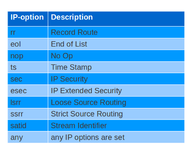
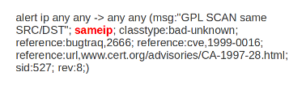
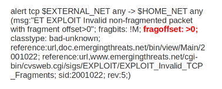
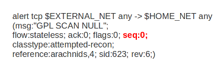
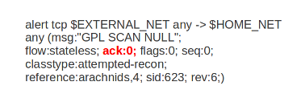
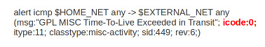
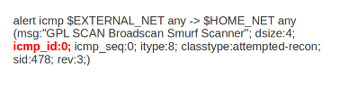
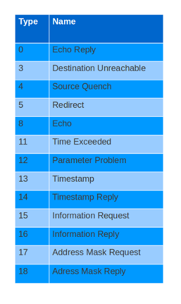
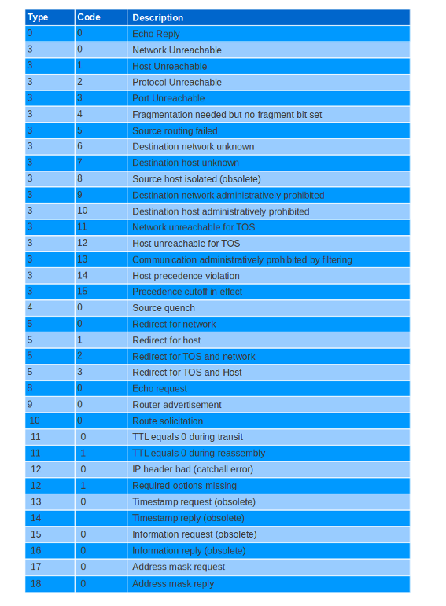

Header Keywords
===============

IP-keywords
-----------

ttl
^^^

The ttl keyword is used to check for a specific IP time-to-live value
in the header of a packet.  The format is::

  ttl:<number>

For example::

  ttl:10;

At the end of the ttl keyword you can enter the value on which you
want to match.  The Time-to-live value determines the maximal amount
of time a packet can be in the Internet-system. If this field is set
to 0, then the packet has to be destroyed.  The time-to-live is based
on hop count. Each hop/router the packet passes subtracts one of the
packet TTL counter.  The purpose of this mechanism is to limit the
existence of packets so that packets can not end up in infinite
routing loops.

Example of the ttl keyword in a rule:

.. image:: header-keywords/ttl.png

Ipopts
^^^^^^

With the ipopts keyword you can check if a specific ip option is
set. Ipopts has to be used at the beginning of a rule. You can only
match on one option per rule. There are several options on which can
be matched. These are:

Format of the ipopts keyword::

  ipopts: <name>

For example::

  ipopts: lsrr;

Example of ipopts in a rule:

.. image:: header-keywords/ipopts_rule.png

sameip
^^^^^^

Every packet has a source IP-address and a destination IP-address. It
can be that the source IP is the same as the destination IP.  With the
sameip keyword you can check if the IP address of the source is the
same as the IP address of the destination.  The format of the sameip
keyword is::

  sameip;

Example of sameip in a rule:

ip_proto
^^^^^^^^

With the ip_proto keyword you can match on the IP protocol in the
packet-header. You can use the name or the number of the protocol.
You can match for example on the following protocols::

   1     ICMP        Internet Control Message
   6     TCP         Transmission Control Protocol
  17     UDP         User Datagram
  47     GRE         General Routing Encapsulation
  50     ESP         Encap Security Payload for IPv6
  51     AH          Authentication Header for Ipv6
  58     IPv6-ICMP   ICMP for Ipv6

For the complete list of protocols and their numbers see
http://en.wikipedia.org/wiki/List_of_IP_protocol_numbers

Example of ip_proto in a rule:

.. image:: header-keywords/ip_proto.png

The named variante of that example would be::

    ip_proto:PIM

Id
^^

With the id keyword, you can match on a specific IP ID value.  The ID
identifies each packet sent by a host and increments usually with one
with each packet that is being send.  The IP ID is used as a fragment
identification number. Each packet has an IP ID, and when the packet
becomes fragmented, all fragments of this packet have the same ID. In
this way, the receiver of the packet knows which fragments belong to
the same packet. (IP ID does not take care of the order, in that case
offset is used. It clarifies the order of the fragments.)

Format of id::

  id:<number>;

Example of id in a rule:

.. image:: header-keywords/id.png

Geoip
^^^^^

The geoip keyword enables (you) to match on the source, destination or
source and destination IP addresses of network traffic, and to see to
which country it belongs. To be able to do this, Suricata uses GeoIP
API of Maxmind.

The syntax of geoip::

  geoip: src, RU;
  geoip: both, CN, RU;
  geoip: dst, CN, RU, IR;
  geoip: both, US, CA, UK;
  geoip: any, CN, IR;

So, you can see you can use the following to make clear on which
direction you would like to match::

  both: both directions have to match with the given geoip (geopip’s)
  any: one of the directions have to match with the given geoip (’s).
  dest: if the destination matches with the given geoip.
  src: the source matches with the given geoip.

The keyword only supports IPv4. As it uses the GeoIP API of Maxmind,
libgeoip must be compiled in.

Fragments
---------

Fragbits
^^^^^^^^

With the fragbits keyword, you can check if the fragmentation and
reserved bits are set in the IP header. The fragbits keyword should be
placed at the beginning of a rule.  Fragbits is used to modify the
fragmentation mechanism.  During routing of messages from one Internet
module to the other, it can occur that a packet is bigger than the
maximal packet size a network can process. In that case, a packet can
be send in fragments. This maximum of the packet size is called
Maximal Transmit Unit (MTU).

You can match on the following bits::

  M - More Fragments
  D - Do not Fragment
  R - Reserved Bit

Matching on this bits can be more specified with the following
modifiers::

  +         match on the specified bits, plus any others
  *         match if any of the specified bits are set
  !         match if the specified bits are not set

Format::

  fragbits:[*+!]<[MDR]>;

Example of fragbits in a rule:

.. image:: header-keywords/fragbits.png

Fragoffset
^^^^^^^^^^

With the fragoffset keyword you can match on specific decimal values
of the IP fragment offset field.  If you would like to check the first
fragments of a session, you have to combine fragoffset 0 with the More
Fragment option.  The fragmentation offset field is convenient for
reassembly. The id is used to determine which fragments belong to
which packet and the fragmentation offset field clarifies the order of
the fragments.

You can use the following modifiers::

  <       match if the value is smaller than the specified value
  >       match if the value is greater than the specified value
  !       match if the specified value is not present

Format of fragoffset::

  fragoffset:[!|<|>]<number>;

Example of fragoffset in a rule:

TCP keywords
------------

seq
^^^

The seq keyword can be used in a signature to check for a specific TCP
sequence number.  A sequence number is a number that is generated
practically at random by both endpoints of a TCP-connection. The
client and the server both create a sequence number, which increases
with one with every byte that they send. So this sequence number is
different for both sides. This sequence number has to be acknowledged
by both sides of the connection.  Through sequence numbers, TCP
handles acknowledgement, order and retransmission. Its number
increases with every data-byte the sender has send. The seq helps
keeping track of to what place in a data-stream a byte belongs. If the
SYN flag is set at 1, than the sequence number of the first byte of
the data is this number plus 1 (so, 2).

Example::

  seq:0;

Example of seq in a signature:

Example of seq in a packet (Wireshark):

.. image:: header-keywords/Wireshark_seq.png

ack
^^^

The ack is the acknowledgement of the receipt of all previous
(data)-bytes send by the other side of the TCP-connection. In most
occasions every packet of a TCP connection has an ACK flag after the
first SYN and a ack-number which increases with the receipt of every
new data-byte.  The ack-keyword can be used in a signature to check
for a specific TCP acknowledgement number.

Format of ack::

  ack:1;

Example of ack in a signature:

Example of ack in a packet (Wireshark):

.. image:: header-keywords/Wireshark_ack.png

window
^^^^^^

The window keyword is used to check for a specific TCP window size.
The TCP window size is a mechanism that has control of the
data-flow. The window is set by the receiver (receiver advertised
window size) and indicates the amount of bytes that can be
received. This amount of data has to be acknowledged by the receiver
first, before the sender can send the same amount of new data. This
mechanism is used to prevent the receiver from being overflowed by
data. The value of the window size is limited and can be 2 to 65.535
bytes.  To make more use of your bandwidth you can use a bigger
TCP-window.

The format of the window keyword::

  window:[!]<number>;

Example of window in a rule:

.. image:: header-keywords/Window.png

ICMP keywords
-------------

ICMP (Internet Control Message Protocol) is a part of IP. IP at itself
is not reliable when it comes to delivering data (datagram). ICMP
gives feedback in case problems occur. It does not prevent problems
from happening, but helps in understanding what went wrong and
where. If reliability is necessary, protocols that use IP have to take
care of reliability themselves.  In different situations ICMP messages
will be send. For instance when the destination is unreachable, if
there is not enough buffer-capacity to forward the data, or when a
datagram is send fragmented when it should not be, etcetera. More can
be found in the list with message-types.

There are four important contents of a ICMP message on which can be
matched with corresponding ICMP-keywords. These are: the type, the
code, the id and the sequence of a message.

itype
^^^^^

The itype keyword is for matching on a specific ICMP type (number).
ICMP has several kinds of messages and uses codes to clarify those
messages. The different messages are distinct by different names, but
more important by numeric values.  For more information see the table
with message-types and codes.

The format of the itype keyword::

  itype:min<>max;
  itype:[<|>]<number>;

Example
This example looks for an ICMP type greater than 10::

  itype:>10;

Example of the itype keyword in a signature:

.. image:: header-keywords/icmp_type.png

icode
^^^^^

With the icode keyword you can match on a specific ICMP code.  The
code of a ICMP message clarifies the message. Together with the
ICMP-type it indicates with what kind of problem you are dealing with.
A code has a different purpose with every ICMP-type.

The format of the icode keyword::

  icode:min<>max;
  icode:[<|>]<number>;

Example:
This example looks for an ICMP code greater than 5::

  icode:>5;

Example of the icode keyword in a rule:

icmp_id
^^^^^^^

With the icmp_id keyword you can match on specific ICMP id-values.
Every ICMP-packet gets an id when it is being send. At the moment the
receiver has received the packet, it will send a reply using the same
id so the sender will recognize it and connects it with the correct
ICMP-request.

Format of the icmp_id keyword::

  icmp_id:<number>;

Example:
This example looks for an ICMP ID of 0::

  icmp_id:0;

Example of the icmp_id keyword in a rule:

icmp_seq
^^^^^^^^

You can use the icmp_seq keyword to check for a ICMP sequence number.
ICMP messages all have sequence numbers. This can be useful (together
with the id) for checking which reply message belongs to which request
message.

Format of the icmp_seq keyword::

  icmp_seq:<number>;

Example:
This example looks for an ICMP Sequence of 0::

  icmp_seq:0;

Example of icmp_seq in a rule:

.. image:: header-keywords/icmp_seq.png

Message types and numbers:

Meaning of type-numbers en codes combined:

