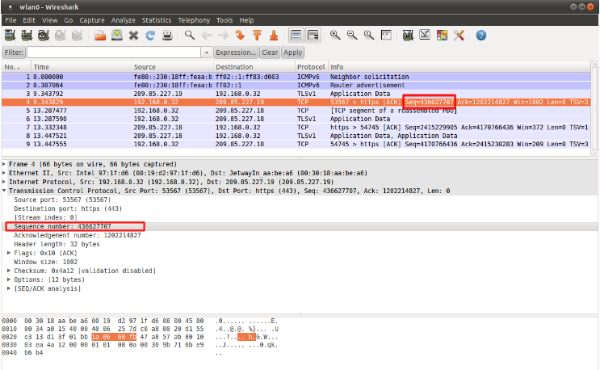

.. role:: example-rule-emphasis

IP Keywords
-----------

ttl
^^^

The ttl keyword is used to check for a specific IP time-to-live value
in the header of a packet. The format is::

  ttl:<number>;

For example::

  ttl:10;

At the end of the ttl keyword you can enter the value on which you
want to match. The Time-to-live value determines the maximal amount
of time a packet can be in the Internet-system. If this field is set
to 0, then the packet has to be destroyed. The time-to-live is based
on hop count. Each hop/router the packet passes subtracts one from the
packet TTL counter. The purpose of this mechanism is to limit the
existence of packets so that packets can not end up in infinite
routing loops.

Example of the ttl keyword in a rule:

.. container:: example-rule

    alert ip $EXTERNAL_NET any -> $HOME_NET any (msg:"IP Packet With TTL 0";
    :example-rule-emphasis:`ttl:0;` classtype:misc-activity; sid:1; rev:1;)

ipopts
^^^^^^
With the ipopts keyword you can check if a specific IP option is
set. Ipopts has to be used at the beginning of a rule. You can only
match on one option per rule. There are several options on which can
be matched. These are:

=========  =============================
IP Option  Description
=========  =============================
rr         Record Route
eol        End of List
nop        No Op
ts         Time Stamp
sec        IP Security
esec       IP Extended Security
lsrr       Loose Source Routing
ssrr       Strict Source Routing
satid      Stream Identifier
any        any IP options are set
=========  =============================

Format of the ipopts keyword::

  ipopts: <name>;

For example::

  ipopts: ts;

Example of ipopts in a rule:

.. container:: example-rule

    alert ip $EXTERNAL_NET any -> $HOME_NET any (msg:"IP Packet with timestamp option"; :example-rule-emphasis:`ipopts:ts;` classtype:misc-activity; sid:2; rev:1;)

sameip
^^^^^^

Every packet has a source IP-address and a destination IP-address. It
can be that the source IP is the same as the destination IP. With the
sameip keyword you can check if the IP address of the source is the
same as the IP address of the destination. The format of the sameip
keyword is::

  sameip;

Example of sameip in a rule:

.. container:: example-rule

    alert ip any any -> any any (msg:"IP Packet with the same source and destination IP"; :example-rule-emphasis:`sameip;` classtype:bad-unknown; sid:3; rev:1;)

ip_proto
^^^^^^^^
With the ip_proto keyword you can match on the IP protocol in the
packet-header. You can use the name or the number of the protocol.
You can match for example on the following protocols::

   1     ICMP        Internet Control Message
   6     TCP         Transmission Control Protocol
  17     UDP         User Datagram
  47     GRE         General Routing Encapsulation
  50     ESP         Encap Security Payload for IPv6
  51     AH          Authentication Header for Ipv6
  58     IPv6-ICMP   ICMP for Ipv6

For the complete list of protocols and their numbers see
http://en.wikipedia.org/wiki/List_of_IP_protocol_numbers

Example of ip_proto in a rule:

.. container:: example-rule

    alert ip any any -> any any (msg:"IP Packet with protocol 1"; :example-rule-emphasis:`ip_proto:1;` classtype:bad-unknown; sid:5; rev:1;)

The named variant of that example would be::

    ip_proto:ICMP;

ipv4.hdr
^^^^^^^^

Sticky buffer to match on the whole IPv4 header.

Example rule:

.. container:: example-rule

    alert ip any any -> any any (:example-rule-emphasis:`ipv4.hdr; content:"|3A|"; offset:9; depth:1;` sid:1234; rev:5;)

This example looks if byte 9 of IPv4 header has value 3A.
That means that the IPv4 protocol is ICMPv6.

ipv6.hdr
^^^^^^^^

Sticky buffer to match on the whole IPv6 header.

id
^^

With the id keyword, you can match on a specific IP ID value. The ID
identifies each packet sent by a host and increments usually with one
with each packet that is being send. The IP ID is used as a fragment
identification number. Each packet has an IP ID, and when the packet
becomes fragmented, all fragments of this packet have the same ID. In
this way, the receiver of the packet knows which fragments belong to
the same packet. (IP ID does not take care of the order, in that case
offset is used. It clarifies the order of the fragments.)

Format of id::

  id:<number>;

Example of id in a rule:

.. container:: example-rule

    alert tcp $EXTERNAL_NET any -> $HOME_NET any (msg:"ET DELETED F5 BIG-IP 3DNS TCP Probe 1"; :example-rule-emphasis:`id: 1;` dsize: 24; flags: S,12; content:"\|00 00 00 00 00 00 00 00 00 00 00 00 00 00 00 00 00 00 00 00 00 00 00 00\|"; window: 2048; reference:url,www.f5.com/f5products/v9intro/index.html; reference:url,doc.emergingthreats.net/2001609; classtype:misc-activity; sid:2001609; rev:13;)

geoip
^^^^^
The geoip keyword enables (you) to match on the source, destination or
source and destination IPv4 addresses of network traffic, and to see to
which country it belongs. To be able to do this, Suricata uses the GeoIP2
API of MaxMind.

The syntax of geoip::

  geoip: src,RU;
  geoip: both,CN,RU;
  geoip: dst,CN,RU,IR;
  geoip: both,US,CA,UK;
  geoip: any,CN,IR;

So, you can see you can use the following to make clear on which
direction you would like to match

====== =============================================================
Option Description
====== =============================================================
both   Both directions have to match with the given geoip(s)
any    One of the directions has to match with the given geoip(s).
dest   If the destination matches with the given geoip.
src    The source matches with the given geoip.
====== =============================================================

The keyword only supports IPv4. As it uses the GeoIP2 API of MaxMind,
libmaxminddb must be compiled in. You must download and install the
GeoIP2 or GeoLite2 database editions desired. Visit the MaxMind site
at https://dev.maxmind.com/geoip/geoip2/geolite2/ for details.

You must also supply the location of the GeoIP2 or GeoLite2 database
file on the local system in the YAML-file configuration (for example)::

  geoip-database: /usr/local/share/GeoIP/GeoLite2-Country.mmdb

fragbits (IP fragmentation)
^^^^^^^^^^^^^^^^^^^^^^^^^^^

With the fragbits keyword, you can check if the fragmentation and
reserved bits are set in the IP header. The fragbits keyword should be
placed at the beginning of a rule. Fragbits is used to modify the
fragmentation mechanism. During routing of messages from one Internet
module to the other, it can occur that a packet is bigger than the
maximal packet size a network can process. In that case, a packet can
be send in fragments. This maximum of the packet size is called
Maximal Transmit Unit (MTU).

You can match on the following bits::

  M - More Fragments
  D - Do not Fragment
  R - Reserved Bit

Matching on this bits can be more specified with the following
modifiers::

  +         match on the specified bits, plus any others
  *         match if any of the specified bits are set
  !         match if the specified bits are not set

Format::

  fragbits:[*+!]<[MDR]>;

Example of fragbits in a rule:

.. container:: example-rule

   alert tcp $EXTERNAL_NET any -> $HOME_NET any (msg:"ET EXPLOIT Invalid non-fragmented packet with fragment offset>0"; :example-rule-emphasis:`fragbits: M;` fragoffset: >0; reference:url,doc.emergingthreats.net/bin/view/Main/2001022; classtype:bad-unknown; sid:2001022; rev:5; metadata:created_at 2010_07_30, updated_at 2010_07_30;)

fragoffset
^^^^^^^^^^

With the fragoffset keyword you can match on specific decimal values
of the IP fragment offset field. If you would like to check the first
fragments of a session, you have to combine fragoffset 0 with the More
Fragment option. The fragmentation offset field is convenient for
reassembly. The id is used to determine which fragments belong to
which packet and the fragmentation offset field clarifies the order of
the fragments.

You can use the following modifiers::

  <       match if the value is smaller than the specified value
  >       match if the value is greater than the specified value
  !       match if the specified value is not present

Format of fragoffset::

  fragoffset:[!|<|>]<number>;

Example of fragoffset in a rule:

.. container:: example-rule

   alert tcp $EXTERNAL_NET any -> $HOME_NET any (msg:"ET EXPLOIT Invalid non-fragmented packet with fragment offset>0"; fragbits: M; :example-rule-emphasis:`fragoffset: >0;` reference:url,doc.emergingthreats.net/bin/view/Main/2001022; classtype:bad-unknown; sid:2001022; rev:5; metadata:created_at 2010_07_30, updated_at 2010_07_30;)

tos
^^^

The tos keyword can match on specific decimal values of the IP header TOS
field. The tos keyword can be have a value from 0 - 255. This field of the
IP header has been updated by `rfc2474 <https://tools.ietf.org/html/rfc2474>`_
to include functionality for
`Differentiated services <https://en.wikipedia.org/wiki/Differentiated_services>`_.
Note that the value of the field has been defined with the right-most 2 bits having
the value 0. When specifying a value for tos, ensure that the value follows this.

E.g, instead of specifying the decimal value 34 (hex 22), right shift twice and use
decimal 136 (hex 88).

You can specify hexadecimal values as with a leading `x`, e.g, `x88`.

Format of tos::

  tos:[!]<number>;

Example of tos in a rule:

.. container:: example-rule

    alert ip any any -> any any (msg:"Differentiated Services Codepoint: Class Selector 1 (8)"; flow:established; :example-rule-emphasis:`tos:8;` classtype:not-suspicious; sid:2600115; rev:1;)

Example of tos with negated values:

.. container:: example-rule

    alert ip any any -> any any (msg:"TGI HUNT non-DiffServ aware TOS setting"; flow:established,to_server; :example-rule-emphasis:`tos:!0; tos:!8; tos:!16; tos:!24; tos:!32; tos:!40; tos:!48; tos:!56;` threshold:type limit, track by_src, seconds 60, count 1; classtype:bad-unknown; sid:2600124; rev:1;)

TCP keywords
------------

seq
^^^
The seq keyword can be used in a signature to check for a specific TCP
sequence number. A sequence number is a number that is generated
practically at random by both endpoints of a TCP-connection. The
client and the server both create a sequence number, which increases
with one with every byte that they send. So this sequence number is
different for both sides. This sequence number has to be acknowledged
by both sides of the connection. Through sequence numbers, TCP
handles acknowledgement, order and retransmission. Its number
increases with every data-byte the sender has send. The seq helps
keeping track of to what place in a data-stream a byte belongs. If the
SYN flag is set at 1, than the sequence number of the first byte of
the data is this number plus 1 (so, 2).

Example::

  seq:0;

Example of seq in a signature:

.. container:: example-rule

    alert tcp $EXTERNAL_NET any -> $HOME_NET any (msg:"GPL SCAN NULL"; flow:stateless; ack:0; flags:0; :example-rule-emphasis:`seq:0;` reference:arachnids,4; classtype:attempted-recon; sid:2100623; rev:7;)

Example of seq in a packet (Wireshark):

ack
^^^

The ack is the acknowledgement of the receipt of all previous
(data)-bytes send by the other side of the TCP-connection. In most
occasions every packet of a TCP connection has an ACK flag after the
first SYN and a ack-number which increases with the receipt of every
new data-byte. The ack keyword can be used in a signature to check
for a specific TCP acknowledgement number.

Format of ack::

  ack:1;

Example of ack in a signature:

.. container:: example-rule

    alert tcp $EXTERNAL_NET any -> $HOME_NET any (msg:"GPL SCAN NULL"; flow:stateless; :example-rule-emphasis:`ack:0;` flags:0; seq:0; reference:arachnids,4; classtype:attempted-recon; sid:2100623; rev:7;)

Example of ack in a packet (Wireshark):

.. image:: header-keywords/Wireshark_ack.png

window
^^^^^^

The window keyword is used to check for a specific TCP window size.
The TCP window size is a mechanism that has control of the
data-flow. The window is set by the receiver (receiver advertised
window size) and indicates the amount of bytes that can be
received. This amount of data has to be acknowledged by the receiver
first, before the sender can send the same amount of new data. This
mechanism is used to prevent the receiver from being overflowed by
data. The value of the window size is limited and can be 2 to 65.535
bytes. To make more use of your bandwidth you can use a bigger
TCP-window.

The format of the window keyword::

  window:[!]<number>;

Example of window in a rule:

.. container:: example-rule

    alert tcp $EXTERNAL_NET any -> $HOME_NET any (msg:"GPL DELETED typot trojan traffic"; flow:stateless; flags:S,12; :example-rule-emphasis:`window:55808;` reference:mcafee,100406; classtype:trojan-activity; sid:2182; rev:8;)

tcp.mss
^^^^^^^

Match on the TCP MSS option value. Will not match if the option is not
present.

The format of the keyword::

  tcp.mss:<min>-<max>;
  tcp.mss:[<|>]<number>;
  tcp.mss:<value>;

Example rule:

.. container:: example-rule

    alert tcp $EXTERNAL_NET any -> $HOME_NET any (flow:stateless; flags:S,12; :example-rule-emphasis:`tcp.mss:<536;` sid:1234; rev:5;)

tcp.hdr
^^^^^^^

Sticky buffer to match on the whole TCP header.

Example rule:

.. container:: example-rule

    alert tcp $EXTERNAL_NET any -> $HOME_NET any (flags:S,12; :example-rule-emphasis:`tcp.hdr; content:"|02 04|"; offset:20; byte_test:2,<,536,0,big,relative;` sid:1234; rev:5;)

This example starts looking after the fixed portion of the header, so
into the variable sized options. There it will look for the MSS option
(type 2, option len 4) and using a byte_test determine if the value of
the option is lower than 536. The `tcp.mss` option will be more efficient,
so this keyword is meant to be used in cases where no specific keyword
is available.

UDP keywords
------------

udp.hdr
^^^^^^^

Sticky buffer to match on the whole UDP header.

Example rule:

.. container:: example-rule

    alert udp any any -> any any (:example-rule-emphasis:`udp.hdr; content:"|00 08|"; offset:4; depth:2;` sid:1234; rev:5;)

This example matches on the length field of the UDP header. In this
case the length of 8 means that there is no payload. This can also
be matched using `dsize:0;`.

ICMP keywords
-------------

ICMP (Internet Control Message Protocol) is a part of IP. IP at itself
is not reliable when it comes to delivering data (datagram). ICMP
gives feedback in case problems occur. It does not prevent problems
from happening, but helps in understanding what went wrong and
where. If reliability is necessary, protocols that use IP have to take
care of reliability themselves. In different situations ICMP messages
will be send. For instance when the destination is unreachable, if
there is not enough buffer-capacity to forward the data, or when a
datagram is send fragmented when it should not be, etcetera. More can
be found in the list with message-types.

There are four important contents of a ICMP message on which can be
matched with corresponding ICMP-keywords. These are: the type, the
code, the id and the sequence of a message.

itype
^^^^^

The itype keyword is for matching on a specific ICMP type (number).
ICMP has several kinds of messages and uses codes to clarify those
messages. The different messages are distinct by different names, but
more important by numeric values. For more information see the table
with message-types and codes.

The format of the itype keyword::

  itype:min<>max;
  itype:[<|>]<number>;

Example
This example looks for an ICMP type greater than 10::

  itype:>10;

Example of the itype keyword in a signature:

.. container:: example-rule

    alert icmp $EXTERNAL_NET any -> $HOME_NET any (msg:"GPL SCAN Broadscan Smurf Scanner"; dsize:4; icmp_id:0; icmp_seq:0; :example-rule-emphasis:`itype:8;` classtype:attempted-recon; sid:2100478; rev:4;)

The following lists all ICMP types known at the time of writing. A recent table can be found `at the website of IANA <https://www.iana.org/assignments/icmp-parameters/icmp-parameters.xhtml>`_

=========  ==========================================================
ICMP Type  Name
=========  ==========================================================
0          Echo Reply
3          Destination Unreachable
4          Source Quench
5          Redirect
6          Alternate Host Address
8          Echo
9          Router Advertisement
10         Router Solicitation
11         Time Exceeded
12         Parameter Problem
13         Timestamp
14         Timestamp Reply
15         Information Request
16         Information Reply
17         Address Mask Request
18         Address Mask Reply
30         Traceroute
31         Datagram Conversion Error
32         Mobile Host Redirect
33         IPv6 Where-Are-You
34         IPv6 I-Am-Here
35         Mobile Registration Request
36         Mobile Registration Reply
37         Domain Name Request
38         Domain Name Reply
39         SKIP
40         Photuris
41         Experimental mobility protocols such as Seamoby
=========  ==========================================================

icode
^^^^^

With the icode keyword you can match on a specific ICMP code. The
code of a ICMP message clarifies the message. Together with the
ICMP-type it indicates with what kind of problem you are dealing with.
A code has a different purpose with every ICMP-type.

The format of the icode keyword::

  icode:min<>max;
  icode:[<|>]<number>;

Example:
This example looks for an ICMP code greater than 5::

  icode:>5;

Example of the icode keyword in a rule:

.. container:: example-rule

    alert icmp $HOME_NET any -> $EXTERNAL_NET any (msg:"GPL MISC Time-To-Live Exceeded in Transit"; :example-rule-emphasis:`icode:0;` itype:11; classtype:misc-activity; sid:2100449; rev:7;)

The following lists the meaning of all ICMP types. When a code is not listed,
only type 0 is defined and has the meaning of the ICMP code, in the table above.
A recent table can be found `at the website of IANA <https://www.iana.org/assignments/icmp-parameters/icmp-parameters.xhtml>`_

+-----------+-----------+-----------------------------------------------------------------------+
| ICMP Code | ICMP Type | Description                                                           |
+===========+===========+=======================================================================+
| 3         | 0         | Net Unreachable                                                       |
|           +-----------+-----------------------------------------------------------------------+
|           | 1         | Host Unreachable                                                      |
|           +-----------+-----------------------------------------------------------------------+
|           | 2         | Protocol Unreachable                                                  |
|           +-----------+-----------------------------------------------------------------------+
|           | 3         | Port Unreachable                                                      |
|           +-----------+-----------------------------------------------------------------------+
|           | 4         | Fragmentation Needed and Don't Fragment was Set                       |
|           +-----------+-----------------------------------------------------------------------+
|           | 5         | Source Route Failed                                                   |
|           +-----------+-----------------------------------------------------------------------+
|           | 6         | Destination Network Unknown                                           |
|           +-----------+-----------------------------------------------------------------------+
|           | 7         | Destination Host Unknown                                              |
|           +-----------+-----------------------------------------------------------------------+
|           | 8         | Source Host Isolated                                                  |
|           +-----------+-----------------------------------------------------------------------+
|           | 9         | Communication with Destination Network is Administratively Prohibited |
|           +-----------+-----------------------------------------------------------------------+
|           | 10        | Communication with Destination Host is Administratively Prohibited    |
|           +-----------+-----------------------------------------------------------------------+
|           | 11        | Destination Network Unreachable for Type of Service                   |
|           +-----------+-----------------------------------------------------------------------+
|           | 12        | Destination Host Unreachable for Type of Service                      |
|           +-----------+-----------------------------------------------------------------------+
|           | 13        | Communication Administratively Prohibited                             |
|           +-----------+-----------------------------------------------------------------------+
|           | 14        | Host Precedence Violation                                             |
|           +-----------+-----------------------------------------------------------------------+
|           | 15        | Precedence cutoff in effect                                           |
+-----------+-----------+-----------------------------------------------------------------------+
| 5         | 0         | Redirect Datagram for the Network (or subnet)                         |
|           +-----------+-----------------------------------------------------------------------+
|           | 1         | Redirect Datagram for the Host                                        |
|           +-----------+-----------------------------------------------------------------------+
|           | 2         | Redirect Datagram for the Type of Service and Network                 |
|           +-----------+-----------------------------------------------------------------------+
|           | 3         | Redirect Datagram for the Type of Service and Host                    |
+-----------+-----------+-----------------------------------------------------------------------+
| 9         | 0         | Normal router advertisement                                           |
|           +-----------+-----------------------------------------------------------------------+
|           | 16        | Doesn't route common traffic                                          |
+-----------+-----------+-----------------------------------------------------------------------+
| 11        | 0         | Time to Live exceeded in Transit                                      |
|           +-----------+-----------------------------------------------------------------------+
|           | 1         | Fragment Reassembly Time Exceeded                                     |
+-----------+-----------+-----------------------------------------------------------------------+
| 12        | 0         | Pointer indicates the error                                           |
|           +-----------+-----------------------------------------------------------------------+
|           | 1         | Missing a Required Option                                             |
|           +-----------+-----------------------------------------------------------------------+
|           | 2         | Bad Length                                                            |
+-----------+-----------+-----------------------------------------------------------------------+
| 40        | 0         | Bad SPI                                                               |
|           +-----------+-----------------------------------------------------------------------+
|           | 1         | Authentication Failed                                                 |
|           +-----------+-----------------------------------------------------------------------+
|           | 2         | Decompression Failed                                                  |
|           +-----------+-----------------------------------------------------------------------+
|           | 3         | Decryption Failed                                                     |
|           +-----------+-----------------------------------------------------------------------+
|           | 4         | Need Authentication                                                   |
|           +-----------+-----------------------------------------------------------------------+
|           | 5         | Need Authorization                                                    |
+-----------+-----------+-----------------------------------------------------------------------+

icmp_id
^^^^^^^

With the icmp_id keyword you can match on specific ICMP id-values.
Every ICMP-packet gets an id when it is being send. At the moment the
receiver has received the packet, it will send a reply using the same
id so the sender will recognize it and connects it with the correct
ICMP-request.

Format of the icmp_id keyword::

  icmp_id:<number>;

Example:
This example looks for an ICMP ID of 0::

  icmp_id:0;

Example of the icmp_id keyword in a rule:

.. container:: example-rule

    alert icmp $EXTERNAL_NET any -> $HOME_NET any (msg:"GPL SCAN Broadscan Smurf Scanner"; dsize:4; :example-rule-emphasis:`icmp_id:0;` icmp_seq:0; itype:8; classtype:attempted-recon; sid:2100478; rev:4;)

icmp_seq
^^^^^^^^

You can use the icmp_seq keyword to check for a ICMP sequence number.
ICMP messages all have sequence numbers. This can be useful (together
with the id) for checking which reply message belongs to which request
message.

Format of the icmp_seq keyword::

  icmp_seq:<number>;

Example:
This example looks for an ICMP Sequence of 0::

  icmp_seq:0;

Example of icmp_seq in a rule:

.. container:: example-rule

    alert icmp $EXTERNAL_NET any -> $HOME_NET any (msg:"GPL SCAN Broadscan Smurf Scanner"; dsize:4; icmp_id:0; :example-rule-emphasis:`icmp_seq:0;` itype:8; classtype:attempted-recon; sid:2100478; rev:4;)

icmpv4.hdr
^^^^^^^^^^

Sitcky buffer to match on the whole ICMPv4 header.

icmpv6.hdr
^^^^^^^^^^

Sticky buffer to match on the whole ICMPv6 header.

icmpv6.mtu
^^^^^^^^^^

Match on the ICMPv6 MTU optional value. Will not match if the MTU is not
present.

The format of the keyword::

  icmpv6.mtu:<min>-<max>;
  icmpv6.mtu:[<|>]<number>;
  icmpv6.mtu:<value>;

Example rule:

.. container:: example-rule

    alert ip $EXTERNAL_NET any -> $HOME_NET any (:example-rule-emphasis:`icmpv6.mtu:<1280;` sid:1234; rev:5;)
