:tocdepth: 2

HTTP Keywords
=============

There are additional content modifiers that can provide protocol-specific
capabilities at the application layer. More information can be found at
:doc:`payload-keywords` These keywords make sure the signature checks only
specific parts of the network traffic. For instance, to check specifically on
the request URI, cookies, or the HTTP request or response body, etc.

Types of modifiers
------------------

There are 2 types of modifiers. The older style 'content modifiers' look back in the rule.

Example::

    alert http any any -> any any (content:"index.php"; http_uri; sid:1;)

In the above example the pattern 'index.php' is modified to inspect the HTTP uri buffer.

The more recent type is called  the 'sticky buffer'. It places the buffer name first and all keywords following it apply to that buffer.

Example::

    alert http any any -> any any (http_response_line; content:"403 Forbidden"; sid:1;)

In the above example the pattern '403 Forbidden' is inspected against the HTTP response line because it follows the ``http_response_line`` keyword.

The following request keywords are available:

============================== ======================== ==================
Keyword                        Sticky or Modifier       Direction
============================== ======================== ==================
http_uri                       Modifier                 Request
http_raw_uri                   Modifier                 Request
http_method                    Modifier                 Request
http_request_line              Sticky Buffer            Request
http_client_body               Modifier                 Request
http_header                    Modifier                 Both
http_raw_header                Modifier                 Both
http_cookie                    Modifier                 Both
http_user_agent                Modifier                 Request
http_host                      Modifier                 Request
http_raw_host                  Modifier                 Request
============================== ======================== ==================

The following response keywords are available:

============================== ======================== ==================
Keyword                        Sticky or Modifier       Direction
============================== ======================== ==================
http_stat_msg                  Modifier                 Response
http_stat_code                 Modifier                 Response
http_response_line             Sticky Buffer            Response
http_header                    Modifier                 Both
http_raw_header                Modifier                 Both
http_cookie                    Modifier                 Both
http_server_body               Modifier                 Response
file_data                      Sticky Buffer            Response
============================== ======================== ==================

It is important to understand the structure of HTTP requests and
responses. A simple example of a HTTP request and response follows:

HTTP request
------------

::

   GET /index.html HTTP/1.0\r\n

GET is a request **method**.  Examples of methods are: GET, POST, PUT,
HEAD, etc. The URI path is ``/index.html`` and the HTTP version is
``HTTP/1.0``. Several HTTP versions have been used over the years; of
the versions 0.9, 1.0 and 1.1, 1.0 and 1.1 are the most commonly used
today.

HTTP response
-------------

::

   HTTP/1.0 200 OK\r\n
   <html>
   <title> some page </title>
   </HTML>

In this example, HTTP/1.0 is the HTTP version, 200 the response status
code and OK the response status message.

Another more detailed example:

Request:

.. image:: http-keywords/request.png

Response:

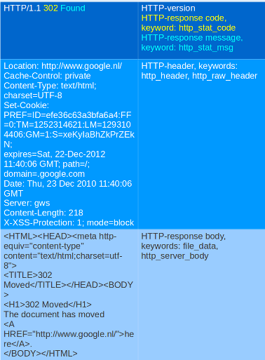

Request:

.. image:: http-keywords/request2.png

Although cookies are sent in an HTTP header, you can not match on them
with the ``http_header`` keyword. Cookies are matched with their own
keyword, namely ``http_cookie``.

Each part of the table belongs to a so-called *buffer*. The HTTP
method belongs to the method buffer, HTTP headers to the header buffer
etc. A buffer is a specific portion of the request or response that
Suricata extracts in memory for inspection.

All previous described keywords can be used in combination with a
buffer in a signature. The keywords ``distance`` and ``within`` are
relative modifiers, so they may only be used within the same
buffer. You can not relate content matches against different buffers
with relative modifiers.

http_method
-----------

With the ``http_method`` content modifier, it is possible to match
specifically and only on the HTTP method buffer. The keyword can be
used in combination with all previously mentioned content modifiers
such as: ``depth``, ``distance``, ``offset``, ``nocase`` and ``within``.

Methods are: **GET**, **POST**, **PUT**, **HEAD**, **DELETE**, **TRACE**,
**OPTIONS**, **CONNECT** and **PATCH**.

Example of a method in a HTTP request:

.. image:: http-keywords/method2.png

Example of the purpose of method:

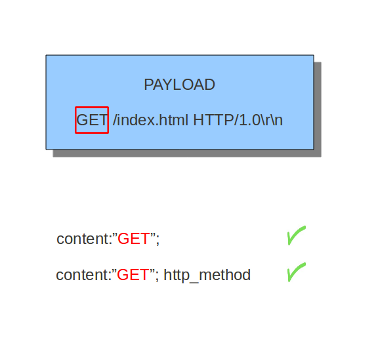

.. image:: http-keywords/Legenda_rules.png

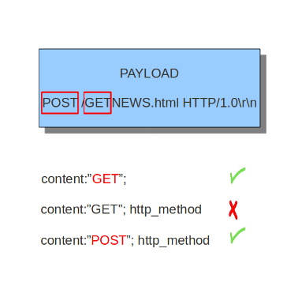

http_uri and http_raw_uri
-------------------------

With the ``http_uri`` and the ``http_raw_uri`` content modifiers, it
is possible to match specifically and only on the request URI
buffer. The keyword can be used in combination with all previously
mentioned content modifiers like ``depth``, ``distance``, ``offset``,
``nocase`` and ``within``.

To learn more about the difference between ``http_uri`` and
``http_raw_uri``, please read the information about
:doc:`http-uri-normalization`.

Example of the URI in a HTTP request:

.. image:: http-keywords/uri1.png

Example of the purpose of ``http_uri``:

.. image:: http-keywords/uri.png

Example of the purpose of ``http_raw_uri``:

#.. image:: http-keywords/raw_uri.png

uricontent
----------

The ``uricontent`` keyword has the exact same effect as the
``http_uri`` content modifier. ``uricontent`` is a deprecated
(although still supported) way to match specifically and only on the
request URI buffer.

Example of ``uricontent``:

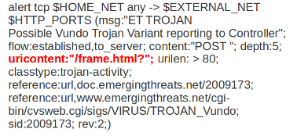

The difference between ``http_uri`` and ``uricontent`` is the syntax:

.. image:: http-keywords/uricontent1.png

.. image:: http-keywords/http_uri.png

When authoring new rules, it is recommended that the ``http_uri``
content modifier be used rather than the deprecated ``uricontent``
keyword.

urilen
------

The ``urilen`` keyword is used to match on the length of the request
URI. It is possible to use the ``<`` and ``>`` operators, which
indicate respectively *smaller than* and *larger than*.

The format of ``urilen`` is::

  urilen:3;

Other possibilities are::

  urilen:1;
  urilen:>1;
  urilen:<10;
  urilen:10<>20;	(bigger than 10, smaller than 20)

Example:

.. image:: http-keywords/urilen.png

Example of ``urilen`` in a signature:

.. image:: http-keywords/urilen1.png

You can also append ``norm`` or ``raw`` to define what sort of buffer you want
to use (normalized or raw buffer).

http_request_line
-----------------

The ``http_request_line`` forces the whole HTTP request line to be inspected.

Example::

    alert http any any -> any any (http_request_line; content:"GET / HTTP/1.0"; sid:1;)

http_header and http_raw_header
-------------------------------

With the ``http_header`` content modifier, it is possible to match
specifically and only on the HTTP header buffer. This contains all of
the extracted headers in a single buffer, except for those indicated
in the documentation that are not able to match by this buffer and
have their own content modifier (e.g. ``http_cookie``). The modifier
can be used in combination with all previously mentioned content
modifiers, like ``depth``, ``distance``, ``offset``, ``nocase`` and
``within``.

    **Note**: the header buffer is *normalized*. Any trailing
    whitespace and tab characters are removed. See:
    http://lists.openinfosecfoundation.org/pipermail/oisf-users/2011-October/000935.html.
    To avoid that, use the ``http_raw_header`` keyword.

Example of a header in a HTTP request:

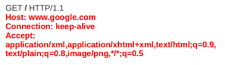

Example of the purpose of ``http_header``:

.. image:: http-keywords/header1.png

http_cookie
-----------

With the ``http_cookie`` content modifier, it is possible to match
specifically and only on the cookie buffer. The keyword can be used in
combination with all previously mentioned content modifiers like
``depth``, ``distance``, ``offset``, ``nocase`` and ``within``.

Note that cookies are passed in HTTP headers, but are extracted to a
dedicated buffer and matched using their own specific content
modifier.

Example of a cookie in a HTTP request:

.. image:: http-keywords/cookie.png

Example of the purpose of ``http_cookie``:

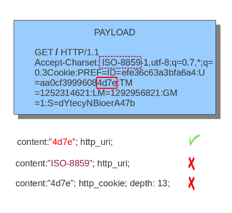

http_user_agent
---------------

The ``http_user_agent`` content modifier is part of the HTTP request
header. It makes it possible to match specifically on the value of the
User-Agent header. It is normalized in the sense that it does not
include the _"User-Agent: "_ header name and separator, nor does it
contain the trailing carriage return and line feed (CRLF). The keyword
can be used in combination with all previously mentioned content
modifiers like ``depth``, ``distance``, ``offset``, ``nocase`` and
``within``. Note that the ``pcre`` keyword can also inspect this
buffer when using the ``/V`` modifier.

An analysis into the performance of ``http_user_agent``
vs. ``http_header`` is found at:
http://blog.inliniac.net/2012/07/09/suricata-http_user_agent-vs-http_header/

Normalization: leading spaces **are not** part of this buffer. So
"User-Agent: \r\n" will result in an empty ``http_user_agent`` buffer.

Example of the User-Agent header in a HTTP request:

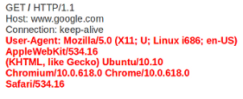

Example of the purpose of ``http_user_agent``:

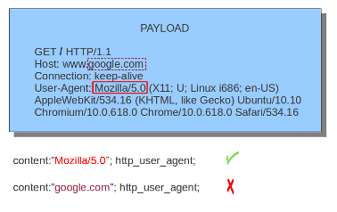

http_client_body
----------------

With the ``http_client_body`` content modifier, it is possible to
match specifically and only on the HTTP request body. The keyword can
be used in combination with all previously mentioned content modifiers
like ``distance``, ``offset``, ``nocase``, ``within``, etc.

Example of ``http_client_body`` in a HTTP request:

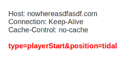

Example of the purpose of ``http_client_body``:

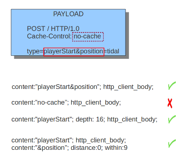

Note: how much of the request/client body is inspected is controlled
in the :ref:`libhtp configuration section
<suricata-yaml-configure-libhtp>` via the ``request-body-limit``
setting.

http_stat_code
--------------

With the ``http_stat_code`` content modifier, it is possible to match
specifically and only on the HTTP status code buffer. The keyword can
be used in combination with all previously mentioned content modifiers
like ``distance``, ``offset``, ``nocase``, ``within``, etc.

Example of ``http_stat_code`` in a HTTP response:

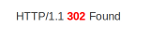

Example of the purpose of ``http_stat_code``:

.. image:: http-keywords/stat-code1.png

http_stat_msg
-------------

With the ``http_stat_msg`` content modifier, it is possible to match
specifically and only on the HTTP status message buffer. The keyword
can be used in combination with all previously mentioned content
modifiers like ``depth``, ``distance``, ``offset``, ``nocase`` and
``within``.

Example of ``http_stat_msg`` in a HTTP response:

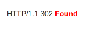

Example of the purpose of ``http_stat_msg``:

.. image:: http-keywords/stat_msg_1.png

http_response_line
------------------

The ``http_response_line`` forces the whole HTTP response line to be inspected.

Example::

    alert http any any -> any any (http_response_line; content:"HTTP/1.0 200 OK"; sid:1;)

http_server_body
----------------

With the ``http_server_body`` content modifier, it is possible to
match specifically and only on the HTTP response body. The keyword can
be used in combination with all previously mentioned content modifiers
like ``distance``, ``offset``, ``nocase``, ``within``, etc.

Note: how much of the response/server body is inspected is controlled
in your :ref:`libhtp configuration section
<suricata-yaml-configure-libhtp>` via the ``response-body-limit``
setting.

http_host and http_raw_host
---------------------------

With the ``http_host`` content modifier, it is possible to
match specifically and only the normalized hostname.
The ``http_raw_host`` inspects the raw hostname.

The keyword can be used in combination with most of the content modifiers
like ``distance``, ``offset``, ``within``, etc.

The ``nocase`` keyword ist not allowed anymore. Keep in mind that you need
to specify a lowercase pattern.

file_data
---------

With ``file_data``, the HTTP response body is inspected, just like
with ``http_server_body``. The ``file_data`` keyword works a bit
differently from the normal content modifiers; when used in a rule,
all content matches following it in the rule are affected (modified)
by it.

Example::

  alert http any any -> any any (file_data; content:"abc"; content:"xyz";)

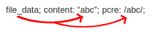

The ``file_data`` keyword affects all following content matches, until
the ``pkt_data`` keyword is encountered or it reaches the end of the
rule. This makes it a useful shortcut for applying many content
matches to the HTTP response body, eliminating the need to modify each
content match individually.

Note: how much of the response/server body is inspected is controlled
in your :ref:`libhtp configuration section
<suricata-yaml-configure-libhtp>` via the ``response-body-limit``
setting.

pcre
----

For information about the ``pcre`` keyword, check the :doc:`pcre` page.

fast_pattern
------------

For information about the ``fast_pattern`` keyword, check the
:doc:`fast-pattern` page.
