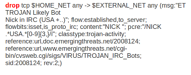
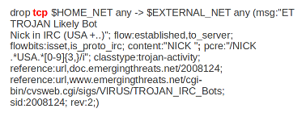
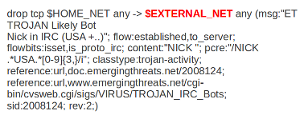
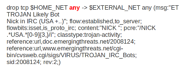

Rules Introduction
==================

.. contents::

Signatures play a very important role in Suricata. In most occasions
people are using existing rulesets. The most used are `Emerging
Threats <http://www.emergingthreats.net/>`_, `Emerging Threats Pro
<http://www.emergingthreatspro.com/>`_ and Sourcefire's `VRT
<http://www.snort.org/vrt/>`_. A way to install rules is described in
:doc:`../rule-management/oinkmaster`.  This Suricata Rules document explains all about
signatures; how to read-, adjust-and create them.

A rule/signature consists of the following:

  The action, header and rule-options.

Example of a signature:

.. image:: intro/intro_sig.png

Action
------

For more information read 'Action Order' see
:ref:`suricata-yaml-action-order`.

Example:

In this example the red, bold-faced part is the action.

Protocol
--------

This keyword in a signature tells Suricata which protocol it
concerns. You can choose between four settings.  tcp (for
tcp-traffic), udp, icmp and ip. ip stands for 'all' or 'any'.
Suricata adds a few protocols : http, ftp, tls (this includes ssl),
smb and dns (from v2.0). These are the so-called application layer
protocols or layer 7 protocols.  If you have a signature with for
instance a http-protocol, Suricata makes sure the signature can only
match if it concerns http-traffic.

Example:

In this example the red, bold-faced part is the protocol.

Source and destination
----------------------

In source you can assign IP-addresses; IPv4 and IPv6 combined as well
as separated. You can also set variables such as HOME_NET. (For more
information see :ref:`suricata-yaml-rule-vars`. In the Yaml-file you
can set IP-addresses for variables such as EXTERNAL_NET and
HOME_NET. These settings will be used when you use these variables in
a rule.  In source and destination you can make use of signs like !
And [ ].

For example::

  ! 1.1.1.1                       (Every IP address but 1.1.1.1)
  ![1.1.1.1, 1.1.1.2]             (Every IP address but 1.1.1.1 and 1.1.1.2)
  $HOME_NET                       (Your setting of HOME_NET in yaml)
  [$EXTERNAL_NET, !$HOME_NET]     (EXTERNAL_NET and not HOME_NET)
  [10.0.0.0/24, !10.0.0.5]        (10.0.0.0/24 except for 10.0.0.5)
  […..,[....]]
  […. ,![.....]]

Pay attention to the following:

If your settings in Yaml are::

  HOME_NET: any
  EXTERNAL_NET: ! $HOME_NET

You can not write a signature using EXTERNAL_NET because it stands for
'not any'. This is a invalid setting.

Example of source and destination in a signature:

.. image:: intro/Source.png

The red, bold-faced part is the source.

The red, bold-faced part is the destination.

Ports (source-and destination-port)
-----------------------------------

Traffic comes in and goes out through ports. Different ports have
different port-numbers. The HTTP-port for example is 80 while 443 is
the port for HTTPS and MSN makes use of port 1863. Commonly the Source
port will be set as 'any'.  This will be influenced by the
protocol. The source port is designated at random by the operating
system. Sometimes it is possible to filter/screen on the source In
setting ports you can make use of special signs as well, like
described above at 'source'. Signs like::

  !       exception/negation
  :       range
  []      signs to make clear which parts belong together
  ,       separation

Example::

  [80, 81, 82]    (port 80, 81 and 82)
  [80: 82]        (Range from 80 till 82)
  [1024: ]        (From 1024 till the highest port-number)
  !80             (Every port but 80)
  [80:100,!99]    (Range from 80 till 100 but 99 excluded)
  [1:80,![2,4]]
  [….[.....]]

Example of ports in a signature:

.. image:: intro/Dest_port.png

In this example, the red, bold-faced part is the port.

Direction
---------

The direction tells in which way the signature has to match. Nearly
every signature has an arrow to the right. This means that only
packets with the same direction can match.

::

  source -> destination
  source <> destination  (both directions)

Example::

  alert tcp 1.2.3.4 1024 - > 5.6.7.8 80

Example 1     tcp-session

.. image:: intro/TCP-session.png

In this example there will only be a match if the signature has the
same order/direction as the payload.

Example of direction in a signature:

.. image:: intro/Direction.png

In this example the red, bold-faced part is the direction.

Rule options
------------

Keywords have a set format::

  name: settings;

Sometimes it is just the name of the setting followed by ; . Like nocase;

There are specific settings for:

* meta-information.
* headers
* payloads
* flows

.. note:: The characters ``;`` and ``"`` have special meaning in the
          Suricata rule language and must be escaped when used in a
          rule option value. For example::

	    msg:"Message with semicolon\;";

For more information about these settings, you can click on the
following headlines:

* :doc:`meta`
* :doc:`payload-keywords`
* :doc:`http-keywords`
* :doc:`dns-keywords`
* :doc:`flow-keywords`
* :doc:`../reputation/ipreputation/ip-reputation-rules`
