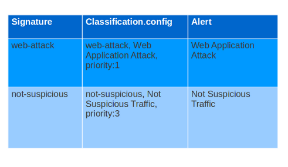

Meta-settings
=============

Meta-settings have no effect on Suricata's inspection; they do have an effect on the way Suricata reports events.

msg (message)
-------------

The keyword msg gives more information about the signature and the possible alert. The first part shows the class of the signature. It is a convention that part is written in uppercase
characters.

The format of msg is:

::

  msg: "some description";

Examples:

::

  msg:"ATTACK-RESPONSES 403 Forbidden";
  msg:"ET EXPLOIT SMB-DS DCERPC PnP bind attempt";

It is a convention that msg is always the first keyword of a signature.

Another example of msg in a signature:

In this example the red, bold-faced part is the msg.

.. note:: The following characters must be escaped inside the msg:
	      ``;`` ``\`` ``"``

Sid (signature id)
------------------

The keyword sid gives every signature its own id. This id is stated with a number.

The format of sid is:

::

  sid:123;

Example of sid in a signature:

.. image:: meta/sid.png

In this example the red, bold-faced part is the sid.

Rev (Revision)
--------------

The sid keyword is almost every time accompanied by rev. Rev
represents the version of the signature. If a signature is modified,
the number of rev will be incremented by the signature writers.  The
format of rev is:

::

  rev:123;

*It is a convention that sid comes before rev, and both are the last
of all keywords.*

Example of rev in a signature:

.. image:: meta/rev.png

In this example the red, bold-faced part is the rev.

Gid (group id)
--------------

The gid keyword can be used to give different groups of signatures
another id value (like in sid). Suricata uses by default gid 1. It is
possible to modify this. It is not usual that it will be changed, and
changing it has no technical implications. You can only notice it in
the alert.

Example of gid in a signature:

.. image:: meta/gid.png

This is an example from the fast.log.
In the part [1:2008124:2], 1 is the gid (2008124 is the the sid and 2 the rev).

Classtype
---------

The classtype keyword gives information about the classification of
rules and alerts. It consists of a short name, a long name and a
priority. It can tell for example whether a rule is just informational
or is about a hack etcetera. For each classtype, the
classification.config has a priority which will be used in the rule.

*It is a convention that classtype comes before sid and rev and after
the rest of the keywords.*

Example classtype::

  config classification: web-application-attack,Web Application Attack,1
  config classification: not-suspicious,Not Suspicious Traffic,3

In this example you see how classtype appears in signatures, the
classification.config and the alert.

Another example of classtype in a signature:

.. image:: meta/classtype.png

In this example the red, bold-faced part is the classtype.

Reference
---------

The reference keywords direct to places where information about the
signature and about the problem the signature tries to address, can be
found. The reference keyword can appear multiple times in a signature.
This keyword is meant for signature-writers and analysts who
investigate why a signature has matched. It has the following format:

::

  reference: url, www.info.nl

In this example url is the type of reference. After that comes the
actual reference (notice here you can not use http before the url).

There are different types of references:

type:

::

  system             URL Prefix
  bugtraq            http://www.securityfocus.com/bid
  cve                http://cve.mitre.org/cgi-bin/cvename.cgi?name=
  nessus             http://cgi.nessus.org/plugins/dump.php3?id=
  arachnids          (No longer available but you might still encounter this in signatures.)
                     http://www.whitehats.com/info/IDS
  mcafee             http://vil.nai.com/vil/dispVirus.asp?virus_k=
  url                http://

For example bugtraq will be replaced by the full url:

::

  reference: bugtraq, 123; http://www.securityfocus.com/bid

Example of reference in a signature:

.. image:: meta/reference.png

In this example the red, bold-faced part is the action.

Priority
--------

The priority keyword comes with a mandatory numeric value which can
range from 1 till 255. The numbers 1 to 4 are most often used.
Signatures with a higher priority will be examined first. The highest
priority is 1.  Normally signatures have already a priority through
class type. This can be overruled with the keyword priority.  The
format of priority is:

::

  priority:1;

Metadata
--------

Suricata ignores the words behind meta data.  Suricata supports this
keyword because it is part of the signature language.  The format is:

::

  metadata:......;

Target
------

The target keyword allows the rules writer to specify which side of the
alert is the target of the attack. If specified, the alert event is enhanced
to contain information about source and target.

The format is:

::

 target: [src_ip|dest_ip]

If the value is src_ip then the source IP in the generated event (src_ip
field in JSON) is the target of the attack. If target is set to dest_ip
then the target is the destination IP in the generated event.
