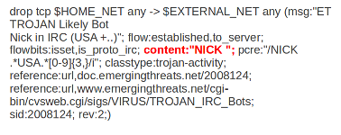

Payload Keywords
================

.. toctree::
   :maxdepth: 2

   pcre
   fast-pattern

Payload keywords inspect the content of the payload of a packet or
stream.

Content
-------

The content keyword is very important in signatures. Between the
quotation marks you can write on what you would like the signature to
match. The most simple format of content is::

  content: ”............”;

It is possible to use several contents in a signature.

Contents match on bytes. There are 256 different values of a byte
(0-255). You can match on all characters; from a till z, upper case
and lower case and also on all special signs. But not all of the bytes
are printable characters. For these bytes heximal notations are
used. Many programming languages use 0x00 as a notation, where 0x
means it concerns a binary value, however the rule language uses
``|00|`` as a notation.  This kind of notation can also be used for
printable characters.

Example::

  |61| is a
  |61 61| is aa
  |41| is A
  |21| is !
  |0D| is carriage return
  |0A| is line feed

There are characters you can not use in the content because they are
already important in the signature. For matching on these characters
you should use the heximal notation. These are::

  “	|22|
  ;	|3B|
  :	|3A|
  |	|7C|

It is a convention to write the heximal notation in upper case characters.

To write for instance ``http://`` in the content of a signature, you
should write it like this: ``content: “http|3A|//”;`` If you use a
heximal notation in a signature, make sure you always place it between
pipes. Otherwise the notation will be taken literally as part of the
content.

A few examples::

  content:“a|0D|bc”;
  content:”|61 0D 62 63|";
  content:”a|0D|b|63|”;

It is possible to let a signature check the whole payload for a match with the content or to let it check specific parts of the payload. We come to that later.
If you add nothing special to the signature, it will try to find a match in all the bytes of the payload.

Example:

In this example, the red, bold-faced part is the content.

By default the pattern-matching is case sensitive. The content has to
be accurate, otherwise there will not be a match.

.. image:: payload-keywords/content2.png

Legend:

.. image:: payload-keywords/Legenda_rules.png

It is possible to use the ! for exceptions in contents as well.

For example::

  alert http $HOME_NET any -> $EXTERNAL_NET any (msg:"Outdated Firefox on
  Windows"; content:"User-Agent|3A| Mozilla/5.0 |28|Windows|3B| ";
  content:"Firefox/3."; distance:0; content:!"Firefox/3.6.13";
  distance:-10; sid:9000000; rev:1;)

You see ``content:!”Firefox/3.6.13”;``. This means an alert will be
generated if the the used version of Firefox is not 3.6.13.

.. note:: The following characters must be escaped inside the content:
             ``;`` ``\`` ``"``

Nocase
------

If you do not want to make a distinction between uppercase and
lowercase characters, you can use nocase. The keyword nocase is a
content modifier.

The format of this keyword is::

  nocase;

You have to place it after the content you want to modify, like::

  content: “abc”; nocase;

Example nocase:

.. image:: payload-keywords/content3.png

It has no influence on other contents in the signature.

Depth
-----

The depth keyword is a absolute content modifier. It comes after the
content. The depth content modifier comes with a mandatory numeric
value, like::

  depth:12;

The number after depth designates how many bytes from the beginning of
the payload will be checked.

Example:

.. image:: payload-keywords/content4.png

Offset
------

The offset keyword designates from which byte in the payload will be
checked to find a match.  For instance offset:3; checks the fourth
byte and further.

.. image:: payload-keywords/content5.png

The keywords offset and depth can be combined and are often used together.

For example::

  content; “def”; offset:3; depth:3;

If this was used in a signature, it would check the payload from the
third byte till the sixth byte.

.. image:: payload-keywords/content6.png

Distance
--------

The keyword distance is a relative content modifier. This means it
indicates a relation between this content keyword and the content
preceding it. Distance has its influence after the preceding match.
The keyword distance comes with a mandatory numeric value. The value
you give distance, determines the byte in the payload from which will
be checked for a match relative to the previous match.  Distance only
determines where Suricata will start looking for a pattern.  So,
distance:5; means the pattern can be anywhere after the previous
match + 5 bytes. For limiting how far after the last match Suricata
needs to look, use 'within'.

Examples of distance:

.. image:: payload-keywords/distance5.png

.. image:: payload-keywords/distance4.png

.. image:: payload-keywords/distance.png

.. image:: payload-keywords/distance1.png

Distance can also be a negative number. It can be used to check for
matches with partly the same content (see example) or for a content
even completely before it. This is not very often used though. It is
possible to attain the same results with other keywords.

.. image:: payload-keywords/distance3.png

Within
------

The keyword within is relative to the preceding match. The keyword
within comes with a mandatory numeric value. Using within makes sure
there will only be a match if the content matches with the payload
within the set amount of bytes. Within can not be 0 (zero)

Example:

.. image:: payload-keywords/within2.png

Example of matching with within:

.. image:: payload-keywords/within1.png

The second content has to fall/come 'within 3 ' from the first content.

As mentioned before, distance and within can be very well combined in
a signature. If you want Suricata to check a specific part of the
payload for a match, use within.

.. image:: payload-keywords/within_distance.png

.. image:: payload-keywords/within_distance2.png

Isdataat
--------

The purpose of the isdataat keyword is to look if there is still data
at a specific part of the payload.  The keyword starts with a number
(the position) and then optional followed by 'relative' separated by a
comma and the option rawbytes.  You use the word 'relative' to know if
there is still data at a specific part of the payload relative to the
last match.

So you can use both examples::

  isdataat:512;

  isdataat:50, relative;

The first example illustrates a signature which searches for byte 512
of the payload. The second example illustrates a signature searching
for byte 50 after the last match.

You can also use the negation (!) before isdataat.

.. image:: payload-keywords/isdataat1.png

Dsize
-----

With the dsize keyword, you can match on the size of the packet
payload. You can use the keyword for example to look for abnormal
sizes of payloads. This may be convenient in detecting buffer
overflows.

Format::

  dsize:<number>;

example of dsize in a rule:

.. image:: payload-keywords/dsize.png

rpc
----

The rpc keyword can be used to match in the SUNRPC CALL on the RPC
procedure numbers and the RPC version.

You can modify the keyword by using a wild-card, defined with * With
this wild-card you can match on all version and/or procedure numbers.

RPC (Remote Procedure Call) is an application that allows a computer
program to execute a procedure on another computer (or address
space). It is used for inter-process communication. See
http://en.wikipedia.org/wiki/Inter-process_communication

Format::

  rpc:<application number>, [<version number>|*], [<procedure number>|*]>;

Example of the rpc keyword in a rule:

.. image:: payload-keywords/rpc.png

Replace
-------

The replace content modifier can only be used in ips. It adjusts
network traffic.  It changes the content it follows ('abc') into
another ('def'), see example:

.. image:: payload-keywords/replace.png

.. image:: payload-keywords/replace1.png

The replace modifier has to contain as many characters as the content
it replaces.  It can only be used with individual packets. It will not
work for :doc:`normalized-buffers` like HTTP uri or a content match in
the reassembled stream.

The checksums will be recalculated by Suricata and changed after the
replace keyword is being used.

pcre
----

For information about pcre check the :doc:`pcre` page.

fast_pattern
------------

For information about fast_pattern check the :doc:`fast-pattern` page.
