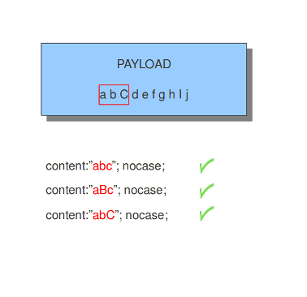
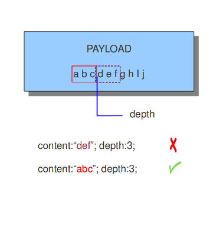
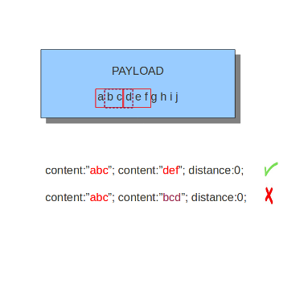
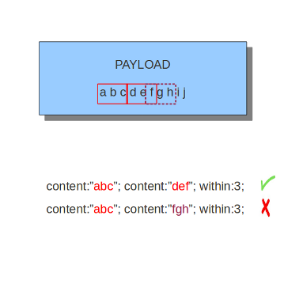
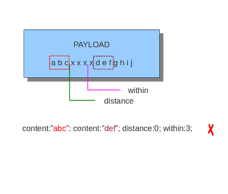
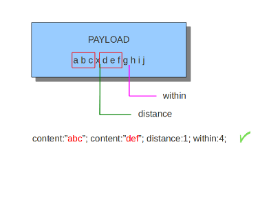
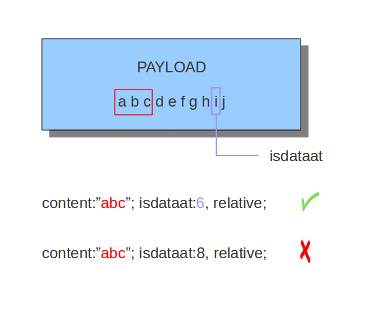
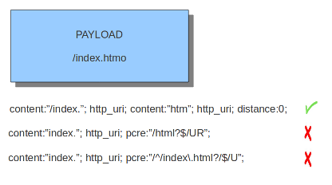
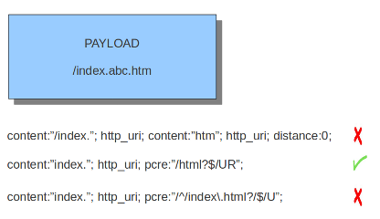

Payload Keywords
================
.. role:: example-rule-emphasis

Payload keywords inspect the content of the payload of a packet or
stream.

content
-------

The content keyword is very important in signatures. Between the
quotation marks you can write on what you would like the signature to
match. The most simple format of content is::

  content: "............";

It is possible to use several contents in a signature.

Contents match on bytes. There are 256 different values of a byte
(0-255). You can match on all characters; from a till z, upper case
and lower case and also on all special signs. But not all of the bytes
are printable characters. For these bytes heximal notations are
used. Many programming languages use 0x00 as a notation, where 0x
means it concerns a binary value, however the rule language uses
``|00|`` as a notation.  This kind of notation can also be used for
printable characters.

Example::

  |61| is a
  |61 61| is aa
  |41| is A
  |21| is !
  |0D| is carriage return
  |0A| is line feed

There are characters you can not use in the content because they are
already important in the signature. For matching on these characters
you should use the heximal notation. These are::

  "	|22|
  ;	|3B|
  :	|3A|
  |	|7C|

It is a convention to write the heximal notation in upper case characters.

To write for instance ``http://`` in the content of a signature, you
should write it like this: ``content: "http|3A|//";`` If you use a
heximal notation in a signature, make sure you always place it between
pipes. Otherwise the notation will be taken literally as part of the
content.

A few examples::

  content:"a|0D|bc";
  content:"|61 0D 62 63|";
  content:"a|0D|b|63|";

It is possible to let a signature check the whole payload for a match with the content or to let it check specific parts of the payload. We come to that later.
If you add nothing special to the signature, it will try to find a match in all the bytes of the payload.

.. container:: example-rule

    drop tcp $HOME_NET any -> $EXTERNAL_NET any (msg:"ET TROJAN Likely Bot Nick in IRC (USA +..)"; flow:established,to_server; flowbits:isset,is_proto_irc; :example-rule-emphasis:`content:"NICK ";` pcre:"/NICK .*USA.*[0-9]{3,}/i"; reference:url,doc.emergingthreats.net/2008124; classtype:trojan-activity; sid:2008124; rev:2;)

By default the pattern-matching is case sensitive. The content has to
be accurate, otherwise there will not be a match.

.. image:: payload-keywords/content2.png

Legend:

.. image:: payload-keywords/Legenda_rules.png

It is possible to use the ! for exceptions in contents as well.

For example::

  alert http $HOME_NET any -> $EXTERNAL_NET any (msg:"Outdated Firefox on
  Windows"; content:"User-Agent|3A| Mozilla/5.0 |28|Windows|3B| ";
  content:"Firefox/3."; distance:0; content:!"Firefox/3.6.13";
  distance:-10; sid:9000000; rev:1;)

You see ``content:!"Firefox/3.6.13";``. This means an alert will be
generated if the used version of Firefox is not 3.6.13.

.. note:: The following characters must be escaped inside the content:
             ``;`` ``\`` ``"``

nocase
------

If you do not want to make a distinction between uppercase and
lowercase characters, you can use nocase. The keyword nocase is a
content modifier.

The format of this keyword is::

  nocase;

You have to place it after the content you want to modify, like::

  content: "abc"; nocase;

Example nocase:

It has no influence on other contents in the signature.

depth
-----

The depth keyword is a absolute content modifier. It comes after the
content. The depth content modifier comes with a mandatory numeric
value, like::

  depth:12;

The number after depth designates how many bytes from the beginning of
the payload will be checked.

Example:

startswith
----------

The ``startswith`` keyword is similar to ``depth``. It takes no arguments
and must follow a ``content`` keyword. It modifies the ``content`` to match
exactly at the start of a buffer.

Example::

    content:"GET|20|"; startswith;

``startswith`` is a short hand notation for::

    content:"GET|20|"; depth:4; offset:0;

``startswith`` cannot be mixed with ``depth``, ``offset``, ``within`` or
``distance`` for the same pattern.

endswith
--------

The ``endswith`` keyword is similar to ``isdataat:!1,relative;``. It takes no
arguments and must follow a ``content`` keyword. It modifies the ``content`` to
match exactly at the end of a buffer.

Example::

    content:".php"; endswith;

``endswith`` is a short hand notation for::

    content:".php"; isdatat:!1,relative;

``endswith`` cannot be mixed with ``offset``, ``within`` or
``distance`` for the same pattern.

offset
------

The offset keyword designates from which byte in the payload will be
checked to find a match.  For instance offset:3; checks the fourth
byte and further.

.. image:: payload-keywords/content5.png

The keywords offset and depth can be combined and are often used together.

For example::

  content:"def"; offset:3; depth:3;

If this was used in a signature, it would check the payload from the
third byte till the sixth byte.

.. image:: payload-keywords/content6.png

distance
--------

The keyword distance is a relative content modifier. This means it
indicates a relation between this content keyword and the content
preceding it. Distance has its influence after the preceding match.
The keyword distance comes with a mandatory numeric value. The value
you give distance, determines the byte in the payload from which will
be checked for a match relative to the previous match.  Distance only
determines where Suricata will start looking for a pattern.  So,
distance:5; means the pattern can be anywhere after the previous
match + 5 bytes. For limiting how far after the last match Suricata
needs to look, use 'within'.

Examples of distance:

.. image:: payload-keywords/distance5.png

.. image:: payload-keywords/distance4.png

.. image:: payload-keywords/distance1.png

Distance can also be a negative number. It can be used to check for
matches with partly the same content (see example) or for a content
even completely before it. This is not very often used though. It is
possible to attain the same results with other keywords.

.. image:: payload-keywords/distance3.png

within
------

The keyword within is relative to the preceding match. The keyword
within comes with a mandatory numeric value. Using within makes sure
there will only be a match if the content matches with the payload
within the set amount of bytes. Within can not be 0 (zero)

Example:

.. image:: payload-keywords/within2.png

Example of matching with within:

The second content has to fall/come 'within 3 ' from the first content.

As mentioned before, distance and within can be very well combined in
a signature. If you want Suricata to check a specific part of the
payload for a match, use within.

rawbytes
--------

The rawbytes keyword has no effect but is included to be comaptible with
signatures that use it, for example signatures used with Snort.

isdataat
--------

The purpose of the isdataat keyword is to look if there is still data
at a specific part of the payload.  The keyword starts with a number
(the position) and then optional followed by 'relative' separated by a
comma and the option rawbytes.  You use the word 'relative' to know if
there is still data at a specific part of the payload relative to the
last match.

So you can use both examples::

  isdataat:512;

  isdataat:50, relative;

The first example illustrates a signature which searches for byte 512
of the payload. The second example illustrates a signature searching
for byte 50 after the last match.

You can also use the negation (!) before isdataat.

bsize
-----

With the bsize keyword, you can match on the length of a buffer. This adds precision to the content match, previously this could have been done with isdataat.

Format::

  bsize:<number>;

Examples of bsize values:

.. container:: example-rule

   alert dns any any -> any any (msg:"bsize exact buffer size"; dns.query; content:"google.com"; bsize:10; sid:1; rev:1;)

   alert dns any any -> any any (msg:"bsize less than value"; dns.query; content:"google.com"; bsize:<25; sid:2; rev:1;)

   alert dns any any -> any any (msg:"bsize buffer less than or equal value"; dns.query; content:"google.com"; bsize:<=20; sid:3; rev:1;)

   alert dns any any -> any any (msg:"bsize buffer greater than value"; dns.query; content:"google.com"; bsize:>8; sid:4; rev:1;)

   alert dns any any -> any any (msg:"bsize buffer greater than or equal value"; dns.query; content:"google.com"; bsize:>=8; sid:5; rev:1;)

   alert dns any any -> any any (msg:"bsize buffer range value"; dns.query; content:"google.com"; bsize:8<>20; sid:6; rev:1;)

dsize
-----

With the dsize keyword, you can match on the size of the packet
payload. You can use the keyword for example to look for abnormal
sizes of payloads which are equal to some n i.e. 'dsize:n'
not equal 'dsize:!n' less than 'dsize:<n' or greater than 'dsize:>n'
This may be convenient in detecting buffer overflows.

Format::

  dsize:[<>!]number; || dsize:min<>max;

Example of dsize in a rule:

.. container:: example-rule

    alert udp $EXTERNAL_NET any -> $HOME_NET 65535 (msg:"GPL DELETED EXPLOIT LANDesk Management Suite Alerting Service buffer overflow"; :example-rule-emphasis:`dsize:>268;` reference: bugtraq,23483; reference: cve,2007-1674; classtype: attempted-admin; sid:100000928; rev:1;)
    alert tcp $EXTERNAL_NET any -> $HOME_NET 8081 (msg:"Example Negation"; :example-rule-emphasis:`dsize:!10;` sid:123; rev:1;)

byte_test
---------
The ``byte_test`` keyword extracts ``<num of bytes>`` and performs an operation selected
with ``<operator>`` against the value in ``<test value>`` at a particular ``<offset>``.
The ``<bitmask value>`` is applied to the extracted bytes (before the operator is applied),
and the final result will be right shifted one bit for each trailing ``0`` in
the ``<bitmask value>``.

Format::
  
  byte_test:<num of bytes>, [!]<operator>, <test value>, <offset> [,relative] \
  [,<endian>][, string, <num type>][, dce][, bitmask <bitmask value>]; 

+----------------+------------------------------------------------------------------------------+
| <num of bytes> | The number of bytes selected from the packet to be converted			|
+----------------+------------------------------------------------------------------------------+
| <operator>	 | 										|
|		 | - [!] Negation can prefix other operators					|
|	         | - < less than								|
|      	         | - > greater than								|
|		 | - = equal									|
|		 | - <= less than or equal							|
|		 | - >= greater than or equal							|
|		 | - & bitwise AND								|
|		 | - ^ bitwise OR								|
+----------------+------------------------------------------------------------------------------+
| <value>	 | Value to test the converted value against [hex or decimal accepted]		|
+----------------+------------------------------------------------------------------------------+
| <offset>	 | Number of bytes into the payload						|
+----------------+------------------------------------------------------------------------------+
| [relative]	 | Offset relative to last content match					|
+----------------+------------------------------------------------------------------------------+
| [endian]	 | Type of number being read:							|	
|		 | - big (Most significant byte at lowest address)				|
|		 | - little (Most significant byte at the highest address)			|
+----------------+------------------------------------------------------------------------------+
| [string] <num> | 										|
|		 | - hex - Converted string represented in hex					|
|		 | - dec - Converted string represented in decimal				|
|		 | - oct - Converted string represented in octal				|
+----------------+------------------------------------------------------------------------------+
| [dce]		 | Allow the DCE module to determine the byte order 				|
+----------------+------------------------------------------------------------------------------+
| [bitmask]	 | Applies the AND operator on the bytes converted				|
+----------------+------------------------------------------------------------------------------+

Example::

  alert tcp any any -> any any \
	 (msg:"Byte_Test Example - Num = Value"; \
	 content:"|00 01 00 02|"; byte_test:2,=,0x01;)

  alert tcp any any -> any any \
	 (msg:"Byte_Test Example - Num = Value relative to content"; \
	 content:"|00 01 00 02|"; byte_test:2,=,0x03,relative;)

  alert tcp any any -> any any \
	 (msg:"Byte_Test Example - Num != Value"; content:"|00 01 00 02|"; \
	 byte_test:2,!=,0x06;)

  alert tcp any any -> any any \ 
         (msg:"Byte_Test Example - Detect Large Values"; content:"|00 01 00 02|"; \
         byte_test:2,>,1000,relative;)

  alert tcp any any -> any any \
	 (msg:"Byte_Test Example - Lowest bit is set"; \
	 content:"|00 01 00 02|"; byte_test:2,&,0x01,relative;)

  alert tcp any any -> any any (msg:"Byte_Test Example - Compare to String"; \
 	 content:"foobar"; byte_test:4,=,1337,1,relative,string,dec;)

byte_math
---------

The ``byte_math`` keyword adds the capability to perform mathematical operations on extracted values with
an existing variable or a specified value.

When ``relative`` is included, there must be a previous ``content`` or ``pcre`` match.

The result can be stored in a result variable and referenced by
other rule options later in the rule.

==============	==================================
 Keyword	    Modifier
============== 	==================================
 content	    offset,depth,distance,within
 byte_test	    offset,value
 byte_jump	    offset
 isdataat	    offset
==============	==================================

Format::

  byte_math:bytes <num of bytes>, offset <offset>, oper <operator>, rvalue <rvalue>, \
        result <result_var> [, relative] [, endian <endian>] [, string <number-type>] \
        [, dce] [, bitmask <value>];

+-----------------------+-----------------------------------------------------------------------+
| <num of bytes>        | The number of bytes selected from the packet                          |
+-----------------------+-----------------------------------------------------------------------+
| <offset>              | Number of bytes into the payload                                      |
+-----------------------+-----------------------------------------------------------------------+
| oper <operator>       | Mathematical operation to perform: +, -, \*, /, <<, >>                |
+-----------------------+-----------------------------------------------------------------------+
| rvalue <rvalue>       | Value to perform the math operation with                              |
+-----------------------+-----------------------------------------------------------------------+
| result <result-var>   | Where to store the computed value                                     |
+-----------------------+-----------------------------------------------------------------------+
| [relative]            | Offset relative to last content match                                 |
+-----------------------+-----------------------------------------------------------------------+
| [endian <type>]       | - big (Most significant byte at lowest address)                       |
|                       | - little (Most significant byte at the highest address)               |
|                       | - dce (Allow the DCE module to determine the byte order)              |
+-----------------------+-----------------------------------------------------------------------+
| [string <num_type>]   |                                                                       |
|                       | - hex Converted data is represented in hex                            |
|                       | - dec Converted data is represented in decimal                        |
|                       | - oct Converted data is represented as octal                          |
+-----------------------+-----------------------------------------------------------------------+
| [dce]                 | Allow the DCE module to determine the byte order                      |
+-----------------------+-----------------------------------------------------------------------+
| [bitmask] <value>     | The AND operator will be applied to the extracted value               |
|                       | The result will be right shifted by the number of bits equal to the   |
|                       | number of trailing zeros in the mask                                  |
+-----------------------+-----------------------------------------------------------------------+

Example::

  alert tcp any any -> any any \
    (msg:"Testing bytemath_body"; \
    content:"|00 04 93 F3|"; \
    content:"|00 00 00 07|"; distance:4; within:4; \
    byte_math:bytes 4, offset 0, oper +, rvalue \
    248, result var, relative;)

  alert udp any any -> any any \
    (byte_extract: 1, 0, extracted_val, relative; \
    byte_math: bytes 1, offset 1, oper +, rvalue extracted_val, result var; \
    byte_test: 2, =, var, 13; \
    msg:"Byte extract and byte math with byte test verification";)

byte_jump
---------

The ``byte_jump`` keyword allows for the ability to select a ``<num of bytes>`` from an ``<offset>`` and moves the detection pointer to that position.  Content matches will then be based off the new position.

Format::

  byte_jump:<num of bytes>, <offset> [, relative][, multiplier <mult_value>] \
        [, <endian>][, string, <num_type>][, align][, from_beginning][, from_end] \
        [, post_offset <value>][, dce][, bitmask <value>];

+-----------------------+-----------------------------------------------------------------------+
| <num of bytes>        | The number of bytes selected from the packet to be converted          |
+-----------------------+-----------------------------------------------------------------------+
| <offset>		| Number of bytes into the payload					|
+-----------------------+-----------------------------------------------------------------------+
| [relative]		| Offset relative to last content match					|
+-----------------------+-----------------------------------------------------------------------+
| [multiplier] <value>  | Multiple the converted byte by the <value>				|
+-----------------------+-----------------------------------------------------------------------+
| [endian]		| - big (Most significant byte at lowest address)			|
|		       	| - little (Most significant byte at the highest address)		|
+-----------------------+-----------------------------------------------------------------------+
| [string] <num_type>  	| 									|
|		       	| - hex Converted data is represented in hex				|
|		       	| - dec Converted data is represented in decimal			|
|		       	| - oct Converted data is represented as octal				|
+-----------------------+-----------------------------------------------------------------------+
| [align]		| Rounds the number up to the next 32bit boundary			|
+-----------------------+-----------------------------------------------------------------------+
| [from_beginning]	| Jumps forward from the beginning of the packet, instead of		|
|			| where the detection pointer is set					|
+-----------------------+-----------------------------------------------------------------------+
| [from_end]		| Jump will begin at the end of the payload, instead of			|
|			| where the detection point is set					|
+-----------------------+-----------------------------------------------------------------------+
| [post_offset] <value>	| After the jump operation has been performed, it will			|
|			| jump an additional number of bytes specified by <value>		|
+-----------------------+-----------------------------------------------------------------------+
| [dce]                 | Allow the DCE module to determine the byte order                      |
+-----------------------+-----------------------------------------------------------------------+
| [bitmask] <value>	| The AND operator will be applied by <value> and the			|
|			| converted bytes, then jump operation is performed			|
+-----------------------+-----------------------------------------------------------------------+

Example::

  alert tcp any any -> any any \
	(msg:"Byte_Jump Example"; \
	content:"Alice"; byte_jump:2,0; content:"Bob";)

  alert tcp any any -> any any \
	(msg:"Byte_Jump Multiple Jumps"; \
	byte_jump:2,0; byte_jump:2,0,relative; content:"foobar"; distance:0; within:6;)

  alert tcp any any -> any any \
	(msg:"Byte_Jump From the End -8 Bytes"; \
	byte_jump:0,0, from_end, post_offset -8; \
	content:"|6c 33 33 74|"; distance:0 within:4;)

byte_extract
------------

The ``byte_extract`` keyword extracts ``<num of bytes>`` at a particular ``<offset>`` and stores it in ``<var_name>``. The value in ``<var_name>`` can be used in any modifier that takes a number as an option and in the case of ``byte_test`` it can be used as a value.

Format::

  byte_extract:<num of bytes>, <offset>, <var_name>, [,relative] [,multiplier <mult-value>] \
        [,<endian>] [, dce] [, string [, <num_type>] [, align <align-value];

+--------------------+--------------------------------------------------------------------------+
| <num of bytes>     | The number of bytes selected from the packet to be extracted		|
+--------------------+--------------------------------------------------------------------------+
| <offset>	     | Number of bytes into the payload						|
+--------------------+--------------------------------------------------------------------------+
| <var_name>	     | The name of the variable in which to store the value			|
+--------------------+--------------------------------------------------------------------------+
| [relative]	     | Offset relative to last content match					|
+--------------------+--------------------------------------------------------------------------+
| multiplier <value> | multiply the extracted bytes by <mult-value> before storing      	|
+--------------------+--------------------------------------------------------------------------+
| [endian]	     | Type of number being read:						|
|		     | - big (Most significant byte at lowest address)				|
|		     | - little (Most significant byte at the highest address)			|
+--------------------+--------------------------------------------------------------------------+
| [string] <num>     | 										|
|		     | - hex - Converted string represented in hex				|
|		     | - dec - Converted string represented in decimal				|
|		     | - oct - Converted string represented in octal				|
+--------------------+--------------------------------------------------------------------------+
| [dce]              | Allow the DCE module to determine the byte order                         |
+--------------------+--------------------------------------------------------------------------+
| align <align-value>| Round the extracted value up to the next                                 |
|                    | <align-value> byte boundary post-multiplication (if any)                 |
|                    | ; <align-value> may be 2 or 4                                            |
+--------------------+--------------------------------------------------------------------------+

==============	==================================
 Keyword	Modifier 
============== 	==================================
 content	offset,depth,distance,within	
 byte_test	offset,value		     	
 byte_math	rvalue
 byte_jump	offset			     	
 isdataat	offset				
==============	==================================

Example::

  alert tcp any any -> any any \
	 (msg:"Byte_Extract Example Using distance"; \
	 content:"Alice"; byte_extract:2,0,size; content:"Bob"; distance:size; within:3; sid:1;)
  alert tcp any any -> any any \
	 (msg:"Byte_Extract Example Using within"; \
	 flow:established,to_server; content:"|00 FF|"; \
	 byte_extract:1,0,len,relative; content:"|5c 00|"; distance:2; within:len; sid:2;)
  alert tcp any any -> any any \
	 (msg:"Byte_Extract Example Comparing Bytes"; \
	 flow:established,to_server; content:"|00 FF|"; \
	 byte_extract:2,0,cmp_ver,relative; content:"FooBar"; distance:0; byte_test:2,=,cmp_ver,0; sid:3;)

rpc
---

The rpc keyword can be used to match in the SUNRPC CALL on the RPC
procedure numbers and the RPC version.

You can modify the keyword by using a wild-card, defined with * With
this wild-card you can match on all version and/or procedure numbers.

RPC (Remote Procedure Call) is an application that allows a computer
program to execute a procedure on another computer (or address
space). It is used for inter-process communication. See
http://en.wikipedia.org/wiki/Inter-process_communication

Format::

  rpc:<application number>, [<version number>|*], [<procedure number>|*]>;

Example of the rpc keyword in a rule:

.. container:: example-rule

    alert udp $EXTERNAL_NET any -> $HOME_NET 111 (msg:"RPC portmap request yppasswdd"; :example-rule-emphasis:`rpc:100009,*,*;` reference:bugtraq,2763; classtype:rpc-portmap-decode; sid:1296; rev:4;)

replace
-------

The replace content modifier can only be used in ips. It adjusts
network traffic.  It changes the content it follows ('abc') into
another ('def'), see example:

.. image:: payload-keywords/replace.png

.. image:: payload-keywords/replace1.png

The replace modifier has to contain as many characters as the content
it replaces.  It can only be used with individual packets. It will not
work for :ref:`rules-normalized-buffers` like HTTP uri or a content match in
the reassembled stream.

The checksums will be recalculated by Suricata and changed after the
replace keyword is being used.

pcre (Perl Compatible Regular Expressions)
------------------------------------------
.. role:: example-rule-emphasis

The keyword pcre matches specific on regular expressions. More
information about regular expressions can be found here
http://en.wikipedia.org/wiki/Regular_expression.

The complexity of pcre comes with a high price though: it has a
negative influence on performance. So, to mitigate Suricata from
having to check pcre often, pcre is mostly combined with 'content'. In
that case, the content has to match first, before pcre will be
checked.

Format of pcre::

  pcre:"/<regex>/opts";

Example of pcre. In this example there will be a match if the payload contains six
numbers following::

  pcre:"/[0-9]{6}/";

Example of pcre in a signature:

.. container:: example-rule

    drop tcp $HOME_NET any -> $EXTERNAL_NET any (msg:"ET TROJAN Likely Bot Nick in IRC (USA +..)"; flow:established,to_server; flowbits:isset,is_proto_irc; content:"NICK "; :example-rule-emphasis:`pcre:"/NICK .*USA.*[0-9]{3,}/i";` reference:url,doc.emergingthreats.net/2008124; classtype:trojan-activity; sid:2008124; rev:2;)

There are a few qualities of pcre which can be modified:

* By default pcre is case-sensitive.
* The . (dot) is a part of regex. It matches on every byte except for
  newline characters.
* By default the payload will be inspected as one line.

These qualities can be modified with the following characters::

  i    pcre is case insensitive
  s    pcre does check newline characters
  m    can make one line (of the payload) count as two lines

These options are perl compatible modifiers. To use these modifiers,
you should add them to pcre, behind regex. Like this::

  pcre: "/<regex>/i";

*Pcre compatible modifiers*

There are a few pcre compatible modifiers which can change the
qualities of pcre as well.  These are:

* ``A``: A pattern has to match at the beginning of a buffer. (In pcre
  ^ is similar to A.)
* ``E``: Ignores newline characters at the end of the buffer/payload.
* ``G``: Inverts the greediness.

.. note:: The following characters must be escaped inside the content:
             ``;`` ``\`` ``"``

Suricata's modifiers
~~~~~~~~~~~~~~~~~~~~

Suricata has its own specific pcre modifiers. These are:

* ``R``: Match relative to the last pattern match. It is similar to distance:0;
* ``U``: Makes pcre match on the normalized uri. It matches on the
  uri_buffer just like uricontent and content combined with http_uri.U
  can be combined with /R. Note that R is relative to the previous
  match so both matches have to be in the HTTP-uri buffer. Read more
  about :ref:`HTTP URI Normalization <rules-http-uri-normalization>`.

.. image:: pcre/pcre3.png

.. image:: pcre/pcre4.png

* ``I``: Makes pcre match on the HTTP-raw-uri. It matches on the same
  buffer as http_raw_uri.  I can be combined with /R. Note that R is
  relative to the previous match so both matches have to be in the
  HTTP-raw-uri buffer. Read more about :ref:`HTTP URI Normalization <rules-http-uri-normalization>`.

* ``P``: Makes pcre match on the HTTP- request-body. So, it matches on
  the same buffer as http_client_body. P can be combined with /R. Note
  that R is relative to the previous match so both matches have to be
  in the HTTP-request body.

* ``Q``: Makes pcre match on the HTTP- response-body. So, it matches
  on the same buffer as http_server_body. Q can be combined with
  /R. Note that R is relative to the previous match so both matches
  have to be in the HTTP-response body.

* ``H``: Makes pcre match on the HTTP-header.  H can be combined with
  /R. Note that R is relative to the previous match so both matches have
  to be in the HTTP-header body.

* ``D``: Makes pcre match on the unnormalized header. So, it matches
  on the same buffer as http_raw_header.  D can be combined with
  /R. Note that R is relative to the previous match so both matches
  have to be in the HTTP-raw-header.

* ``M``: Makes pcre match on the request-method. So, it matches on the
  same buffer as http_method.  M can be combined with /R. Note that R
  is relative to the previous match so both matches have to be in the
  HTTP-method buffer.

* ``C``: Makes pcre match on the HTTP-cookie. So, it matches on the
  same buffer as http_cookie.  C can be combined with /R. Note that R
  is relative to the previous match so both matches have to be in the
  HTTP-cookie buffer.

* ``S``: Makes pcre match on the HTTP-stat-code. So, it matches on the
  same buffer as http_stat_code.  S can be combined with /R. Note that
  R is relative to the previous match so both matches have to be in
  the HTTP-stat-code buffer.

* ``Y``: Makes pcre match on the HTTP-stat-msg. So, it matches on the
  same buffer as http_stat_msg.  Y can be combined with /R. Note that
  R is relative to the previous match so both matches have to be in
  the HTTP-stat-msg buffer.

* ``B``: You can encounter B in signatures but this is just for
  compatibility. So, Suricata does not use B but supports it so it
  does not cause errors.

* ``O``: Overrides the configures pcre match limit.

* ``V``: Makes pcre match on the HTTP-User-Agent. So, it matches on
  the same buffer as http_user_agent.  V can be combined with /R. Note
  that R is relative to the previous match so both matches have to be
  in the HTTP-User-Agent buffer.

* ``W``: Makes pcre match on the HTTP-Host. So, it matches on the same
  buffer as http_host.  W can be combined with /R. Note that R is
  relative to the previous match so both matches have to be in the
  HTTP-Host buffer.

.. _pcre-update-v1-to-v2:

Changes from PCRE1 to PCRE2
===========================

The upgrade from PCRE1 to PCRE2 changes the behavior for some
PCRE expressions.

- ``\I`` is a valid pcre in PCRE1, with a useless escape, so
  equivalent to ``I``, but it is no longer the case in PCRE2.
  There are other characters than I exhibiting this pattern
- ``[\d-a]`` is a valid pcre in PCRE1, with either a digit,
  a dash or the character ``a``, but the dash must now be escaped
  with PCRE2 as ``[\d\-a]`` to get the same behavior
- ``pcre2_substring_copy_bynumber`` now returns an error
  ``PCRE2_ERROR_UNSET`` instead of ``pcre_copy_substring`` returning
  no error and giving an empty string. If the behavior of some use
  case is no longer the expected one, please let us know.

