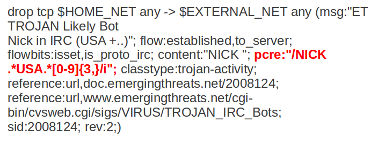

pcre (Perl Compatible Regular Expressions)
==========================================

The keyword pcre matches specific on regular expressions. More
information about regular expressions can be found here
http://en.wikipedia.org/wiki/Regular_expression.

The complexity of pcre comes with a high price though: it has a
negative influence on performance. So, to mitigate Suricata from
having to check pcre often, pcre is mostly combined with 'content'. In
that case, the content has to match first, before pcre will be
checked.

Format of pcre::

  “/<regex>/opts”;

Example of pcre::

  pcre:”/[0-9]{6}/”;

In this example there will be a match if the payload contains six
numbers following.

Example of pcre in a signature:

There are a few qualities of pcre which can be modified:

* By default pcre is case-sensitive.
* The . (dot) is a part of regex. It matches on every byte except for
  newline characters.
* By default the payload will be inspected as one line.

These qualities can be modified with the following characters::

  i    pcre is case insensitive
  s    pcre does check newline characters
  m    can make one line (of the payload) count as two lines

These options are perl compatible modifiers. To use these modifiers,
you should add them to pcre, behind regex. Like this::

  pcre: “/<regex>/i”;

*Pcre compatible modifiers*

There are a few pcre compatible modifiers which can change the
qualities of pcre as well.  These are:

* ``A``: A pattern has to match at the beginning of a buffer. (In pcre
  ^ is similar to A.)
* ``E``: Ignores newline characters at the end of the buffer/payload.
* ``G``: Inverts the greediness.

.. note:: The following characters must be escaped inside the content:
             ``;`` ``\`` ``"``

Suricata's modifiers
~~~~~~~~~~~~~~~~~~~~

Suricata has its own specific pcre modifiers. These are:

* ``R``: Match relative to the last pattern match. It is similar to distance:0;
* ``U``: Makes pcre match on the normalized uri. It matches on the
  uri_buffer just like uricontent and content combined with http_uri.U
  can be combined with /R. Note that R is relative to the previous
  match so both matches have to be in the HTTP-uri buffer. Read more
  about :doc:`http-uri-normalization`.

.. image:: pcre/pcre3.png

.. image:: pcre/pcre4.png

.. image:: pcre/pcre5.png

.. image:: pcre/pcre6.png

* ``I``: Makes pcre match on the HTTP-raw-uri. It matches on the same
  buffer as http_raw_uri.  I can be combined with /R. Note that R is
  relative to the previous match so both matches have to be in the
  HTTP-raw-uri buffer. Read more about :doc:`http-uri-normalization`.

* ``P``: Makes pcre match on the HTTP- request-body. So, it matches on
  the same buffer as http_client_body. P can be combined with /R. Note
  that R is relative to the previous match so both matches have to be
  in the HTTP-request body.

* ``Q``: Makes pcre match on the HTTP- response-body. So, it matches
  on the same buffer as http_server_body. Q can be combined with
  /R. Note that R is relative to the previous match so both matches
  have to be in the HTTP-response body.

* ``H``: Makes pcre match on the HTTP-header.  H can be combined with
  /R. Note that R is relative to the previous match so both matches have
  to be in the HTTP-header body.

* ``D``: Makes pcre match on the unnormalized header. So, it matches
  on the same buffer as http_raw_header.  D can be combined with
  /R. Note that R is relative to the previous match so both matches
  have to be in the HTTP-raw-header.

* ``M``: Makes pcre match on the request-method. So, it matches on the
  same buffer as http_method.  M can be combined with /R. Note that R
  is relative to the previous match so both matches have to be in the
  HTTP-method buffer.

* ``C``: Makes pcre match on the HTTP-cookie. So, it matches on the
  same buffer as http_cookie.  C can be combined with /R. Note that R
  is relative to the previous match so both matches have to be in the
  HTTP-cookie buffer.

* ``S``: Makes pcre match on the HTTP-stat-code. So, it matches on the
  same buffer as http_stat_code.  S can be combined with /R. Note that
  R is relative to the previous match so both matches have to be in
  the HTTP-stat-code buffer.

* ``Y``: Makes pcre match on the HTTP-stat-msg. So, it matches on the
  same buffer as http_stat_msg.  Y can be combined with /R. Note that
  R is relative to the previous match so both matches have to be in
  the HTTP-stat-msg buffer.

* ``B``: You can encounter B in signatures but this is just for
  compatibility. So, Suricata does not use B but supports it so it
  does not cause errors.

* ``O``: Overrides the configures pcre match limit.

* ``V``: Makes pcre match on the HTTP-User-Agent. So, it matches on
  the same buffer as http_user_agent.  V can be combined with /R. Note
  that R is relative to the previous match so both matches have to be
  in the HTTP-User-Agent buffer.

* ``W``: Makes pcre match on the HTTP-Host. So, it matches on the same
  buffer as http_host.  W can be combined with /R. Note that R is
  relative to the previous match so both matches have to be in the
  HTTP-Host buffer.
