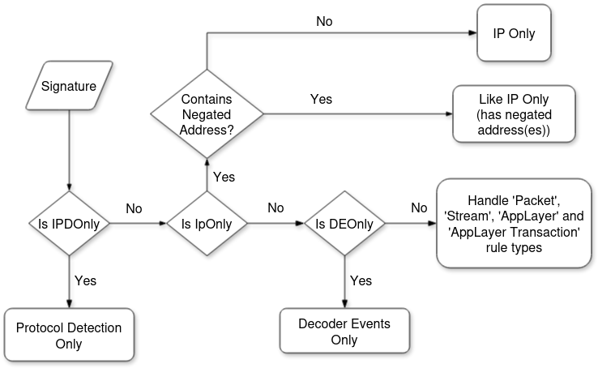
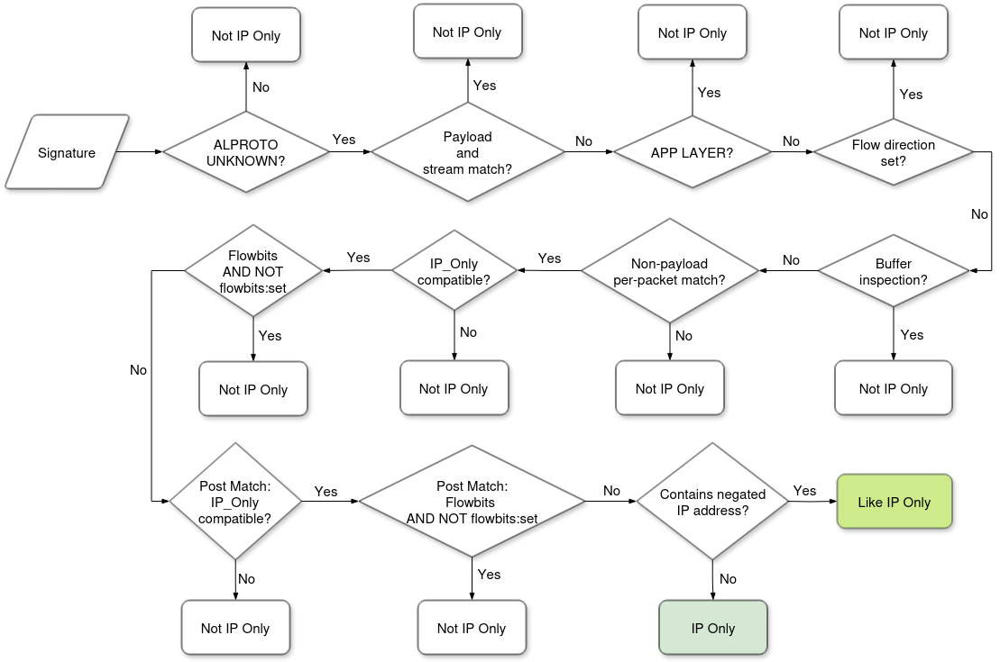
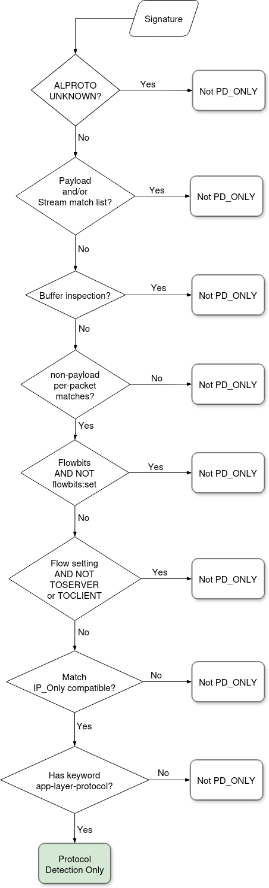
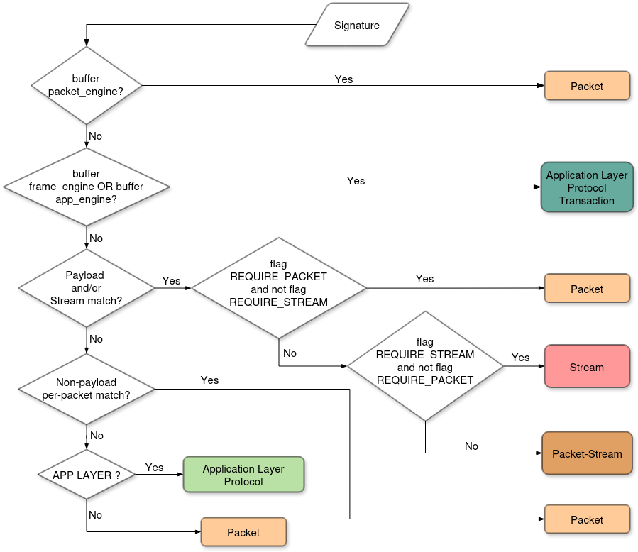

.. role:: example-rule-action
.. role:: example-rule-header
.. role:: example-rule-options
.. role:: example-rule-emphasis

Rule Types and Categorization
=============================

Once parsed, Suricata rules are categorized for performance and further
processing (as different rule types will be handled by specific engine modules).
The signature types are defined in `src/detect.h
<https://github.com/OISF/suricata/blob/main/src/detect.h>`_:

.. literalinclude:: ../../../src/detect.h
    :caption: src/detect.h
    :language: c
    :start-after: // rule types documentation tag start: SignatureType
    :end-before: // rule types documentation tag end: SignatureType

In more human readable terms:

.. list-table:: Suricata Rule Types, and their Engine Analysis Term
    :header-rows: 1

    * - Rule Type
      - Code Symbol
      - Engine-Analysis Representation
    * - Decoder Events Only
      - ``SIG_TYPE_DEONLY``
      - ``de_only``
    * - Packet
      - ``SIG_TYPE_PKT``
      - ``pkt``
    * - IP Only
      - ``SIG_TYPE_IPONLY``
      - ``ip_only``
    * - IP Only (contains negated address(es))
      - ``SIG_TYPE_LIKE_IPONLY``
      - ``like_ip_only``
    * -  Protocol Detection Only
      - ``SIG_TYPE_PDONLY``
      - ``pd_only``
    * - Packet-Stream
      - ``SIG_TYPE_PKT_STREAM``
      - ``pkt_stream``
    * - Stream
      - ``SIG_TYPE_STREAM``
      - ``stream``
    * - Application Layer Protocol
      - ``SIG_TYPE_APPLAYER``
      - ``app_layer``
    * - Application Layer Protocol Transactions
      - ``SIG_TYPE_APP_TX``
      - ``app_tx``

The rule type will impact:

  - To what does the signature action apply, in case of a match (`Action Scope`)
  - When is the rule matched against traffic (`Inspection Hook`)
  - Against what the rule matches (`Data Exposed`)

This categorization is done taking into consideration the presence or absence of
certain rule elements, as well as the type of keywords used. The categorization
currently takes place in `src/detect-engine-build.c:void SignatureSetType()
<https://github.com/OISF/suricata/blob/main/src/detect-engine-build.c#L1642-L1704>`_.

The ``SignatureSetType()`` overall flow is described below:

Flowcharts expanding uncovered functions or portions of the overall algorithm
above are shown in the :ref:`detailed-flowcharts-sig-type` section.

The following table lists all Suricata signature types, and how they impact the
aspects aforementioned.

.. list-table:: Suricata Rule Types
    :widths: 10 17 22 29 26
    :header-rows: 1

    * - Type
      - Action Scope
      - Inspection Hook
      - Data Exposed
      - Keyword Examples

        (non-exhaustive)
    * - :ref:`Decoder Events Only <de-only-rule-type>`

        (``de_only``)
      - Packet
      - Per-broken/ invalid packet
      - Decoding events
      - ``decode-event``
    * - :ref:`Packet <pkt-rule-type>`

        (``pkt``)
      - Packet
      - Per-packet basis
      - Packet-level info (e.g.: header info)
      - ``tcp-pkt``, ``itype``, ``tcp.hdr``, ``tcp.seq``, ``ttl`` etc.
    * - :ref:`IP Only <ip-only-rule-type>`

        (``ip_only``)
      - Flow (if existing). Packets (if not part of a flow)
      - Once per direction
      - IP addresses on the flow
      - Source/ Destination field of a rule
    * - :ref:`IP Only (contains negated address) <like-ip-only-rule-type>` :sup:`2`

        (``like_ip_only``)
      - Flow
      - All packets
      - IP addresses on the flow
      - Source/ Destination field of a rule containing negated address
    * - :ref:`Protocol Detection Only <pd-only-rule-type>`

        (``pd_only``)
      - Flow
      - Once per direction, when protocol detection is done
      - Protocol detected for the flow
      - ``app-layer-protocol``
    * - :ref:`Packet-Stream <pkt-stream-rule-type>`

        (``pkt_stream``)
      - Flow, if stateful :sup:`1`
      - Per stream chunk, if stateful, per-packet if not

        (stream payload AND packet payload)
      - The reassembled stream and/or payload data
      - ``content`` with ``startswith`` or ``depth``
    * - :ref:`Stream <stream-rule-type>`

        (``stream``)
      - Flow, if stateful :sup:`1`
      - Stream chunks, if stateful, just packets if not
      - Stream reassembled payload or packet payload data
      - ``tcp-stream`` in protocol field; simple ``content``; ``byte_extract``
    * - :ref:`Application Layer Protocol <app-layer-rule-type>`

        (``app_layer``)
      - Flow
      - Per-packet basis
      - 'protocol' field in a rule
      - `Protocol field <https://suri-rtd-test.readthedocs.io/en/doc-sigtypes-et-properties-v5/rules/intro.html#protocol>`_ of a rule
    * - :ref:`Application Layer Protocol Transactions <app-tx-rule-type>`

        (``app_tx``)
      - Flow
      - Per :ref:`transaction <transactions>` update
      - Buffer keywords
      - Application layer protocol-related, e.g. ``http.host``, ``rfb.secresult``,
        ``dcerpc.stub_data``, ``frame`` keywords

.. note:: Action Scope: `Flow, if stateful`

    (1) Apply to the flow. If a segment isn't accepted into a stream for any
    reason (such as packet anomalies, errors, memcap reached etc), the rule will
    be applied on a packet level.

.. warning::

    Although both are related to matching on application layer protocols, as the
    table suggests, since Suricata 7 a Protocol Detection rule (that uses the
    ``app-layer-protocol`` keyword) is not internally classified the same as a
    rule simply matching on the application layer protocol on the ``protocol``
    field.

Signature Properties
--------------------

The `Action Scope` mentioned above relates to the Signature Properties, as seen in
`src/detect-engine.c <https://github.com/OISF/suricata/blob/main/src/detect-engine.c>`_:

.. literalinclude:: ../../../src/detect-engine.c
    :caption: src/detect-engine.c
    :language: c
    :start-after: // rule types documentation tag start: SignatureProperties
    :end-before: // rule types documentation tag end: SignatureProperties

Signature: Require Real Packet
^^^^^^^^^^^^^^^^^^^^^^^^^^^^^^

Aside from the scope of action of a signature, certain rule conditions will
require that it matches against a *real packet* (as opposed to a *pseudo packet*).
These rules are flagged with ``SIG_MASK_REQUIRE_REAL_PKT`` by the engine, and
will have ``real_pkt`` listed as one of the rule's ``requirements``. (See
``engine-analysis`` example output for the :ref:`pkt-rule-type` rule type.)

A *pseudo packet* is an internal resource used by the engine when a flow is over
but there is still data to be processed, such as when there is a flow timeout.
A fake packet is then injected in the flow to finish up processing before ending it.

Those two types will be more documented soon (tracking
`#7424 <https://redmine.openinfosecfoundation.org/issues/7424>`_).

.. _variable-like-keywords-sig-type:

Signature Types and Variable-like Keywords
------------------------------------------

Keywords such as flow variables (``flowint``, ``flowbits``), ``datasets``,
and similar ones can alter the rule type, if present in a signature.

That happens because the variable condition can change per packet. Thus, the
Signature is categorized as a `packet` rule.

This affects rule types:

    - Application Layer (``app_layer``)
    - Protocol Detection Only (``pd_only``)
    - Decoder Events Only (``de_only``)
    - IP Only (``ip_only``) :sup:`3`
    - Like IP Only (``like_ip_only``) :sup:`3`

The rule examples provided further cover some such cases, but the table below
lists those keywords with more details:

.. list-table:: Variable-like Keywords
    :header-rows: 1

    * - Keyword
      - Keyword Option
      - Rule Type change?
    * - ``flow``
      - ``to_server``, ``to_client``
      - no type changes :sup:`3`
    * - ``flow``
      - ``established``, ``not_established``
      - to `packet`
    * - ``flowbits``, ``xbits``, ``hostbits``
      - ``isset``, ``isnotset``
      - to `packet`
    * - ``flowbits``, ``xbits``, ``hostbits``
      - ``set``, ``unset``, ``toggle``
      - no type change
    * - ``flowint``
      - ``isset``, ``notset``, all operators
      - to `packet`
    * - ``flowint``
      - defining the variable; unseting;
      - no type change
    * - ``iprep``
      - ``isset``, ``notset``, all operators
      - to `packet`

.. note:: IP Only and Like IP Only

    (3) Unlike the other affected types, signatures that would otherwise be
    classified as ``ip_only`` or ``like_ip_only`` become Packet rules if the
    ``flow`` keyword is used, regardless of option.

.. note::

    ``dataset``, while may look similar to the keywords above, doesn't pertain
    to this list as it can only be used with sticky buffer keywords, thus being
    only available to Application Layer Transaction rules (`app_tx`), which are
    not affected by this.

Flowbits: ``isset``
^^^^^^^^^^^^^^^^^^^

If a non-stateful rule (e.g. a ``pkt`` rule) checks if a ``flowbit`` is set
(like in *flowbits:fb6,isset*) and the rule that sets that variable is a
stateful one, such as an ``app_tx`` rule, the engine will set a flag to indicate
that that rule is also stateful - without altering its signature type. This flag
is currently ``SIG_FLAG_INIT_STATE_MATCH`` (cf. ticket `#7483
<https://redmine.openinfosecfoundation.org/issues/7483>`_).

There is a work-in-progress to add information about this to the ``engine-analysis``
report (ticket `#7456 <https://redmine.openinfosecfoundation.org/issues/7456>`_).

Signatures per Type
-------------------

This section offers brief descriptions for each rule type, and illustrates what
signatures of each type may look like. It is possible to learn the type of a
signature, as well as other important information, by running Suricata in
:ref:`engine analysis <config:engine-analysis>` mode.

For each rule type, there is also a sample of the Engine Analysis report
for one or more of rule(s) shown.

.. _de-only-rule-type:

Decoder Events Only
^^^^^^^^^^^^^^^^^^^

Signatures that inspect broken or invalid packets. They expose Suricata decoding
events.

For more examples check https://github.com/OISF/suricata/blob/main/rules/decoder-events.rules.

Example
"""""""

.. container:: example-rule

    alert pkthdr any any -> any any (msg:"SURICATA IPv6 duplicated Hop-By-Hop Options extension header"; :example-rule-emphasis:`decode-event:ipv6.exthdr_dupl_hh;` classtype:protocol-command-decode; sid:1101;)

.. container:: example-rule

    drop pkthdr any any -> any any (msg:"SURICATA IPv4 invalid option length"; `:example-rule-emphasis:`decode-event:ipv4.opt_invalid_len;` classtype:protocol-command-decode; sid:2200005; rev:2;)

Engine-Analysis Report
""""""""""""""""""""""
.. code-block:: json

    {
      "raw": "alert pkthdr any any -> any any (msg:\"SURICATA IPv6 duplicated Hop-By-Hop Options extension header\"; decode-event:ipv6.exthdr_dupl_hh; classtype:protocol-command-decode; sid:1101;)",
      "id": 1101,
      "gid": 1,
      "rev": 0,
      "msg": "SURICATA IPv6 duplicated Hop-By-Hop Options extension header",
      "app_proto": "unknown",
      "requirements": [
        "engine_event"
      ],
      "type": "de_only",
      "flags": [
        "src_any",
        "dst_any",
        "sp_any",
        "dp_any",
        "toserver",
        "toclient"
      ],
      "pkt_engines": [
        {
          "name": "packet",
          "is_mpm": false
        }
      ],
      "frame_engines": [],
      "lists": {
        "packet": {
          "matches": [
            {
              "name": "decode-event"
            }
          ]
        }
      }
    }

.. _pkt-rule-type:

Packet
^^^^^^

Rules that expose/ inspect information on a packet-level (for instance, the
header). Certain flow keywords may also turn a rule into a ``pkt`` rule, if
they require per-packet inspection (cf. :ref:`variable-like-keywords-sig-type`).

Examples
""""""""

.. container:: example-rule

    alert :example-rule-emphasis:`tcp-pkt` any any -> any any (msg:"tcp-pkt, anchored content"; :example-rule-emphasis:`content:"abc"; startswith;` sid:203;)

.. container:: example-rule

    alert tcp any any -> any any (msg:"ttl"; :example-rule-emphasis:`ttl:123;` sid:701;)

.. container:: example-rule

    alert udp any any -> any any (msg:"UDP with flow direction"; flow:to_server; sid:1001;)

.. container:: example-rule

    alert tcp any any -> any 443 (flow: to_server; flowbits:set,tls_error; sid:1604; msg:"Allow TLS error handling (outgoing packet) - non-stateful rule";)

.. container:: example-rule

    alert tcp-pkt any any -> any any (msg:"Flowbit isset"; :example-rule-emphasis:`flowbits:isset,fb6; flowbits:isset,fb7;` sid:1919;)

Engine-Analysis Report
""""""""""""""""""""""
.. code-block:: json

    {
      "raw": "alert tcp-pkt any any -> any any (msg:\"tcp-pkt, anchored content\"; content:\"abc\"; startswith; sid:203;)",
      "id": 203,
      "gid": 1,
      "rev": 0,
      "msg": "tcp-pkt, anchored content",
      "app_proto": "unknown",
      "requirements": [
        "payload",
        "real_pkt"
      ],
      "type": "pkt",
      "flags": [
        "src_any",
        "dst_any",
        "sp_any",
        "dp_any",
        "need_packet",
        "toserver",
        "toclient",
        "prefilter"
      ],
      "pkt_engines": [
        {
          "name": "payload",
          "is_mpm": true
        }
      ],
      "frame_engines": [],
      "lists": {
        "payload": {
          "matches": [
            {
              "name": "content",
              "content": {
                "pattern": "abc",
                "length": 3,
                "nocase": false,
                "negated": false,
                "starts_with": true,
                "ends_with": false,
                "is_mpm": true,
                "no_double_inspect": false,
                "depth": 3,
                "fast_pattern": false,
                "relative_next": false
              }
            }
          ]
        }
      },
      "mpm": {
        "buffer": "payload",
        "pattern": "abc",
        "length": 3,
        "nocase": false,
        "negated": false,
        "starts_with": true,
        "ends_with": false,
        "is_mpm": true,
        "no_double_inspect": false,
        "depth": 3,
        "fast_pattern": false,
        "relative_next": false
      }
    }

.. _ip-only-rule-type:

IP Only
^^^^^^^

The IP ONLY rule type is used when rules match only on source and destination
IP addresses, and not on any other flow or content modifier.

Examples
""""""""

.. container:: example-rule

    alert tcp-stream :example-rule-emphasis:`any` any -> :example-rule-emphasis:`any` any (msg:"tcp-stream, no content"; sid:101;)

.. container:: example-rule

    alert tcp-pkt :example-rule-emphasis:`[192.168.0.0/16,10.0.0.0/8,172.16.0.0/12]` any -> :example-rule-emphasis:`any` any (msg:"tcp-pkt, no content"; sid:201;)

.. container:: example-rule

    alert ip :example-rule-emphasis:`any` any -> :example-rule-emphasis:`any` any (:example-rule-emphasis:`hostbits:set,myflow2;` sid:1505;)

.. container:: example-rule

    alert udp :example-rule-emphasis:`any` any -> :example-rule-emphasis:`any` any (msg:"UDP with flow direction"; sid:1601;)

Engine-Analysis Report
""""""""""""""""""""""
.. code-block:: json

    {
      "raw": "alert ip any any -> any any (hostbits:set,myflow2; sid:1505;)",
      "id": 1505,
      "gid": 1,
      "rev": 0,
      "app_proto": "unknown",
      "requirements": [],
      "type": "ip_only",
      "flags": [
        "src_any",
        "dst_any",
        "sp_any",
        "dp_any",
        "toserver",
        "toclient"
      ],
      "pkt_engines": [],
      "frame_engines": [],
      "lists": {
        "postmatch": {
          "matches": [
            {
              "name": "hostbits"
            }
          ]
        }
      }
    }

.. _like-ip-only-rule-type:

IP Only (contains negated address)
^^^^^^^^^^^^^^^^^^^^^^^^^^^^^^^^^^

A rule that inspects IP only properties, but contains negated IP addresses.

IP Only signatures with negated addresses are `like` IP-only signatures, but
currently handled differently due to limitations of the algorithm processing
IP Only rules. Impactful differences from a user-perspective are listed on the
Signature Types table.

Examples
""""""""

.. container:: example-rule

    alert tcp 192.168.0.0/16,10.0.0.0/8,172.16.0.0/12 any -> :example-rule-emphasis:`![192.168.0.0/16,10.0.0.0/8,172.16.0.0/12]` any (msg:"tcp, has negated IP address"; sid:304;)

.. container:: example-rule

    alert tcp :example-rule-emphasis:`[10.0.0.0/8,!10.10.10.10]` any -> :example-rule-emphasis:`[10.0.0.0/8,!10.10.10.10]` any (msg:"tcp, has negated IP address"; sid:305;)

Engine-Analysis Report
""""""""""""""""""""""
.. code-block:: json

    {
      "raw": "alert tcp [10.0.0.0/8,!10.10.10.10] any -> [10.0.0.0/8,!10.10.10.10] any (msg:\"tcp, has negated IP address\"; sid:305;)",
      "id": 305,
      "gid": 1,
      "rev": 0,
      "msg": "tcp, has negated IP address",
      "app_proto": "unknown",
      "requirements": [],
      "type": "like_ip_only",
      "flags": [
        "sp_any",
        "dp_any",
        "toserver",
        "toclient"
      ],
      "pkt_engines": [],
      "frame_engines": [],
      "lists": {}
    }

.. _pd-only-rule-type:

Protocol Detection Only
^^^^^^^^^^^^^^^^^^^^^^^

When a signature checks for the application layer protocol but there is no need
for a per-packet inspection, protocol detection can be done with the
``app-layer-protocol`` keyword. Check the `keyword documentation
<https://docs.suricata.io/en/latest/rules/app-layer.html#app-layer-protocol>`_
full for usage.

See :ref:`Protocol Detection Only <flowchart-pd-only-sig-type>` for a flowchart
representing how the type is defined.

See :ref:`app-layer-rule-type` for a packet-based inspection.

.. warning::

    Since Suricata 7, a Protocol Detection rule (that uses the
    ``app-layer-protocol`` keyword) is not internally classified the same as a
    rule simply matching on the application layer protocol on the ``protocol``
    field.

Examples
""""""""

.. container:: example-rule

    alert tcp any any -> any any (msg:"tcp, pd negated"; :example-rule-emphasis:`app-layer-protocol:!http;` sid:401;)

.. container:: example-rule

    alert tcp any any -> any any (msg:"tcp, pd positive"; :example-rule-emphasis:`app-layer-protocol:http;` sid:402;)

.. container:: example-rule

    alert tcp any any -> any any (msg:"tcp, pd positive dns"; :example-rule-emphasis:`app-layer-protocol:dns;` sid:403;)

.. container:: example-rule

    alert tcp any any -> any any (msg:"tcp, pd positive, dns, flow:to_server"; :example-rule-emphasis:`app-layer-protocol:dns;` flow:to_server; sid:405;)

Engine-Analysis Report
""""""""""""""""""""""
.. code-block:: json

    {
      "raw": "alert tcp any any -> any any (msg:\"tcp, pd positive dns\"; app-layer-protocol:dns; sid:403;)",
      "id": 403,
      "gid": 1,
      "rev": 0,
      "msg": "tcp, pd positive dns",
      "app_proto": "unknown",
      "requirements": [],
      "type": "pd_only",
      "flags": [
        "src_any",
        "dst_any",
        "sp_any",
        "dp_any",
        "toserver",
        "toclient"
      ],
      "pkt_engines": [
        {
          "name": "packet",
          "is_mpm": false
        }
      ],
      "frame_engines": [],
      "lists": {
        "packet": {
          "matches": [
            {
              "name": "app-layer-protocol"
            }
          ]
        }
      }
    }

.. _pkt-stream-rule-type:

Packet-Stream
^^^^^^^^^^^^^

A rule is categorized as such when it inspects on traffic in specific portions
of the packet payload, using ``content`` buffer with the ``startswith`` or
``depth`` keywords.

Examples
""""""""

.. container:: example-rule

   alert tcp any any -> any any (msg:"tcp, anchored content"; :example-rule-emphasis:`content:"abc"; startswith;` sid:303;)

.. container:: example-rule

   alert http any any -> any any (msg:"http, anchored content"; :example-rule-emphasis:`content:"abc"; depth:30;` sid:603;)

Engine-Analysis Report
""""""""""""""""""""""
.. code-block:: json

    {
      "raw": "alert http any any -> any any (msg:\"http, anchored content\"; content:\"abc\"; depth:30; sid:603;)",
      "id": 603,
      "gid": 1,
      "rev": 0,
      "msg": "http, anchored content",
      "app_proto": "http_any",
      "requirements": [
        "payload",
        "flow"
      ],
      "type": "pkt_stream",
      "flags": [
        "src_any",
        "dst_any",
        "sp_any",
        "dp_any",
        "applayer",
        "need_packet",
        "need_stream",
        "toserver",
        "toclient",
        "prefilter"
      ],
      "pkt_engines": [
        {
          "name": "payload",
          "is_mpm": true
        }
      ],
      "frame_engines": [],
      "lists": {
        "payload": {
          "matches": [
            {
              "name": "content",
              "content": {
                "pattern": "abc",
                "length": 3,
                "nocase": false,
                "negated": false,
                "starts_with": false,
                "ends_with": false,
                "is_mpm": true,
                "no_double_inspect": false,
                "depth": 30,
                "fast_pattern": false,
                "relative_next": false
              }
            }
          ]
        }
      },
      "mpm": {
        "buffer": "payload",
        "pattern": "abc",
        "length": 3,
        "nocase": false,
        "negated": false,
        "starts_with": false,
        "ends_with": false,
        "is_mpm": true,
        "no_double_inspect": false,
        "depth": 30,
        "fast_pattern": false,
        "relative_next": false
      }
    }

.. _stream-rule-type:

Stream
^^^^^^

A rule that matches payload traffic without regards to its position, that is,
on an unanchored ``content`` buffer, uses byte extraction or matches on
``tcp-stream`` is classified a stream rule.

Examples
""""""""

.. container:: example-rule

   alert :example-rule-emphasis:`tcp-stream` any any -> any any (msg:"tcp-stream, simple content"; :example-rule-emphasis:`content:"abc";` sid:102;)

.. container:: example-rule

   alert :example-rule-emphasis:`http` any any -> any any (msg:"http, simple content"; :example-rule-emphasis:`content:"abc";` sid:602;)

.. container:: example-rule

    alert tcp any any -> any 443 (:example-rule-emphasis:`flow: to_server; content:"abc";` flowbits:set,tls_error; sid:1605; msg:"Allow TLS error handling (outgoing packet) with simple content - Stream rule";)

.. container:: example-rule

    alert tcp any any -> any 443 (:example-rule-emphasis:`flow: to_server; content:"abc";` sid:160401; msg:"Allow TLS error handling (outgoing packet) - stream rule";)

.. container:: example-rule

    alert tcp any any -> any 443 (:example-rule-emphasis:`content:"abc";` sid:160402; msg:"Allow TLS error handling (outgoing packet) - stream rule";)

.. container:: example-rule

   alert :example-rule-emphasis:`tcp` any any -> any any (msg:"byte_extract with dce"; :example-rule-emphasis:`byte_extract:4,0,var,dce; byte_test:4,>,var,4,little;` sid:901;)

Engine-Analysis Report
""""""""""""""""""""""
.. code-block:: json

    {
      "raw": "alert tcp any any -> any any (msg:\"byte_extract with dce\"; byte_extract:4,0,var,dce; byte_test:4,>,var,4,little; sid:901;)",
      "id": 901,
      "gid": 1,
      "rev": 0,
      "msg": "byte_extract with dce",
      "app_proto": "dcerpc",
      "requirements": [
        "payload",
        "flow"
      ],
      "type": "stream",
      "flags": [
        "src_any",
        "dst_any",
        "sp_any",
        "dp_any",
        "applayer",
        "need_stream",
        "toserver",
        "toclient"
      ],
      "pkt_engines": [
        {
          "name": "payload",
          "is_mpm": false
        }
      ],
      "frame_engines": [],
      "lists": {
        "payload": {
          "matches": [
            {
              "name": "byte_extract"
            },
            {
              "name": "byte_test",
              "byte_test": {
                "nbytes": 4,
                "offset": 4,
                "base": "unset",
                "flags": [
                  "little_endian"
                ]
              }
            }
          ]
        }
      }
    }

.. _app-layer-rule-type:

Application Layer Protocol
^^^^^^^^^^^^^^^^^^^^^^^^^^

For a packet-based inspection of the application layer protocol, a rule should
use the `protocol <https://suri-rtd-test.readthedocs.io/en/doc-sigtypes-et-properties-v5/rules/intro.html#protocol>`_ field for the matches.

.. warning::

    Since Suricata 7, a simple rule matching traffic on the ``protocol`` field
    is not internally classified the same as a rule using the ``app-layer-protocol``
    keyword).

.. warning::

    As per Suricata 7, if ``flow:established`` or ``flow:not_established`` is added
    to a base Application Layer Protocol rule, that signature will become a
    :ref:`pkt-rule-type` rule.

Examples
""""""""

.. container:: example-rule

    alert :example-rule-emphasis:`dns` any any -> any any (msg:"app-layer, dns"; sid:404;)

.. container:: example-rule

   alert :example-rule-emphasis:`http` any any -> any any (msg:"http, no content"; sid:601;)

.. container:: example-rule

    alert :example-rule-emphasis:`tls` any any -> any any (msg:"tls, pkt or app-layer?"; flowint:tls_error_int,=,0; sid:613;)

Engine-Analysis Report
""""""""""""""""""""""
.. code-block:: json

    {
      "raw": "alert dns any any -> any any (msg:\"app-layer, dns\"; sid:404;)",
      "id": 404,
      "gid": 1,
      "rev": 0,
      "msg": "app-layer, dns",
      "app_proto": "dns",
      "requirements": [
        "flow"
      ],
      "type": "app_layer",
      "flags": [
        "src_any",
        "dst_any",
        "sp_any",
        "dp_any",
        "applayer",
        "toserver",
        "toclient"
      ],
      "pkt_engines": [],
      "frame_engines": [],
      "lists": {}
    }

.. _app-tx-rule-type:

Application Layer Protocol Transactions
^^^^^^^^^^^^^^^^^^^^^^^^^^^^^^^^^^^^^^^

Rules inspecting traffic using keywords related to application layer protocols
are classified with this signature type. This also includes `frame` keywords.

Examples
""""""""

.. container:: example-rule

   alert tcp any any -> any any (msg:"http, pos event"; :example-rule-emphasis:`app-layer-event:http.file_name_too_long;` sid:501;)

.. container:: example-rule

   alert http any any -> any any (msg:"Test"; flow:established,to_server; :example-rule-emphasis:`http.method; content:"GET"; http.uri; content:".exe";` endswith; :example-rule-emphasis:`http.host; content:!".google.com";` endswith; sid:1102;)

.. container:: example-rule

   alert udp any any -> any any (msg:"DNS UDP Frame"; flow:to_server; :example-rule-emphasis:`frame:dns.pdu;` content:"\|01 20 00 01\|"; offset:2; content:"suricata"; offset:13; sid:1402; rev:1;)

.. container:: example-rule

    alert tcp any any -> any any (msg:"byte_extract with dce"; :example-rule-emphasis:`dcerpc.stub_data;` content:"abc"; byte_extract:4,0,var,relative; byte_test:4,>,var,4,little; sid:902;)

Engine-Analysis Report
""""""""""""""""""""""
.. code-block:: json

    {
      "raw": "alert tcp any any -> any any (msg:\"byte_extract with dce\"; dcerpc.stub_data; content:\"abc\"; byte_extract:4,0,var,relative; byte_test:4,>,var,4,little; sid:902;)",
      "id": 902,
      "gid": 1,
      "rev": 0,
      "msg": "byte_extract with dce",
      "app_proto": "dcerpc",
      "requirements": [
        "flow"
      ],
      "type": "app_tx",
      "flags": [
        "src_any",
        "dst_any",
        "sp_any",
        "dp_any",
        "applayer",
        "toserver",
        "toclient",
        "prefilter"
      ],
      "pkt_engines": [],
      "frame_engines": [],
      "engines": [
        {
          "name": "dce_stub_data",
          "direction": "toclient",
          "is_mpm": true,
          "app_proto": "dcerpc",
          "progress": 0,
          "matches": [
            {
              "name": "content",
              "content": {
                "pattern": "abc",
                "length": 3,
                "nocase": false,
                "negated": false,
                "starts_with": false,
                "ends_with": false,
                "is_mpm": true,
                "no_double_inspect": false,
                "fast_pattern": false,
                "relative_next": true
              }
            },
            {
              "name": "byte_extract"
            },
            {
              "name": "byte_test",
              "byte_test": {
                "nbytes": 4,
                "offset": 4,
                "base": "unset",
                "flags": [
                  "little_endian"
                ]
              }
            }
          ]
        },
        {
          "name": "dce_stub_data",
          "direction": "toserver",
          "is_mpm": true,
          "app_proto": "dcerpc",
          "progress": 0,
          "matches": [
            {
              "name": "content",
              "content": {
                "pattern": "abc",
                "length": 3,
                "nocase": false,
                "negated": false,
                "starts_with": false,
                "ends_with": false,
                "is_mpm": true,
                "no_double_inspect": false,
                "fast_pattern": false,
                "relative_next": true
              }
            },
            {
              "name": "byte_extract"
            },
            {
              "name": "byte_test",
              "byte_test": {
                "nbytes": 4,
                "offset": 4,
                "base": "unset",
                "flags": [
                  "little_endian"
                ]
              }
            }
          ]
        },
        {
          "name": "dce_stub_data",
          "direction": "toclient",
          "is_mpm": true,
          "app_proto": "smb",
          "progress": 0,
          "matches": [
            {
              "name": "content",
              "content": {
                "pattern": "abc",
                "length": 3,
                "nocase": false,
                "negated": false,
                "starts_with": false,
                "ends_with": false,
                "is_mpm": true,
                "no_double_inspect": false,
                "fast_pattern": false,
                "relative_next": true
              }
            },
            {
              "name": "byte_extract"
            },
            {
              "name": "byte_test",
              "byte_test": {
                "nbytes": 4,
                "offset": 4,
                "base": "unset",
                "flags": [
                  "little_endian"
                ]
              }
            }
          ]
        },
        {
          "name": "dce_stub_data",
          "direction": "toserver",
          "is_mpm": true,
          "app_proto": "smb",
          "progress": 0,
          "matches": [
            {
              "name": "content",
              "content": {
                "pattern": "abc",
                "length": 3,
                "nocase": false,
                "negated": false,
                "starts_with": false,
                "ends_with": false,
                "is_mpm": true,
                "no_double_inspect": false,
                "fast_pattern": false,
                "relative_next": true
              }
            },
            {
              "name": "byte_extract"
            },
            {
              "name": "byte_test",
              "byte_test": {
                "nbytes": 4,
                "offset": 4,
                "base": "unset",
                "flags": [
                  "little_endian"
                ]
              }
            }
          ]
        }
      ],
      "lists": {},
      "mpm": {
        "buffer": "dce_stub_data",
        "pattern": "abc",
        "length": 3,
        "nocase": false,
        "negated": false,
        "starts_with": false,
        "ends_with": false,
        "is_mpm": true,
        "no_double_inspect": false,
        "fast_pattern": false,
        "relative_next": true
      }
    }

.. _detailed-flowcharts-sig-type:

Detailed Flowcharts
-------------------

A look into the illustrated overall representation of functions or paths that
determine signature types.

.. _flowchart-ip-only-sig-type:

IP Only and IP Only with negated addresses
^^^^^^^^^^^^^^^^^^^^^^^^^^^^^^^^^^^^^^^^^^

``ip_only`` and ``like_ip_only`` flows.

.. _flowchart-pd-only-sig-type:

Protocol Detection Only
^^^^^^^^^^^^^^^^^^^^^^^

``pd_only`` flow.

.. _flowchart-app-layer-packet-app-tx-stream-sig-types:

Application Layer Protocol, Transaction, Packet, Stream and Stream-Packet rules
^^^^^^^^^^^^^^^^^^^^^^^^^^^^^^^^^^^^^^^^^^^^^^^^^^^^^^^^^^^^^^^^^^^^^^^^^^^^^^^

``app_layer``, ``app_tx``, ``pkt``, ``stream`` and ``stream-pkt`` flows.

``REQUIRE_PACKET`` and ``REQUIRE_STREAM`` can be seen as flags ``need_packet``
and ``need_stream`` in the ``engine-analysis`` output.

        that handles app_layer, app_tx, stream, pkt_stream and pkt rules.
