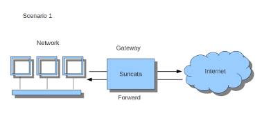
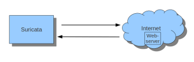
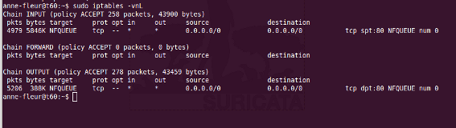
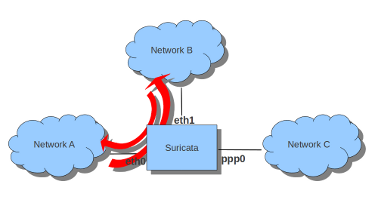

Setting up IPS/inline for Linux
================================

Setting up IPS with Netfilter
-----------------------------

In this guide, we'll discuss how to work with Suricata in layer3 `inline
mode` using ``iptables``.

First, start by compiling Suricata with NFQ support. For instructions
see `Ubuntu Installation
<https://redmine.openinfosecfoundation.org/projects/suricata/wiki/Ubuntu_Installation>`_.
For more information about NFQ and ``iptables``, see
:ref:`suricata-yaml-nfq`.

To check if you have NFQ enabled in your Suricata build, enter the following command: ::

  suricata --build-info

and make sure that NFQ is listed in the output.

To run Suricata with the NFQ mode, you have to make use of the ``-q`` option. This
option tells Suricata which queue numbers it should use.

::

  sudo suricata -c /etc/suricata/suricata.yaml -q 0

Iptables configuration
~~~~~~~~~~~~~~~~~~~~~~

First of all, it is important to know which traffic you would like to send
to Suricata. There are two choices:

1.  Traffic that passes your computer
2.  Traffic that is generated by your computer.

.. image:: setting-up-ipsinline-for-linux/iptables1.png

If Suricata is running on a gateway and is meant to protect the computers
behind that gateway you are dealing with the first scenario: *forward_ing* .

If Suricata has to protect the computer it is running on, you are dealing
with the second scenario: *host* (see drawing 2).

These two ways of using Suricata can also be combined.

The easiest rule in case of the gateway-scenario to send traffic to Suricata is:

::

  sudo iptables -I FORWARD -j NFQUEUE

In this case, all forwarded traffic goes to Suricata.

In case of the host situation, these are the two most simple ``iptables`` rules;

::

  sudo iptables -I INPUT -j NFQUEUE
  sudo iptables -I OUTPUT -j NFQUEUE

It is possible to set a queue number. If you do not, the queue number will
be 0 by default.

Imagine you want Suricata to check for example just TCP traffic, or all
incoming traffic on port 80, or all traffic on destination-port 80, you
can do so like this:

::

  sudo iptables -I INPUT -p tcp  -j NFQUEUE
  sudo iptables -I OUTPUT -p tcp -j NFQUEUE

In this case, Suricata checks just TCP traffic.

::

  sudo iptables -I INPUT -p tcp --sport 80  -j NFQUEUE
  sudo iptables -I OUTPUT -p tcp --dport 80 -j NFQUEUE

In this example, Suricata checks all input and output on port 80.

.. image:: setting-up-ipsinline-for-linux/iptables2.png

To see if you have set your ``iptables`` rules correct make sure Suricata is
running and enter:

::

  sudo iptables -vnL

In the example you can see if packets are being logged.

This description of the use of ``iptables`` is the way to use it with IPv4. To
use it with IPv6 all previous mentioned commands have to start with ``ip6tables``.
It is also possible to let Suricata check both kinds of traffic.

There is also a way to use ``iptables`` with multiple networks (and interface cards). Example:

::

  sudo iptables -I FORWARD -i eth0 -o eth1 -j NFQUEUE
  sudo iptables -I FORWARD -i eth1 -o eth0 -j NFQUEUE

The options ``-i`` (input) ``-o`` (output) can be combined with all previous mentioned
options.

If you would stop Suricata and use internet, the traffic will not come through.
To make internet work correctly, first delete all ``iptables`` rules.

To erase all ``iptables`` rules, enter:

::

  sudo iptables -F

Nftables configuration
~~~~~~~~~~~~~~~~~~~~~~

NFtables configuration is straight forward and allows mixing firewall rules
with IPS. The concept is to create a dedicated chain for the IPS that will
be evaluated after the firewalling rule. If your main table is named `filter`
it can be created like so::

 nft> add chain filter IPS { type filter hook forward priority 10;}

To send all forwarded packets to Suricata one can use ::

 nft> add rule filter IPS queue

To only do it for packets exchanged between eth0 and eth1 ::

 nft> add rule filter IPS iif eth0 oif eth1 queue
 nft> add rule filter IPS iif eth1 oif eth0 queue

NFQUEUE advanced options
~~~~~~~~~~~~~~~~~~~~~~~~

NFQUEUE mechanism supports some interesting options. The ``nftables`` configuration
will be shown there but the features are also available in ``iptables``.

The full syntax of the queuing mechanism is as follows::

 nft add rule filter IPS queue num 3-5 options fanout,bypass

This rule sends matching packets to 3 load-balanced queues starting at 3 and
ending at 5. To get the packets in Suricata with this setup, you need to specify
multiple queues on command line: ::

 suricata -q 3 -q 4 -q 5

`fanout` and `bypass` are the two available options:

- `fanout`: When used together with load balancing, this will use the CPU ID
  instead of connection hash as an index to map packets to the queues. The idea
  is that you can improve performance if there’s one queue per CPU. This requires
  total with a number of queues superior to 1 to be specified.
- `bypass`: By default, if no userspace program is listening on an Netfilter
  queue, then all packets that are to be queued are dropped. When this option
  is used, the queue rule behaves like ACCEPT if there is no program listening,
  and the packet will move on to the next table.

The `bypass` option can be used to avoid downtime of link when Suricata is not
running but this also means that the blocking feature will not be present.

Settings up IPS at Layer 2
--------------------------

.. _afp-ips-l2-mode:

AF_PACKET IPS mode
~~~~~~~~~~~~~~~~~~

AF_PACKET capture method is supporting a IPS/Tap mode. In this mode, you just
need the interfaces to be up. Suricata will take care of copying the packets
from one interface to the other. No ``iptables`` or ``nftables`` configuration is
necessary.

You need to dedicate two network interfaces for this mode. The configuration
is made via configuration variable available in the description of an AF_PACKET
interface.

For example, the following configuration will create a Suricata acting as IPS
between interface ``eth0`` and ``eth1``: ::

 af-packet:
   - interface: eth0
     threads: 1
     defrag: no
     cluster-type: cluster_flow
     cluster-id: 98
     copy-mode: ips
     copy-iface: eth1
     buffer-size: 64535
     use-mmap: yes
   - interface: eth1
     threads: 1
     cluster-id: 97
     defrag: no
     cluster-type: cluster_flow
     copy-mode: ips
     copy-iface: eth0
     buffer-size: 64535
     use-mmap: yes

This is a basic af-packet configuration using two interfaces. Interface
``eth0`` will copy all received packets to ``eth1`` because of the `copy-*`
configuration variable ::

    copy-mode: ips
    copy-iface: eth1

The configuration on ``eth1`` is symmetric ::

    copy-mode: ips
    copy-iface: eth0

There are some important points to consider when setting up this mode:

- The implementation of this mode is dependent of the zero copy mode of
  AF_PACKET. Thus you need to set `use-mmap` to `yes` on both interface.
- MTU on both interfaces have to be equal: the copy from one interface to
  the other is direct and packets bigger then the MTU will be dropped by kernel.
- Set different values of `cluster-id` on both interfaces to avoid conflict.
- Any network card offloading creating bigger then physical layer datagram
  (like GRO, LRO, TSO) will result in dropped packets as transmit path can not
  handle them.
- Set `stream.inline` to `auto` or `yes` so Suricata switches to
  blocking mode.

The `copy-mode` variable can take the following values:

- `ips`: the drop keyword is honored and matching packets are dropped.
- `tap`: no drop occurs, Suricata acts as a bridge

Some specific care must be taken to scale the capture method on multiple
threads. As we can't use defrag that will generate too big frames, the in
kernel load balancing will not be correct: the IP-only fragment will not
reach the same thread as the full featured packet of the same flow because
the port information will not be present.

A solution is to use eBPF load balancing to get an IP pair load balancing
without fragmentation. The AF_PACKET IPS Configuration using multiple threads
and eBPF load balancing looks like the following: ::

 af-packet:
   - interface: eth0
     threads: 16
     defrag: no
     cluster-type: cluster_ebpf
     ebpf-lb-file: /usr/libexec/suricata/ebpf/lb.bpf
     cluster-id: 98
     copy-mode: ips
     copy-iface: eth1
     buffer-size: 64535
     use-mmap: yes
   - interface: eth1
     threads: 16
     cluster-id: 97
     defrag: no
     cluster-type: cluster_ebpf
     ebpf-lb-file: /usr/libexec/suricata/ebpf/lb.bpf
     copy-mode: ips
     copy-iface: eth0
     buffer-size: 64535
     use-mmap: yes

The eBPF file ``/usr/libexec/suricata/ebpf/lb.bpf`` may not be present on disk.
See :ref:`ebpf-xdp` for more information.

DPDK IPS mode
~~~~~~~~~~~~~~~~~~

In the same way as you would configure AF_PACKET IPS mode, you can configure the DPDK capture module.
Prior to starting with IPS (inline) setup, it is recommended to go over :ref:`dpdk-capture-module` manual page
to understand the setup essentials.

DPDK IPS mode, similarly to AF-Packet, uses two interfaces. Packets received on the first network interface
(``0000:3b:00.1``) are transmitted by the second network interface (``0000:3b:00.0``) and similarly,
packets received on the second interface (``0000:3b:00.0``) are transmitted
by the first interface (``0000:3b:00.1``). Packets are not altered in any way in this mode.

The following configuration snippet configures Suricata DPDK IPS mode between two NICs: ::

    dpdk:
      eal-params:
        proc-type: primary

      interfaces:
      - interface: 0000:3b:00.1
        threads: 4
        promisc: true
        multicast: true
        checksum-checks: true
        checksum-checks-offload: true
        mempool-size: 262143
        mempool-cache-size: 511
        rx-descriptors: 4096
        tx-descriptors: 4096
        copy-mode: ips
        copy-iface: 0000:3b:00.0
        mtu: 3000

      - interface: 0000:3b:00.0
        threads: 4
        promisc: true
        multicast: true
        checksum-checks: true
        checksum-checks-offload: true
        mempool-size: 262143
        mempool-cache-size: 511
        rx-descriptors: 4096
        tx-descriptors: 4096
        copy-mode: ips
        copy-iface: 0000:3b:00.1
        mtu: 3000

The previous DPDK configuration snippet outlines several things to consider:

- ``copy-mode`` - see Section :ref:`afp-ips-l2-mode` for more details.
- ``copy-iface`` - see Section :ref:`afp-ips-l2-mode` for more details.
- ``threads`` - all interface entries must have their thread count configured
  and paired/connected interfaces must be configured with the same amount of threads.
- ``mtu`` - MTU must be the same on both paired interfaces.

DPDK capture module also requires having CPU affinity set in the configuration file. For the best performance,
every Suricata worker should be pinned to a separate CPU core that is not shared with any other Suricata thread
(e.g. management threads).
The following snippet shows a possible :ref:`suricata-yaml-threading` configuration set-up for DPDK IPS mode. ::

    threading:
      set-cpu-affinity: yes
      cpu-affinity:
        - management-cpu-set:
            cpu: [ 0 ]
        - worker-cpu-set:
            cpu: [ 2,4,6,8,10,12,14,16 ]

